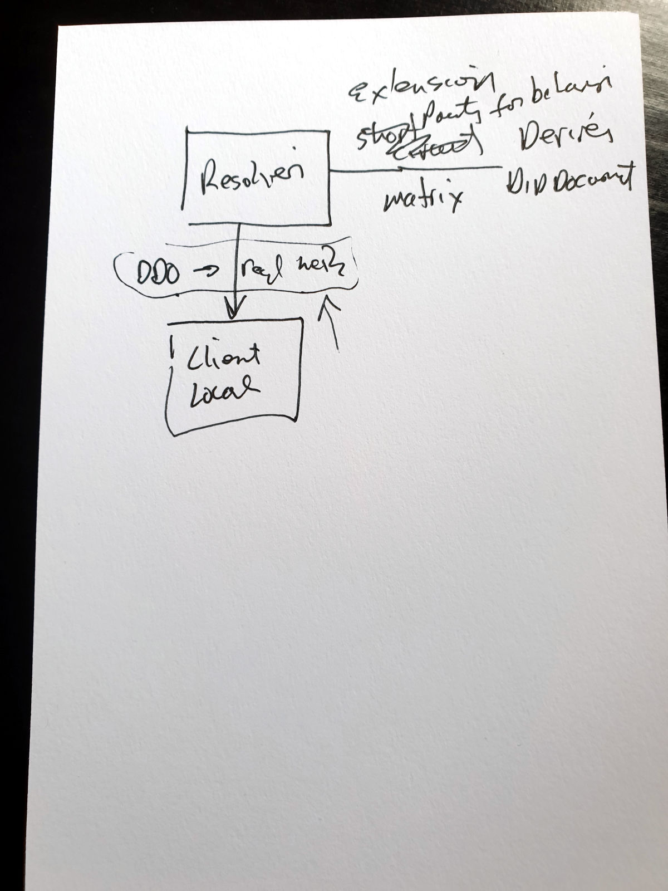
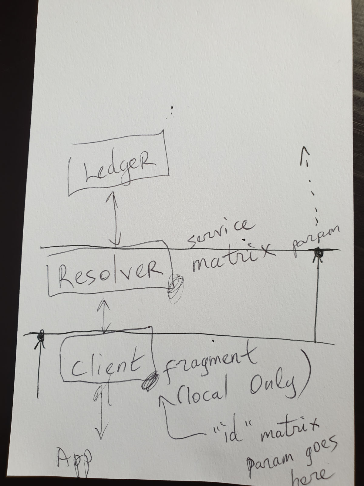
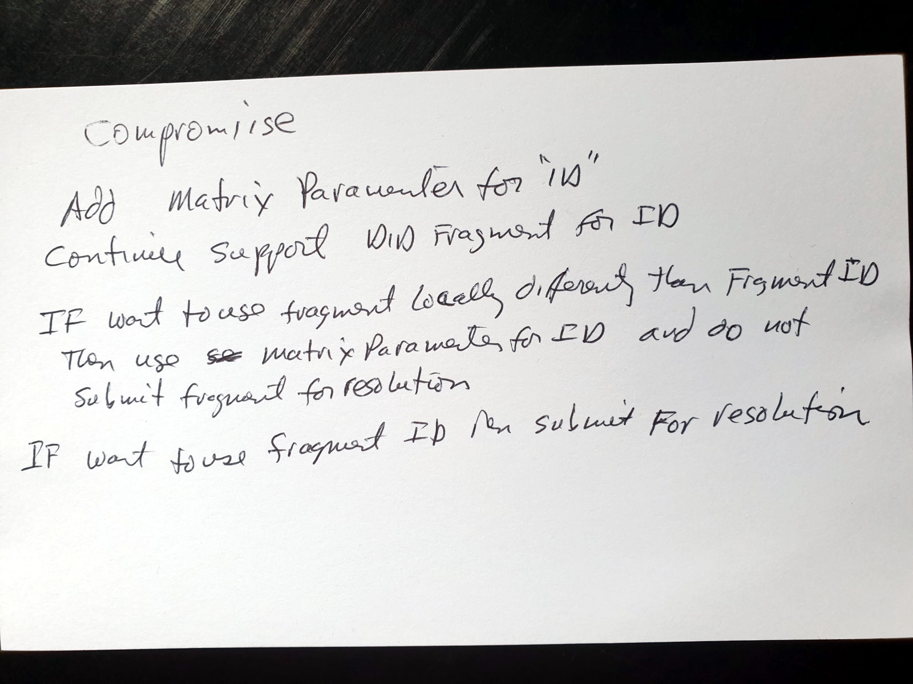

# Authors

Markus Sabadello, Kyle Den Hartog, Dmitri Zagidulin, Samuel M. Smith

# Abstract

We will work on the next version of the DID Resolution spec (v0.2) and add/improve various issues that have been discussed recently and that are critical for ongoing implementation efforts.

This includes: DID Resolver architectures, trustable DID Resolver software, versioning matrix parameters, immutable DID URLs for keys, the DID URL dereferencing algorithm, and resolution metadata.

# Notes from RWoT

**This group will not produce a final RWoT paper or artifact. Instead, work will continue in the W3C [Credentials Community Group](https://w3c-ccg.github.io/) on the [DID Resolution Spec](https://w3c-ccg.github.io/did-resolution/).**

* PR raised by Kyle to clarify "Verifiable Read" and "Unverifiable" Read: https://github.com/w3c-ccg/did-resolution/pull/44

* Some notes by Markus during discussion:
  * Processing of hash fragment should be local
  * Meaning of fragment is MIME type dependent, but can be used differently by client if desired
  * "service" matrix parameter can "short-circuit" the dereferencing process
  * Default result of dereferencing should be the DID Document; methods can return other resources for certain DID URLs
  * Matrix parameters (generic, and method-specific) should be the primary extension mechanism

* Notes by Sam about "service" matrix parameter and fragment:

