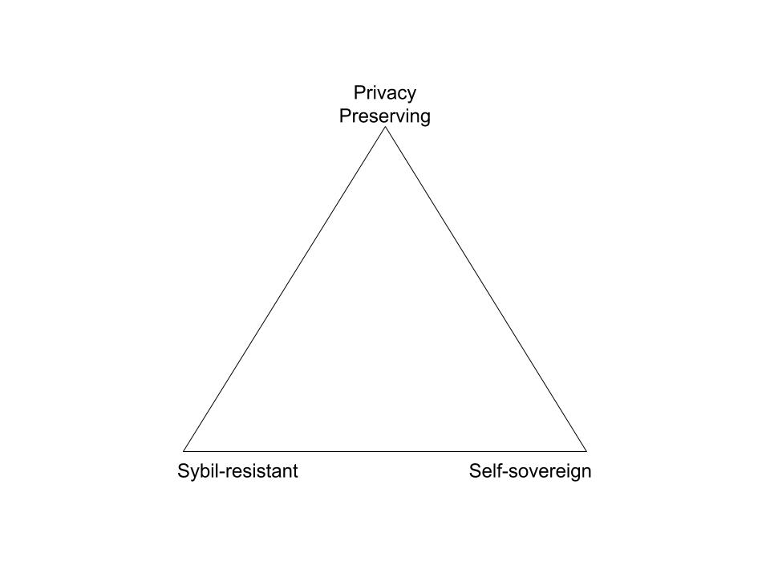

# “Not a Sybil!”: Exploring the Path to Non-Dystopian Approaches to Digital Personhood 

Authors:

Aleeza Howitt, Daniel Burnett, Frederic Meyer, Kai Wagner, Zih-shiuan (Spin) Yuan, Francesco Micheli

General Roles:

aleeza= fill in info on “current approaches”

Kai = feedback on current approaches and write chapter on limitations

Frederic = concept general input, practical approach, reviewing. /!\ will try to bring in insight on Sybil-resistant techniques

Spin = Reviewing & partial “Centralized ways to prove digital personhood” 

Francesco = Random handshakes approach Upala

Dan = Content review and  grammar/etc. editorial review

## 

## Table of Contents

[TOC]

## 

## Abstract

This paper discusses the need for, design of, and use of digital information that suggests that an entity is a unique individual human without necessarily identifying the individual. It is important not to rely on politically centralized entities for the creation of such information, in order to safeguard certain universal human rights; thus we consider only approaches that ensure a governance structure that is robust to abuse of power and preserves system integrity. This could be information that provides either a 100% guarantee, or one that provides less certainty; it could also be anonymous or pseudonymous. For example, such information could enable a decentralized voting system, distribution of a universal basic income, or ticket scalping reduction. Organizing Sybil-proof identity information in this way is associated with various risks; thus we warn against some possible paths of abuse.

**Keywords: **

## Problem Statement

The need for digital information that can establish an individual’s personhood is necessary for many functions related to human rights. In particular, there is a need for digital information suggesting that an entity is a unique individual human without necessarily identifying the individual.

“Article 6 of the Universal Declaration on Human Rights stipulates that "Everyone has the right to recognition everywhere as a person before the law." The Sustainable Development Goals (2015-2030) include target 16.9 which aims to "provide legal identity to all, including birth registration, by 2030." [^1]

Traditionally, states have held the responsibility for certifying the personhood of their citizens; they have done this in a variety of ways, with various levels of success (e.g. social security numbers are terrible, digital identity vs other documents), and rarely in ways that address privacy needs. Notably, many people do not even have access to these imperfect state-sponsored identification systems; it is estimated that over one billion people remain without any identity documents at all. [^2]

A crucial challenge in this area is not to rely on politically centralized entities for the creation of such information, in order to safeguard certain universal human rights. However, the problem of providing a privacy-preserving proof of personhood is magnified in a system without a state, or lacking a functionally similar identity-certifying centralized entity.

This challenge has previously been described as the “decentralized identity trilemma,” as indicated below in Figure 1: “None of the existing solutions are privacy-preserving, Sybil-resistant and self-sovereign at the same time.”[^3]

 

“Self-sovereignty — anybody can create and control as many identities(1) as they wish without 3rd party involvement.

Privacy-preserving — one can acquire and utilize an identifier without revealing their ‘real name’ or any other personality identifying information in the process.

Sybil-resistant — identity is subject to scarcity; i.e. creating more identifiers cannot be used to manipulate a system(2).”

[https://en.wikipedia.org/wiki/Right_to_personal_identity](https://en.wikipedia.org/wiki/Right_to_personal_identity)

There must exist a decentralized, anonymous, privacy-preserving system for establishing digital personhood, that is accessible to every human being.

## What is digital personhood?

There are a variety of ways to define a person; legal definitions vary by geopolitical regions.  One existing definition of digital personhood is “a term used to discuss recognition of a human being as having status as a person in the electronic realm”.[^4] For the purposes of this paper, we disregard non-human persons and instead consider only human beings. We define personhood as a status that confers certain inalienable human rights to every human being.

We further define digital personhood as digital information indicating the _one and only_ proof of some particular human being’s existence. Digital personhood may indicate a number of sub-attributes, depending on the use case. These can include:

1. Is the person alive or deceased?
2. Is the person independent or a dependant (e.g. a child, mentally incapacitated, etc.)?
3. Is the person in good standing within the community (e.g. a convicted felon)?

### Self Sovereignty

A “self sovereign” identity system, indicating an identity system which does not rely on politically centralized entities and is accessible to all, is a human right. It is desirable because states and centralized institutions are subject to political forces and thus there is always a risk that they may discriminate against certain populations or individuals. Because a digital proof of personhood is tied to access to other human rights, it is itself a human right, and must not be subject to the whims of any politically-influenced entities. However, any system providing such proof would have great influence over the definition of personhood, creating the need to develop and exercise effective governance for these systems.

### Privacy and Anonymity

Anonymity plays an important role in protecting human beings from political persecution. For example, important democratic responsibilities like voting are usually anonymous by design. This property must be preserved in a system of digital personhood:  obtaining and using a digital proof of one’s personhood should not require revealing personally identifying information, when that information is not directly relevant. This is an important point to make explicit because traditional methods of identification rely heavily on gathering sensitive, personally identifying information. Gathering such information creates the risk of data misuse or data leaks. If a system of digital personhood is possible without intrusively gathering sensitive information, then it must be done in a privacy-preserving way.

### Sybil Resistance

A “Sybil” is a duplicate identity of a real human. A situation in which a human creates many duplicate digital identities in order to game a system is known as a “Sybil attack”. In a system of personhood, it is crucial to avoid the possibility of Sybil attacks and instead only distribute one identity, or proof of personhood, per real human person. This may be extremely difficult to prevent in a digital personhood system, depending on how the proof of personhood is obtained; or depending on what entity certifies the proof. Notably, a Sybil-proof personhood proof is logically limited to the system providing the proof; any one system of personhood is structurally incompatible with any other system of personhood..

## Centralized ways to prove digital personhood 

### 1. Examples of traditional models to establish personhood:

How do states document their citizens?

The priority is preventing Sybil attacks, not protecting sensitive personal information.

What are the weaknesses with this model? 1) Privacy concerns/data misuse, 2) Risk of a non-inclusive system

Aadhar Indian identity system:

 [https://www.forbes.com/sites/cognitiveworld/2019/07/16/nuances-of-aadhaar-indias-digital-identity-identification-system-and-id/](https://www.forbes.com/sites/cognitiveworld/2019/07/16/nuances-of-aadhaar-indias-digital-identity-identification-system-and-id/)

Estonian e-identity system:

#### [https://e-estonia.com/solutions/e-identity/id-card/](https://e-estonia.com/solutions/e-identity/id-card/)

Iris scanning for refugees:

[https://apolitical.co/solution_article/iris-scanning-atms-give-refugees-identity-access-cash/](https://apolitical.co/solution_article/iris-scanning-atms-give-refugees-identity-access-cash/)

CLEAR airport security:

[https://thepointsguy.com/guide/clear-expedited-airport-security/](https://thepointsguy.com/guide/clear-expedited-airport-security/)

### 2. Methods of accessing a proof of personhood:

Risks: Privacy concerns…

Biometric / KYC ? 

#### Two-factor authentication (email & phone)

#### Two-factor authentication is a two-step verification which requires both subjective knowledge (what you know) and objective inherence (what you have) in order to confirm users' claimed identities via setting up an extra layer. The multiple-authentication principle is based on the assumption that an unauthorized actor can barely provide the components required for access, which tend to be verifiable unique identifiers. One well-known example for two-factor authentication is to

(card & pin)

#### direct documents (ID cards, passports, etc.)

#### KYC & AML checks

### Concerns of centralized approaches

Clumsy, doesn’t translate to the digital realm very well.

Requires collecting sensitive information, giving to a third party

Often requires revealing sensitive information unnecessarily (this is not really on topic though)

Security flaws; subject to identity theft (e.g. US social security #s)

Meta concern: Not inclusive (may exclude non-citizens)

## Current approaches to providing Politically Decentralized Proof of Limited Personhood & concerns

This section discusses a variety of current approaches to providing solutions in this space, along with the pros and cons of each approach.

### Graph analysis based approaches 

BrightID ([https://www.brightid.org/](https://www.brightid.org/)), Borg

### Simultaneous “captcha” based approaches

Idena

### Web of trust approach

Duniter web of trust

### Reputation/Public attestation, or Prediction market approach

HumanityDAO, (maybe) see Gooddollar

### Analysis of biometrics etc

See: Gooddollar, (maybe) Democracy Earth

### Random handshakes approach

Upala identity proof system purpose is to distinguish people from bots and clones, people with multiple IDs. Every user has a global and local reputation (where local means geographically local). Users gain local reputation when they meet each other in person in pseudo-random pairs defined by the system and if they both confirm each other “humanness” they gain reputation score. The steps to gain local reputation are:

1. Announce your availability for a meeting
2. Agree on the system proposed time
3. Meet the other person and confirm that is a real person acting at their own will and the person’s ID photo is correct

Successful handshake bring points to both users, rejection subtracts points 

### Digital Pseudonym parties

Ford-inspired work

Can also include:

 [https://ubiresearch.org/proposal-for-a-decentralized-unique-identity-seeding-protocol](https://ubiresearch.org/proposal-for-a-decentralized-unique-identity-seeding-protocol) 

### Relaxing global uniqueness: personhood in a smaller community

Maybe GroupIncome project is good here? (Ok Turtles project)

(but this is not a universal identity)

## Conclusion

Summarize why centralized systems are less than ideal

Recommend promising decentralized paths.

Summarize risks associated with promising paths.

## Resources 

Links:

[https://www.researchgate.net/publication/259440924_The_Sybil_Attacks_and_Defenses_A_Survey](https://www.researchgate.net/publication/259440924_The_Sybil_Attacks_and_Defenses_A_Survey) <reviewing Sybil-attacks and defenses in non-identity related projects>

[https://jamespflynn.com/2018/03/01/kuwa-a-decentralized-pseudo-anonymous-and-sybil-resistant-individual-identification-system/](https://jamespflynn.com/2018/03/01/kuwa-a-decentralized-pseudo-anonymous-and-sybil-resistant-individual-identification-system/)

[https://idena.io/](https://idena.io/) <captcha-based identity project underlying a blockchain

Brightid.org 

[http://duniter.org](http://duniter.org/) <French UBI cryptocurrency with web-of-trust built into their blockchain

[https://medium.com/six-degrees-of-separation/random-handshakes-sybil-attack-protection-mechanism-for-upala-digital-identity-system-28e78fd44621](https://medium.com/six-degrees-of-separation/random-handshakes-sybil-attack-protection-mechanism-for-upala-digital-identity-system-28e78fd44621)

Presentation on enabling sybil proof identity presentation at DWeb Camp [https://dwebcamp2019.sched.com/event/RcJM](https://dwebcamp2019.sched.com/event/RcJM)

^Same guys: [https://github.com/WebOfTrustInfo/rwot9-prague/blob/master/topics-and-advance-readings/decentralized-unique-anonymous-identity.md](https://github.com/WebOfTrustInfo/rwot9-prague/blob/master/topics-and-advance-readings/decentralized-unique-anonymous-identity.md)

Allies(?):

General note on graphs: [https://github.com/WebOfTrustInfo/rwot8-barcelona/blob/master/topics-and-advance-readings/graphs-everywhere.md](https://github.com/WebOfTrustInfo/rwot8-barcelona/blob/master/topics-and-advance-readings/graphs-everywhere.md)

Created “Borg” identity system: 

[https://github.com/WebOfTrustInfo/rwot8-barcelona/blob/master/topics-and-advance-readings/Attention%20as%20a%20Source%20of%20Scarcity%20for%20Decentralized%20Identity%20Systems.pdf](https://github.com/WebOfTrustInfo/rwot8-barcelona/blob/master/topics-and-advance-readings/Attention%20as%20a%20Source%20of%20Scarcity%20for%20Decentralized%20Identity%20Systems.pdf)

handshakes: [https://medium.com/six-degrees-of-separation/random-handshakes-sybil-attack-protection-mechanism-for-upala-digital-identity-system-28e78fd44621](https://medium.com/six-degrees-of-separation/random-handshakes-sybil-attack-protection-mechanism-for-upala-digital-identity-system-28e78fd44621)

### Notes etc…

Suggestion: differentiate what bot and human behaviors might look like from a network perspective. Bots might have very task-focused behaviors, whereas humans would have a variety of data generating activities (travel, buying food, clothing, paying rent, moving around), so a human could prove personhood by showing these types of activities via verifiable (yet privacy protected) info, ie: certified Uber ride, plane travel, rent paying, ordering food, etc. Maintaining a bot would then incur huge expenses PER BOT, in cash and other resources (fake Uber rides, etc.), potentially more than what the UBI would provide. Mentally/physically challenged people or kids still have verifiable activity (medical costs, nurses, hospital bed, school). A bot can’t fake crossing someone in the streets if that someone’s wallet doesn’t approve it. Bots could verify each other in a way where they only cross each other’s paths, but their behavioral patterns would quickly show they’re not crossing anyone BUT people of their group, and not making any human-like expenses. In a way, expenses and handshakes with passers by verify your existence => use money and interactions as oracles, and make maintaining a bot more costly than what revenue it could generate.

Frederic’s THOUGHTS ON CURRENT APPROACHES: social graphs are an essential component but can’t be sole trustless oracles. Network-based (CIVIC etc.) rely on trusted entourage without proofs.

THREAT: someone using the system for the first time would create a profile and start generating a history ex-nihilo. How to prevent that someone who already has an account from creating a second profile? 1/ Device-limitation? => IMEI lock? NO: Not enough as people could conspire to take turns holding a device (thus avoiding cloning of a single behavior) and passing detection tests. 2/ birth details serving as unique source for generating an ID? NO: central ID system dependent.

_

From Frederic:

I’ve gone back and read some papers Aleeza wrote (ubiresearch.org) to get a better grasp of the scope and her goals. Here are some thoughts.

*   what is a person? What restrictions do we apply: being human (vegans might disagree), alive (what of wills and legacies?), conscious (what of babies, people with mental or physical inabilities?) or are we just trying to create a framework whereby someone could prove they are a unique non-bot digital user? I feel we are going for the latter, since the others probably involve answering philosophical, legal (sometimes political/religious) questions that might be a little too broad?
*   Next, I suggest that we list characteristics of a unique non-bot digital user. I see 2 types*: the digital « consumer » (basically your average person with broad usage and generating loads of data and accepting that it participate in forming his/her personhood, though in all privacy) and the digital « seeker » (people with a much narrower usage, though not necessarily less frequent, AND/OR limiting the scope of their data participating in forming that personhood). I separate the two because the « consumer » will see his/her personhood determined across a multiplicity of factors (quantitative) while the « seeker » might be more defined by qualitative characteristics (or maybe even proofs of life requested at random, anytime, anywhere?). I don’t expect us to define here the threshold at which a user switches from one to the other.
*   In all likelihood, anyone wanting/needing/required to prove personhood should be holding a privacy-preserving, self-sovereign wallet that proves his/her ownership of that digital entity. It should be mentioned that we will not delve into the complexities of wallet/key management here, but just take it as an absolute. This wallet would collect data for our personal use throughout our day, and allow us to show a variety of markers to prove personhood when the need arises.
*   Reason being that we are all different in what we do in the digital space, and I can see how our personal data wallet could be powered with a personal AI, that could detect unusual behavior. Some of us might be very-routine driven, some might be more the type to live in the forest and log off for extended periods of time. Eventually, this AI could help in proof of life systems or emergency alerting?

*It is to be mentioned that there is some info on the size of data that we generate, whether we like it or not, or whether we are an extensive user or not:

*   World creates 16 BILLION Gb per day
*   By 2020, EVERY user will generate 1.7 Mb of data per second
*   The total amount of data DOUBLES every 2 years, ie: half the data in existence is less than 2 years old

I am thinking about 3 things that make a person digitally existent:

*   Purpose in action: our direction (when moving) has a destination, etc.
*   Handshakes with other passers by ---
*   Expenses with neutral « trusted » parties for typical human activities (sustenance, leisure): supermarkets, restaurants, airlines

Entirely unsure of the capabilities of these systems, but this could be worth considering to help with a privacy-preserving aspect:

“Homomorphic encryption is a form of encryption that allows computation on ciphertexts, generating an encrypted result which, when decrypted, matches the result of the operations as if they had been performed on the plaintext.” ([wikipedia](https://en.wikipedia.org/wiki/Homomorphic_encryption))

As I understand it, this enables untrusted nodes to perform computations on encrypted data without revealing the information to the node. Again, entirely uncertain of the technical feasibility of this, but if this works as I understand it, a node could collect and analyze biometric measurements (a photo of someone’s face), and an output that indicates whether that face is already included in the database without ever decrypting the photo, which was encrypted on the edge device. See [NuCypher](https://www.nucypher.com/fully-homomorphic-encryption/).

Another idea would be pushing the algorithms to the edge, executing these facial recognition (for example) algorithms on the edge user’s phone or laptop, and only providing non-identifiable data to some centralized server for cross-referencing with a database of unique persons known to the system. This also serves to protect individual privacy while still possibly enabling comparison with other private users. Does anyone know if a deterministic biometric identification algorithm exists? 

[Keyless](https://keyless.io/) (as I understand it) uses biometrics to generate / access private keys - but their site is very short on details, and may not preserve privacy - not sure. 

Temporary outtakes:

In activity based approaches that prove personhood the requirement of a once-only condition is not given, as one can have multiple very active persona. (Sybil attacks would be an example for this.)

<!-- Footnotes themselves at the bottom. -->
## Notes

[^1]:
     https://sustainabledevelopment.un.org/sdg16

[^2]:
     [EVERY CHILD’S BIRTH RIGHT: Inequities and trends in birth registration (2013), https://www.unicef.org/media/files/Embargoed_11_Dec_Birth_Registration_report_low_res.pdf](https://www.unicef.org/media/files/Embargoed_11_Dec_Birth_Registration_report_low_res.pdf)

[^3]:
     http://maciek.blog/dit/

[^4]:
     [Theorising digital personhood: a dramaturgical approach](https://www.tandfonline.com/doi/full/10.1080/0267257X.2016.1260630)

