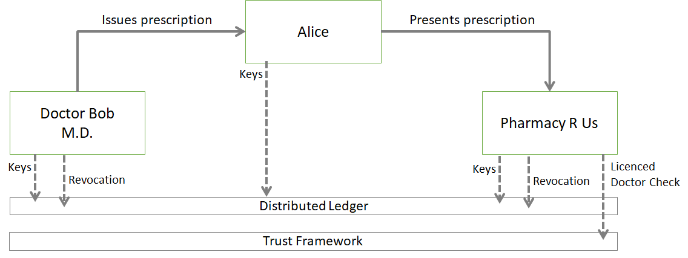

# Alice Attempts to Abuse a Verifiable Credential
*P. Dingle, S. Hammann, D. Hardman, C. Winczewski, S. Smith*

September 2019

## Introduction

Verifiable credentials (VCs) are an exciting innovation in decentralized identity. By standardizing a data format that allows the holder of a credential to be in control of the receipt and the presentation of digital documents, VCs represent a step forward in data control, while still allowing authoritative information to flow. However, there are reasonable concerns around whether the remote interactions that VCs enable can be secured. A verifiable credential is easy to copy. The cryptographic keys that protect them are easy to share. This makes an old problem from physical credential space more pressing: _What mechanisms exist for the system to prevent fraud?_

In this paper, we explore a subset of the fraud problem: vulnerabilities associated with a malicious credential holder. Our frame is a fictional narrative about Alice, a person who receives a prescription as a verifiable credential. Unfortunately, Alice is addicted to the prescribed drug, she is eager to earn quick cash, and she has little respect for legal processes&mdash;so she has multiple motives to apply her credential and creativity for mischief.

## Assumptions

We do not want to treat real-world drug addiction casually, and we also do not want prescription experts to get bogged down in whether details of today's prescription systems make a particular abuse less believable. Therefore, we add a further layer of fictionality: the drug that Alice is addicted to is [melange](https://en.wikipedia.org/wiki/Melange_(fictional_drug)) (the fictional spice that drives a galactic economy in the sci-fi universe of _Dune_), and this takes place some time in the future. In Alice’s world, verifiable credentials are common, software that supports them is reasonably mature, and laws and procedures may vary a bit from what we know now.

For simplicity it is assumed that the system consists of three categories of participants: issuers, holders, and verifiers. Issuers and verifiers are assumed to be honest and acting in good faith&mdash;the doctor is licensed to practice and the pharmacy is licensed to distribute melange. Only the holder (Alice) is acting maliciously. 

## Alice Tries her Luck

### Alice tampers with the credential 

To start our scenario, Alice receives a valid prescription for melange from her doctor’s office in the form of a verifiable credential. However, she is not happy with the dosage. She decides to tamper with the credential and increase the amount of melange that she can buy. She changes the dosage text value within the credential from 250mg to 500mg and presents the modified credential to the pharmacy.

#### Traditionally Signed Credential

If Alice holds a traditionally signed credential, then when she presents it to the pharmacy, the pharmacy verifies its signature as follows:

  1. Locally compute the hash of the credential as specified in the credential schema (e.g. SHA256)
  2. Resolve the doctor’s (issuer’s) Decentralized Identifier (DID) and retrieve the public key
  3. Calculate the local signature from the local hash and the public key
  4. Compare the local signature to the credential signature

At this point the verification fails because the local hash calculated in Step 1 is different from the hash calculated when the credential was issued due to Alice’s tampering. Thus, the signature comparison does not match, and Alice’s tampered credential is rejected.

#### Zero Knowledge Proof (ZKP)-enabled Credential

If Alice holds a ZKP-enabled credential, then the pharmacy expects a proof that Alice is bound as holder to a credential with a signature by the prover over the unmodified credential’s content. Since Alice changed the proof’s content, the signature no longer matches the content, and her device is unable to produce a valid proof. The invalid proof is rejected by the pharmacy.

Alternatively, Alice could try to construct a proof that her credential contains 500 mg in the dosage field rather than 250 mg. However, since this is not the actual content of her credential, her device is once again unable to produce a valid proof.\[[1](#1)\]

### Alice forges a new prescription from a non-existent doctor

Next, Alice tries to forge a new prescription credential for melange. However, she already knows that the pharmacy performs signature verification, so having a credential with an invalid or missing signature would not work. This is not stopping Alice, though. She has recently taken a course about DIDs and verifiable credentials, and even knows that the pharmacy is looking up the doctor’s public key on a public blockchain. Thus, she invents a doctor’s office with its own DID and key-pair, and registers that DID on the blockchain. She then issues herself a new prescription credential, using the made-up doctor’s DID as the issuer. Since this credential has a valid signature, will her mischief succeed?

No matter which type of credential Alice is holding, when she presents this credential to the pharmacy, the pharmacy resolves the issuer’s DID and successfully verifies the signature. This foils Alice’s evil plans once again, for the pharmacy’s verification process fails with the error “Credential is not issued by certified doctor’s office.” Verification relies on a trust framework\[[2](#2)\]&mdash;a published behavioral agreement adopted by mutual consent of all stakeholders. In our setting, we assume that there exists a trust framework governing the issuance of health care related credentials such as prescriptions. In particular, the trust framework specifies which issuers are authorized to issue prescription credentials. Alice’s made-up doctor’s office does not belong to this list of issuers, so her forged credential is rejected.

### Alice tries to use prescription after expiration

Alice remembers that she has an old prescription which she never filled last year. Knowing from her first attempt that modifying a credential fails, she does not try to change the date and simply hopes the date is not checked. She submits this prescription to the pharmacy.

#### Traditionally-signed Credential
For the pharmacy, this is simple enough to detect. While the credential has a correct signature from a certified doctor, the pharmacy also checks the expiration date against today’s date, and rejects the expired credential. Alice is again out of luck.

#### ZKP-enabled Credential
A ZKP-enabled credential could disclose the expiration date, in which case the logic described for traditionally-signed credentials applies as described in the preceding paragraph. Alternatively, the pharmacy could challenge Alice to prove that the expiration date for her prescription lies in the future. Since Alice’s old credential expiration date has passed, her device is unable to produce such a proof.

### Alice tries to sell her prescription

Alice searches the dark web, looking for buyers of her prescription credential. She imagines there will be high demand; surely there are addicts who are willing to pay a lot to fill a melange prescription while pretending to be her.

But Alice has much less success than she expected. It turns out that her credential is mostly worthless on the black market, for one or more of the following reasons:

#### Traditionally-signed Credential
* The credential is bound to a DID, and credential holders are required to disclose the same DID every time they fill a prescription. The verifier can check to see if a person purporting to be Alice is using the same DID with this prescription as they used last week with a different prescription and reject the credential if there is a mismatch.

#### Either Credential Type
* The issuer (doctor’s office) has embedded in the prescription credential a biometric (e.g., a photo, voiceprint, fingerprint, hand geometry, or iris scan) that bind it exclusively to Alice. Pharmacies are required to check this biometric to confirm that the person filling a prescription is the same person to whom it was issued. (Traditionally, capturing biometrics from a remote device, not under the control of the verifier, has been problematic. However, a new wave of solutions from academics\[[3](#3)\] and industry groups like the FIDO Alliance is now making this more practical.)

#### ZKP-enabled Credential
* The link secret is protected by a [link secret bond](https://github.com/WebOfTrustInfo/rwot9-prague/blob/master/topics-and-advance-readings/zkp-safety.md#technique-7-link-secret-bond). This means Alice cannot sell her link secret (necessary to use the prescription) to anyone on the dark web, or else the dishonest people who learn the secret could also confiscate her bond in a way that's publicly observable. In this setting, pharmacies would be required to check the integrity of her bond and only accept a credential for which the link secret has not been compromised.

 * Credential holders are required to [use the same link secret each time](https://github.com/WebOfTrustInfo/rwot9-prague/blob/master/topics-and-advance-readings/zkp-safety.md#technique-3-require-link-secret-continuity) they fill a prescription. The verifier can check for link secret continuity, without knowing the link secret itself. This prevents credential transfers.
 
 * Prescription credential holders are required to
[commit a DID to a link secret](https://github.com/WebOfTrustInfo/rwot9-prague/blob/master/topics-and-advance-readings/zkp-safety.md#technique-4-commit-a-did-to-a-link-secret). In Alice's society, when someone becomes an adult and is legally able to fill prescriptions for themselves, they must appear in person at a pharmacy and prove their identity with a strong, link-secret-based ID, such as a driver's license. A fragment of this proof is kept on file for each person. Later, when a person fills a prescription, they must demonstrate to the verifier (the pharmacy) that the link secret embedded in the current prescription is the same as the link secret used in the proof on file for the named person, and that it is also equal to the link secret in a randomly chosen credential that the pharmacy challenges them to prove they possess (a driver's license, a credit card, a passport, etc). Since the fraudster can't predict in advance which credential they will need, even if Alice sells her link secret, she can't just sell one credential on the black market&mdash;she must sell many of them or none. (A similar technique might be used for non-ZKP credentials, except that the linking would be DID-based and DID-disclosing, instead of link secret based and secret-hiding.)

### Alice tries to rent her prescription

Finding that selling the prescription is impractical, Alice tries a different tack. She offers to participate in a remote proving interaction with a pharmacy, on demand, for a fee. Basically, she's offering to do legitimate proving on someone else's behalf. If successful, this transfers the benefits of the credential to another person, even though Alice remains the holder and prover.

However, the verifier defeats this by requiring a single, coherent, [richly contextualized presentation](https://github.com/WebOfTrustInfo/rwot9-prague/blob/master/topics-and-advance-readings/zkp-safety.md#technique-1-richly-contextualized-presentation-requests). This has the effect of guaranteeing that the person who proves proper possession of the prescription (Alice) is also the person whose shipping address and credit card are used to pay for and ship/receive the drugs; Alice can't redirect the payment or the drugs.

### Alice tries a visual hack 

Alice notices that when she fills her prescription at the pharmacy, her phone shows a big green checkmark. She wonders if maybe a green checkmark alone could result in distribution of additional melange. She takes a screenshot of her app showing the success screen and shows it to the pharmacy agent.

This doesn't work. The pharmacy has trained all of its employees to only believe data when confirmed by its own systems. Thus, what Alice's phone says is irrelevant; the credential must be embodied in a digital verifiable credential presentation that's transmitted to the pharmacy's systems and evaluated there.

### Alice double spends her prescription

Alice wonders whether she could fulfill her prescription more frequently than the doctor intends. She walks to several pharmacies and presents her verifiable credential in each place.

Alice is stymied by the rules established by the trust framework mentioned earlier. One of the issues the trust framework plans for is attempts to fill a given prescription more than once.

One way the trust framework can make prescriptions one-time use only is by requiring pharmacies to publish information about filled prescriptions (perhaps just a unique prescription ID) to a common database. Another option is to require pharmacies to revoke (or to ask issuers to revoke) prescriptions the moment they are used.

### Alice tries to Hack the Pharmacy

Alice tries to leverage the verifiable credential to gain unauthorized access to pharmacy resources. She knows that many pharmacies don’t take basic security precautions seriously and so researches how she could alter the self-asserted parts of the verifiable credential in a way that could compromise the system. There are many types of hacks, but Alice decides to work on the one item on the infamous [OWASP Top 10 list](https://www.owasp.org/images/7/72/OWASP_Top_10-2017_%28en%29.pdf.pdf) that can be influenced as an end user.

Alice changes her name in the doctor’s system to `Alice’); DROP TABLE PRESCRIPTIONS;`, hoping to cause the pharmacy to forget whether her prescription was already issued.

Unfortunately for Alice, the pharmacy has implemented robust input validation and is sanitizing all data received from within a verifiable credential. Characters that could be interpreted as escape characters by the system are rendered harmless either by detecting and removing the characters or by converting them to text equivalents. Penetration tests have been performed to ensure that various kinds of injection are blocked. 

### Alice tries to Prevent Connectivity to the Pharmacy

Alice wonders whether any of her attacks would work better if the pharmacy were temporarily offline and unable to do aggressive verification. She walks to the pharmacy, finds the internet cable running into the building, and cuts it. For some amount of time, the pharmacy is unable to perform simple operations like resolving DIDs against a ledger.

But the pharmacy is more prepared for this than Alice expected. It regularly caches all sorts of data, including:

#### Traditionally-signed Credentials
* The DIDs and verkeys of each holder
* Any relevant revocation lists

#### Both Credential Types
* The DIDs and public keys for doctors who are authorized by the trust framework to write prescriptions

#### ZKP-enabled Credentials
* State information for pairwise DIDs (In ZKP ecosystems, holders don't interact on prescriptions via a public DID; instead, they use [pairwise DIDs](https://openssi.github.io/peer-did-method-spec/). Pharmacies will have the associated DID docs.)
* The relevant revocation merkle tree roots or cryptographic accumulators.

When Alice presents her credential in any of the fraudulent ways that were previously discussed, the pharmacy is able to operate off its cached data according to a staleness policy that the pharmacy carefully designed. Perhaps they conclude that since public DIDs of issuers are relatively stable, they can have a staleness of up to 24 hours, whereas revocation data needs to be current within the previous hour.

### Alice gets caught causing mischief, gets prescription revoked

Enough is enough, and after Alice’s latest exploits, her doctor’s office decides to revoke her credential. Nevertheless, she still tries to use her credential to at least salvage the dose of melange that was actually issued to her. 

The pharmacy successfully verifies the signature against the correct doctor’s office, but, as mandated by the trust framework, in another step it checks a revocation list or a privacy-preserving revocation registry available on the public blockchain. The pharmacy finds an entry with the ID of Alice’s credential, and thus, again, rejects the credential. 

Photo by [amenclinicsphotos ac, Flickr, CC SA 2.0](https://www.flickr.com/photos/125892716@N05/14602770711)

## Best Practices for Verifiers

In this section, we zoom out from Alice’s story and more generally describe best practices that verifiers should follow to protect against credential fraud from malicious credential holders. We present the points roughly in the order in which they apply during credential verification.

* The verifier should not allow others to determine (parts of) the verification process.
  * Verification done by the holder does not provide any guarantees; the holder could use dishonest software that makes it look like verification was successful.
  * The verifier must be explicit about acceptable issuers and acceptable credential schemas and must confirm that the evidence in a presentation matches those requirements. A schema that encodes dates with month first must not be confused with a schema that encodes dates with day-of-month first when testing expiration, for example.
  * Using a third party verifier leaves the verifier vulnerable to anyone who could collude with that verifier, or to vulnerabilities or bugs in that verifier.

* The verifier should treat data provided by a credential holder as untrusted input and perform proper input validation rather than assume a correct credential format.
  * This is a standard secure coding practice: Any input from untrusted sources must be properly validated to prevent, e.g., code injection or buffer overflow attacks.
  * The code specific to verifiable credential verification should only be executed after successful input validation.

* The verifier must always perform signature verification with respect to the issuer’s public key, or properly verify a presented zero-knowledge proof.
  * In particular, omitting this check should never be an acceptable fallback to keep business running, e.g. in case of connectivity outage. The potential cost incurred by credential fraud is potentially much higher than that incurred by a brief interruption of business activities.
  * While caching the issuer’s public key for a short time may be acceptable, as a best practice this cache time should be short to prevent signature verification against an outdated public key (e.g, the issuer may have rotated the key because the old key was compromised).

* The verifier must ensure that the issuer is authorized to issue this type of credential with respect to the underlying trust framework
  * A trust framework must be in place with clearly defined rules about which issuers can validly issue which types of credentials, and these rules must be enforced by the verifier.

* The verifier must have a clearly defined set of acceptance criteria for credentials. This includes, but is not limited to, establishing that the credential belongs to the subject the holder claims it belongs to (often the holder themselves).
  * Some methods to bind a verifiable credential to a subject were outlined in the “Alice tries to sell/rent her credentials”. Note that this is a complex matter that cannot be fully addressed in one bullet point of this paper.
  * If there are checks that must be performed manually, such as comparing a photograph to a person’s face, precise guidelines must be in place to be followed by employees.
  * We described a special type of credential that may only be presented once; other credential types may require different domain-specific checks. The trust framework must clearly define the additional checks a verifier must perform.

* The verifier must check that the credential has not expired and has not been revoked.
  * Revocation checks involve a revocation registry (e.g., the same ledger where the issuer’s public key is stored). Thus, the same best practices (e.g., short caching times) should be applied as for looking up the private key.

This list of best practices is not exhaustive. More general-purpose recommendations are undoubtedly appropriate, and specific best practices may be important in particular industries or particular proving contexts.

## Survivability
Most of our discussion has taken a traditional cybersecurity mindset, emphasizing vulnerabilities and their countermeasures. However, military planners take an alternative perspective grounded in the discipline of [mission survivability](https://en.wikipedia.org/wiki/Survivability#Military). In this approach, the question is not "How can we prevent attacks?" &mdash; rather, it is "how can we accomplish our mission in the face of active opposition?" \[[4](#4)\] In our Alice-pharmacy scenario, the pharmacy's mission is to fill prescriptions according to law/regulation, to an acceptable level of assurance&mdash;and this suggests that we ponder three interdependent factors that influence the outcome:

* Susceptibility (likelihood of attack)
* Vulnerability (likelihood of damage, given an attack)
* Recoverability (ease and completeness of recovery, given damage)

Most countermeasures listed above address vulnerability, but there are exceptions. The biometric and linked secret bond mechanisms do not directly impede a credential sale (decrease vulnerability); instead, they make it unlikely (less susceptible) by undermining incentives.

Such techniques can have profound application to credentialing scenarios. As a case in point, consider the online voting system in Estonia that allows each citizen to vote as many times as they like, but counts only the last vote. \[[5](#5)\] This undermines any incentive for buying votes, since a citizen who sells their vote can just vote again afterward, cancelling the effect of the fraud and altering susceptibility.

Similarly, recoverability is worth pondering. If credential fraud is quickly and automatically detected, undone, and punished, some proving scenarios may decide that protections are adequate, even if the initial fraud is relatively easy. In our offline verification scenario, for example, it may be better to relax the freshness guarantees on signatures slightly, in the interest of dispensing life-giving medicines quickly&mdash;but the timing and automated nature of recovery would have to be weighed with care. Trust frameworks exist to make sure such tradeoffs have been carefully evaluated and publicly documented.

We intuit that a mature and safe ecosystem for verifiable credentials will include thoughtful decisions on all three of these dimensions, not just on vulnerability.

# Summary

Stepping back, we can see that Alice has not been successful in her attempts to modify or profit from her prescription credential. At each step, her attempts to tamper with the credential or use it in ways outside of the intended scope were detected, remediated, and/or undone. The pharmacy, acting as a verifier, has ensured integrity within the system and significantly mitigated risks by following best practices.

It is worth noting that while this paper attempts to identify many possible attack vectors initiating from the perspective of the holder, this is by no means an exhaustive list for either present or future attacks. The appropriate standards for accuracy and completeness of verification criticality vary according to use case. The authors suggest that any implementer of verification and consulting this paper should also perform a thorough threat analysis that framed by their specific needs.

## Notes

##### 1
See this [explanation of zero-knowledge proofs in Hyperledger Ursa](https://github.com/hyperledger/ursa/blob/master/libursa/docs/anoncreds-design.md).

##### 2
For a general exploration of trust frameworks, see "[Trust Frameworks: Their Critical Role in Governing Identity Systems and Allocating Liability](https://www.oixnet.org/wp-content/uploads/2017/04/Trust-Frameworks-Their-Critical-Role-in-Governing-Identity-Systems-and-Allocating-Liability_KNOW-Conference.pdf)". Two very extensive examples are the [Sovrin Governance Framework](https://sovrin.org/library/sovrin-governance-framework/) and the [Pan-Canadian Trust Framework](https://diacc.ca/pan-canadian-trust-framework/). A [much simpler example](https://github.com/hyperledger/aries-rfcs/blob/master/concepts/0103-indirect-identity-control/guardianship-sample/trust-framework.md) is found in [Aries RFC 0103](https://github.com/hyperledger/aries-rfcs/blob/master/concepts/0103-indirect-identity-control/README.md).

##### 3
See "[Private Eyes: Secure Remote Biometric Authentication](https://dedis.cs.yale.edu/dissent/papers/secrypt15-biometric.pdf)" and "[Remote Biometric Authentication System using Android Phone](https://pdfs.semanticscholar.org/666a/2d03391ecb4f568802b7d92d9db55b02e061.pdf).

##### 4
See "[Anthropomorphized risks for digital assets](https://github.com/BlockchainCommons/SmartCustodyBook/blob/master/manuscript/03-adversaries.md)".

##### 5
See "[What the U.S. Can Learn About Electronic Voting From This Tiny Eastern European Nation](https://time.com/5541876/estonia-elections-electronic-voting/)".
