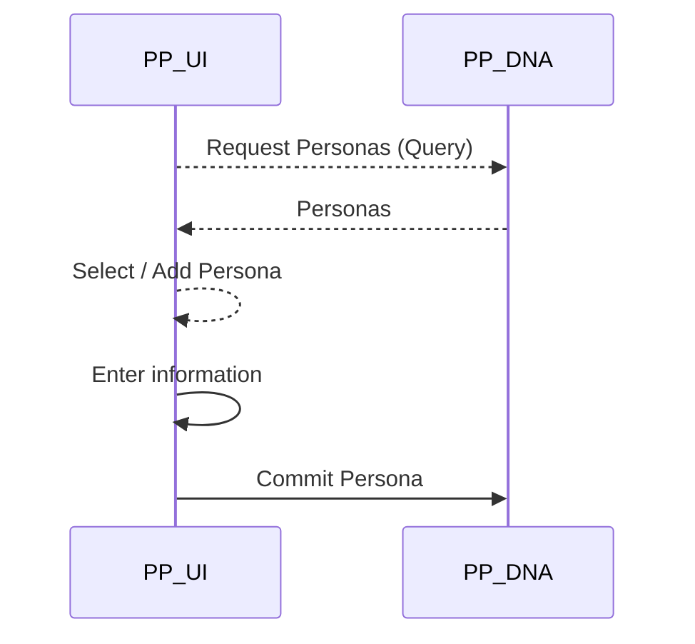
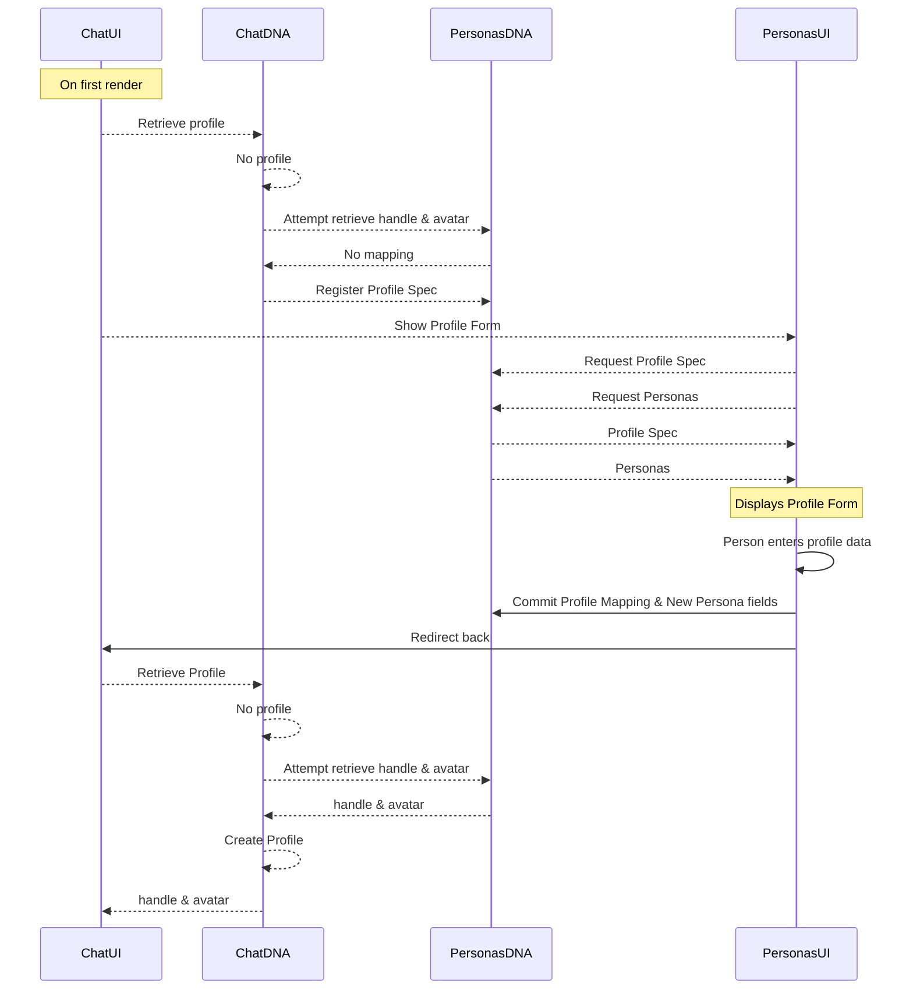

# Building Blocks for Sovereign P2P Identity

<table style="text-align: center; border-width: 0;">
  <tr>
   <td>Arthur Brock<br/>artbrock@holochain.org
   </td>
   <td>Joel Ulahanna<br/>joel.ulahanna@holo.host
   </td>
   <td>Philip Beadle<br/>philip.beadle@holo.host
   </td>
  </tr>
</table>

## Abstract

> We present a collection of tools designed to perform as a complete foundation for distributed applications enable a fully distributed, peer-to-peer identity.  These tools are integrated into an open-source, cryptographic, data integrity framework called Holochain, without promoting the Holochain Foundation into any elevated status of authority as an identity provider. Instead, the tools are specifically designed to enable the emergence of an ecosystem of providers leveraging the tools as a foundation for their services.
> 
> The tools are comprised of::
> 1. **DPKI** - Decentralized Public Key Infrastructure to manage registration, replacement, and revocation of the cryptographic keys used for network addresses, signing, and encryption.
> 2. **A Personal Data Vault** for people to be the authoritative source of their identifying data, which they gives them one place to update changes, as well as track and revoke sharing data with any apps accessing it.
> 3. **Signed Claims and Assertions** enable validation of credentials provided by third party peers or authorities with selective exposure of the data elements they contain.
> 
> From these elements, we believe people can create and manage secure decentralized identity that can integrate with existing identity systems, but is not wholly dependent on them.


## Context & Holochain’s Distributed Framework

Typical centralized approaches to identity management rely on central authorities such as governments or corporations. These systems fail to reach and serve certain populations and are inadequate for today’s rapidly changing world and for the conditions many people find themselves in the modern world.

Some decentralized approaches to identity are little more multi-authoritative rather than a single authority. Other succeed in greater decentralization, such as blockchain based projects like uPort, but incur costly functional overhead as well as scalability challenges from this platform choice.

By building on Holochain the identity tools function as a fully distributed, peer-to-peer (P2P) framework as well as being highly scalable by eliminating the high overhead involved with maintaining global consensus and constructing absolute time sequencing. Real-world identity works fine without requiring either of those constraints, digital identity should also be able to be constructed without them. Holochain’s approach is modeled on these same scalable coordination patterns we find in biology and physics.

Specifically, Holochain operates less like a global state blockchain, and more like git plus BitTorrent. Each node (a.k.a. agent, device, or person) signs any actions it originates to a local hashchain (providing an immutable sequence of local state changes) then publishes entries from their chain to a shared ledger space structured as a sharded, eventually consistent, validating DHT (distributed hash table). There are no consensus bottlenecks to this approach, such that users experience very similar performance to using normal web apps.

Every application on Holochain functions as its own P2P encrypted network. The network ID is the SHA-256 hash of the application code as compiled to WASM (also called the DNA of the app). And the address space of network nodes and data, is the SHA-256 hash of the data. This makes for an extremely large address space (about 1.34e+154) with no top level namespace to create artificial scarcity or encourage name squatting. This should be plenty of elbow room for identity applications and other dApps.

**Mainstreaming with Holo:** Having functional P2P identity by running a crypto framework like Holochain is great, however, mainstream users are generally not ready or educated about the advantages of installing such software so they can function as a peer. Most users are used to accessing centralized systems through their web browsers, so we have created Holo as a web app hosting framework for nodes who are running Holochain and want to get paid for sharing spare computing resources to provide hosting for others. This enables web users a virtually identical experience to using any web site, but puts them on the track to own their own data if or when they decide to install Holochain. This makes these P2P identity tools available to any web users who have an email address and can remember their password.


## Distributed Key Management


### Holochain Conductor and DPKI Standard

Holochain’s distributed data engine functions as a data services library for an executable which runs Holochain apps, serves UIs, and provides system socket connections. We call the runtime system the Conductor since it can orchestrate these resources for many Holochain apps on a single machine. 

The Conductor expects to store public/private keypairs in a password encrypted key store, and have key registration, renewal, and revocation managed by some dApp which binds to the Holochain DPKI methods. We provide a default implementation of the DPKI standards in an app called Deepkey (a sloppy pronunciation of the acronym: Dee-pki). 

As an open source project, the community could build other apps which implement DPKI services for the conductor. The main constraint here is that all nodes of an app must use the same key management dApp.


### Holochain Conductor

Holochain was designed to be highly platform and system compatible. Architecturally, Holochain DNAs are intended to be small composable units that provide bits of distributed data integrity functionality. Thus most Holochain based applications will actually be assemblages of many "bridged" DNA instances. For this to work we needed a distinct layer that orchestrates the data flow (i.e. zome function call requests and responses), between the transport layer (i.e. HTTP, Websockets, Unix domain sockets, etc) and the DNA instances. We call the layer that performs these two crucial functions, the Conductor.

**Important Roles the Conductors plays:**


*   Installing, Uninstalling, Configuring, Starting and Stopping instances of DNA
*   Exposing APIs to securely make function calls into the Zome functions of DNA instances
*   Accepting information concerning the cryptographic keys and agent info to be used for identity and signing, and passing it into Holochain
*   Establishing "bridging" between DNA instances

### DPKI Standard

Like most other distributed systems, Holochain fundamentally relies on public-key cryptography. Among other uses, Holochain nodes are identified by their public keys, and thus provenance of messages from nodes can be checked simply by checking a message signature against the node's identifier. This fundamental use requires nodes to keep the private key secret, to avoid the risk of the node's very agency be compromised. Keeping such secrets in the digital age is a non-trivial problem. Additionally, distributed systems imply an abundance of nodes with public keys, many of which may wish to be identified as being under the control of a single actor. Solutions to this need create yet another layer of keys which sign other keys, and the management of all this can become quite complex.

To address these needs is the function of the public key infrastructure, and in this case, because we use the power of Holochain itself to do this, we have the Distributed Public Key Infrastructure(DPKI)


### Requirements: (encrypted keystore, private keys never travel)

**DPKI provides the following design requirements:**

1. It will provide a way to create new keys for nodes.
2. It will provide a way to revoke compromised keys and replace keys from the node
3. It will provide a way to verify the provenance of keys by grouping them as originating from a single human agent. 
4. It will securely manage private keys. The private keys will never travel over the network.

**Encrypted Keystore:**

For each Holochain DNA instance, the Conductor maintains a Keystore, which holds "secrets" (seeds and keys) needed for cryptographic signing and encrypting. Each of the secrets in the Keystore is associated with a string which is a handle needed when using that secret for some cryptographic operation. Our cryptographic implementation is based on libsodium, and the seeds use their notions of context and index for key derivation paths. This implementation allows DNA developers to securely call cryptographic functions from WASM which will be executed in the conductor's secure memory space when actually doing the cryptographic processing.

The holochain conductor uses a simple interface for the fundamental functions needed.

### Deepkey: Holo’s dApp Implementing DPKI

**Key Unification:** Users can unify the management of their keys across different applications and devices by associating them with a single key which is a one-time use key to establish their umbrella. We call this a KeySetRoot
```
pub struct KeysetRoot {
    pub first_deepkey_agent: HashString,
    pub root_pubkey: HashString,
    pub firstDeepKeyAgent_signed_by_rootkey: Signature,
}
```
**Revocation Rules:** For each KeySetRoot, the controlling agent must identify one ruleset for validating the revocation or renewal of keys. This initially defaults to using a revocation key using a specific derivation path from the users Master Seed. 

Other options such as delegating to a revocation authority, or requiring M of N signatures from friends or colleagues are also available, but are only useful once a user has established enough social connections to make use of these options. 

#### Validation Rules & CRUD Status

Any node can validate the registration or revocation process by confirming authorized Ed25519 signatures that were used in registering or revoking a key. 

Any node can immediately determine whether a key is currently live (valid), whether it has been replaced, or revoked by checking the CRUD status in Deepkey’s DHT for that key. `hdk::get_entry_crudstatus(&pub_Key)`

The simple data structure is used for this.
```
pub struct KeyAnchor {
    pub pub_key: HashString,
}
```

If status = valid, then the key is live

If status = updated, then the key has been replaced with a new key, and they can retrieve the new key as well as check sequence/timing of the key replacement.

If status = deleted, then the key has been revoked.

**Key Derivations:** Holochain uses NaCl and libsodium for its encryption and signing, as well as for management of seeds and key derivations. When someone registers a newly derived key for a Holochain app, they create a public entry in their source chain which publishes the new public key to the DHT, and makes it valid for use. In addtion, they store a private entry to their chain that tracks which app the key is used for and the derivation path to produce it. Having this enables a user to regenerate lost keys from their master seed. 

**Mainstreaming via DID Resolver:** We are providing call methods to integrate with the Decentralized ID (DID) standard such that any Holochain node running the Deepkey app could provide DID resolution services. Both Holo and Holochain organizations will provide a public resolver gateway.


## Personas & Profiles - Web of Trust Whitepaper

The personal data tools built on Holochain are designed to empower people with agency over their information.
Personas & Profiles is a personal data store that replicates across authorised devices on its own DNA. 
Personas & Profiles puts people in control of how their information is used (Displayed or Stored by the hApp) and allows them to share the same information to many different hApps. 
The Personas & Profiles hApp was built to achieve the following goals: 
- To keep personal data private and in control of the person whose information it is by storing it only on devices they are in control of or trust. 
    - A popular scenario would be the person has a mobile phone, a laptop and access to a HoloPort or 2 located in trusted locations. They may also choose to share to close family as well, which is partiucularly useful for medical records and insurance information.
- It has to be more convenient to fill out forms than OAuth. 
    - Profile forms auto fill with matching information from previous profiles. 
    - Each field also has auto-complete along with the ability to manage Persona data. 
    - The person filling out the form can change all matching fields by selecting a pre-existing persona 
- It has to  be simple to manage profile data over multiple Holochain Apps (hApps). 
    - The data stored in a Profile is a mapping to the actual data stored as a Persona. Updating the Persona data such as Address is then reflected in every profile 
    - Every profile is stored locally so there is no need to visit multiple websites to make your information consistent.

## Personas

People typically have more than one persona in their lives. For example at "Work" most people behave differently and may wish to be addressed more formally than if they were amongst "Friends". The "Friends" persona may have a shortened version of the person's name, that while appropriate for conversation may not be appropriate for formal documentation such as a bank account. 
Personas have a name, such as "Personal" and a set of associated fields. Each field is made up of the field name such as "first_name" and the field data such as "Lucy". This gives people the power to save whatever information they want into a Persona.
As an example a person may have three personas, "Default", "Work" and "Friends" each with a field called "first_name", each with a different first name. 

## Profiles

Profiles are made up of two parts, the Profile Spec and the Profile Mappings. The Profile Spec lists the fields the hApp needs, what it wants to do with the information and why. A Profile Mapping is created by the person when they select which Persona and which field the information is in. For example the Profile Spec had a field "first_name" and the person filling out the form selected to use the "first_name" in their "Personal" persona.

When a person starts using a hApp, such as Peer Chat, the hApp typically needs some information about them such as a handle to refer to them by and an avatar to represent them in the chat streams they participate in. Other information such as Full Name may also be requested. 

To do this the Peer Chat hApp registers a "Profile Spec" that lists the fields the app needs, the reason for asking for it and how that information will be used by the hApp.

This is the Profile Spec for Peer Chat:

```=json
{
    "spec": {
    "name": "Holochain Peer Chat",
    "sourceDna": DNA_ADDRESS.to_string(),
    "fields": [
        {
            "name": "handle",
            "displayName": "Handle",
            "required": true,
            "description": "This is the name other people you chat to will see. ",
            "usage": "STORE",
            "schema": ""
        },
        {
            "name": "avatar",
            "displayName": "Avatar",
            "required": true,
            "description": "This is the avatar other people you chat to will see.",
            "usage": "STORE",
            "schema": ""
        },
        {
            "name": "full_name",
            "displayName": "Full Name",
            "required": false,
            "description": "Your name will show when someone clicks it in the members list if you are online",
            "usage": "DISPLAY",
            "schema": ""
        }
        ]
    }
}
```
The sourceDna field ties the Profile Mappings to the hApp and the name is used when displaying the Profiles.
For the Peer Chat hApp the "Handle" & "Avatar" fields have a Usage of STORE which means the data not the mapping will be stored in the Peer Chat DHT. This makes sense as they are used all the time by the hApp and need to be available even when one of the people in a chat room is offline. The usage of this data is clearly shown in the UI with a STORE symbol along with the reason for the hApp needing it. The "Full Name" field, however, is never saved in any way by Peer Chat as it is marked as DISPLAY and from the description given it can be seen that the data is only shown to someone when they explicitly requests it.

In this [Example Profile](https://holochain.github.io/personas-profiles/?selectedKind=Profile&selectedStory=Not%20mapped%20has%20matching%20defaults&full=0&addons=1&stories=1&panelRight=0&addonPanel=storybook%2Fnotes%2Fpanel) the auto complete fields find any matching data in existing Personas. This example has 4 Personas, Default, Personal, Work and Friends with different fields and spelling of some values to demonstrate to use Personas.


## Managing your Personas

You can add edit and delete Personas in the "Personas & Profiles" app.



### Demo
You can try out the UI on the links below.  Make sure you read the *Notes* section.

[Create a New Persona](https://holochain.github.io/personas-profiles/?selectedKind=Persona&selectedStory=New%20Persona&full=0&addons=1&stories=1&panelRight=0&addonPanel=storybook%2Fnotes%2Fpanel)
[Edit an Existing Persona](https://holochain.github.io/personas-profiles/?selectedKind=Persona&selectedStory=Edit%20Existing%20Persona&full=0&addons=1&stories=1&panelRight=0&addonPanel=storybook%2Fnotes%2Fpanel)

## Personas
Personas are stored in 2 steps. First a Persona Spec is created. The returned Persona Address is then used to link each of the fields in the Persona. This was done so that you can add/edit/delete fields in the Persona without the Persona Address changing making it simpler to manage the Persona Field Mappings used in the Profile.
```jsx=
export interface PersonaSpec {
  name: string
  id?: string
}

export interface Persona extends PersonaSpec {
  hash: string
  fields: Array<PersonaField>
}

export interface PersonaField {
  name: string,
  data: any
}

{
   "personas":[
      {
         "name":"Personal",
         "hash":"QmPUFfLugTwizXVcw4VVrzA59MwjV6EKTXRTsHPJLzNPCU",
         "fields":[
            {
               "name":"firstName",
               "data":"Phil"
            },
            {
               "name":"suburb",
               "data":"Burwood"
            },
            {
               "name":"lastName",
               "data":"Beadle"
            },
            {
               "name":"city",
               "data":"Melbourne"
            },
            {
               "name":"address",
               "data":"123 Holochain Road"
            }
         ]
      },
      {
         "name":"Default",
         "hash":"QmX8h3NSrbNLnoj1U1oakM99erFGkrhV4zGr7EphYmje7L",
         "fields":[

         ]
      },
      {
         "name":"Work",
         "hash":"QmWe29VeWJj4CM1oWZT9dtjCZBjAe2dxgShm7KcXQJ1eHy",
         "fields":[
            {
               "name":"firstName",
               "data":"Philip"
            },
            {
               "name":"location",
               "data":"Melbourne"
            },
            {
               "name":"role",
               "data":"Engineer"
            },
            {
               "name":"lastName",
               "data":"Beadle"
            }
         ]
      },
      {
         "name":"Friends",
         "hash":"QmbeCeZBH5UmqoKCaTQh2MiRAnsQD6R2S32SWyrFeEZtyG",
         "fields":[
            {
               "name":"hobby",
               "data":"DJ"
            },
            {
               "name":"nickName",
               "data":"@philt3r"
            }
         ]
      }
   ]
}
```

### Registering and Filling Out a New Profile

The following message sequence diagram shows how a person would fill out a Profile requested by a hApp. 
The first time Peer Chat needs the "Profile" of an agent it registers a Profile Spec (shown above) where each field has a reason the information is needed and whether or not the data will be stored in a Peer Chat DNA or displayed from Personas & Profiles.
When Peer Chat needs the person's "handle" it will first request it from its own store, the design of this is up to the developers. If the field cannot be found a bridge call to the person's Personas & Profiles hApp is made in an attempt to retrieve the field. If this also returns nothing then the person is redirected to Personas & Profiles and the Profile Spec is used to show the Profile Form. The Person then maps their data, saves it into Personas & Profiles and is redirected back to Peer Chat.
Peer Chat then tries again to retrieve the field "handle". It doesnt exist in the Peer Chat DHT so it again bridges to P&P, retrieves the value and then if it's a storeable field saves it into the Peer Chat DHT.



When the Profile is saved in P&P each field Profile Mapping looks like this:

```jsx=
export interface ProfileMapping {
  retrieverDNA: string,
  profileFieldName: string,
  personaAddress: string,
  personaFieldName: string
}
```


**Mainstreaming with OAuth:** Holo will provide a public OAuth bridge so that users of the Personas app can become their own OAuth provider for providing identity info and single sign-on to other sites, without having to use Google, Facebook, or other centralized corporations.


## Composable Credentials, Claims, and Assertions


### Signed Claims

In addition to the Deepkey and Personas apps, Holochain is also building a fairly simple framework for vouching and verifying a few types of claims and assertions regarding users and their credentials.


### Claims without Data Exposure

All the data in the Personas app is self-asserted by each user. Nothing stops you from claiming your name is Bob, Henry, or Henrietta. This is completely appropriate for many uses of identity data, however, there are cases which require clearer correlation between self-asserted identity and socially validated identity. 

One possible option is to have people who know you, and can confirm that it is you they are interacting with digitally, create claims along the lines of: The SHA-256 hash of this person’s first name, last name = Qma39slKn0usdlkj3HIHD3892. 

Then when a user chooses to expose their first name and last name to someone, they can hash it and see all these people who have signed a social validation of this data. You may know or trust one of the claimants, and feel comfortable enough to proceed considering their identity to be verified. 

Obviously you can make various useful combinations of such data fields, and even mix in some salt which the self-identifying user can also provide so that people can’t try to match the hash of “John Smith” against user hashes. 

We consider this a simple baseline for socially triangulated identity that functions without anyone needing to leak any personally identifying data.


### Claims with Selective Data Exposure

Sometimes even stronger validation is needed. Someone may have legal reasons to verify such things as age, citizenship, driver’s license, tax ID, or passport data. In this case, a user can store private entries to their source chain which contain these official credentials as a signed Merkle tree, which has been signed either by the issuer of the identity, or other “trusted” validators of identity, such as a KYC service. 

This allows the user to provide a Merkle proof of only the minimal fields required to confirm their age, or citizenship, for example. The signature validation and lookup of the signing validator or issuer are simply another set of keys and identities one can look up inside the framework. These entities could also publish their public key on other trusted channels, such as their web site, so you can confirm you are interacting with a party like the DMV or Social Security Administration.

**Mainstreaming with Verifiable Credentials:** We plan to provide APIs compatible with Verifiable Credentials so that these tools play well with others using these emerging standards.


