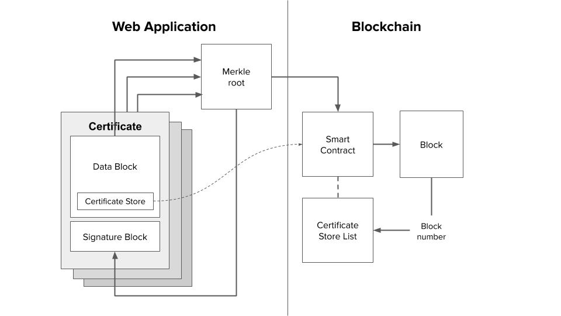

#**Decentralising OpenCerts**

Authors: [Bill Claxton](mailto://williamc@nextid.com), [Wong Wai Chung](mailto://waichung@nextid.com)

###**Abstract**

Singapore is a tiny equatorial island with a population size similar to Finland and one of the world’s most advanced industrial economies.  The country describes itself as a “Smart Nation” with a strong commitment to digitisation of essential public services[^1].  Digitalisation is a key pillar of the Government's current public service transformation efforts[^2].  Key thrusts of this initiative are digitally enabled workplaces and a digitally confident workforce. Specific implementations are web-based public services that are “pre-filled with Government-verified data” which offer “digital options for wet ink signatures”. 

Against this backdrop, it is no surprise that Singapore’s government should pioneer an effort to put academic certificates on the blockchain, nor is it remarkable that the solution architecture is focused on trusted issuers white-listed by government agencies.  It is the authors’ thesis that this is an acceptable compromise on the path to decentralisation.  However it does highlight the tension between the co-evolution of government-issued IDs and decentralised opt-in credentials which are cryptographically verifiable.

###**The OpenCerts Solution**

In March 2018, Singapore’s GovTech unit introduced the OpenCerts solution for issuing academic certificates linked to the Ethereum public blockchain[^3].  Essentially, OpenCerts is an open source library and a specification for a JSON LD schema which is optimised for academic certification.  GovTech is also operating an OpenCerts verification service.

Another agency, Skills Future Singapore (SSG), is a statutory board under the Ministry of Education.  SSG is responsible for continuing education and vocational training, particularly for Singaporean mid-career employees.  In the OpenCerts project, SSG assumes responsibility for data storage and access control.  In May 2019, GovTech, SSG and 16 Institutes of Higher Learning (IHLs) announced a collaboration agreement to issue diplomas and degrees to every student using the OpenCerts format[^4].  Because it’s a national certification initiative, this was a big announcement which made international headlines.

Before examining the OpenCerts technical solution, let’s just recap the role of the government agencies.  GovTech is providing technology infrastructure and SSG is acting as a data hub, providing access controls as well as long-term hosting of certificates.  This custodial role is consistent with the mission of SSG, which is to assure that workers can continue to meet the demands of a rapidly evolving economy. 

###**Technical Review**

OpenCerts’ design is described by GovTech as building on OpenBadges and BlockCerts.  The certificates have a user-friendly visual layer (formatted using React templates) and a verifiable cryptographic layer which complies with OpenCerts’ unique JSON LD schema.  Certificates are anchored to the Ethereum blockchain. 

The OpenCerts schema includes a data payload and a signature.  This design supports payload hashing and recording a smart contract address in the signature (more on this below). This correspondence between the hashed payload and data written into a smart contract is what makes it possible for a certificate to be compared with its hash on the blockchain, to determine if the credential has been tampered with.

OpenCerts libraries support batch processing.  As each certificate payload is hashed, the hashes are combined into a merkle tree (a data structure in which each non-leaf node is a hash of its respective child nodes).  The merkle tree is digested to a merkle root and that is recorded on the blockchain.  

So far, this seems similar to how BlockCerts works.  Looking more closely, OpenCerts uses a Certificate Store - a smart contract containing transaction processing and list management functionality.  

A Certificate Store is a ledger of issued and revoked certificates, controlled by a particular institution.  An institution is required to deploy at least one instance of the Certificate Store smart contract on the Ethereum public main net.  This contract is used by the OpenCerts verification service to confirm that certificates have been issued, were not revoked and have not been tampered with subsequently. 

Each time a batch of certificates is issued, the Certificate Store smart contract will create a new Ethereum transaction which records the merkle root for the batch.  Also, the block number of that transaction and the merkle root are appended to a list kept by the Certificate Store.  Access to this smart contract is public-read, owner-write.  The list can be inspected by anyone.  We’ll see how they can discover the contract address in the next section.

Issuing institutions provide each recipient with a copy of their certificate, transmitted as a JSON LD file via the school email address.  At least one of the schools encloses the certificate in a password-protected zip package.  In this manner, the institution is able to assure that each student gets their correct certificate(s) in a relatively private way.

Once certificates are issued, the files are transferred to Skills Future Data Hub where they are hosted permanently and linked to an individual’s online career profile. It is our understanding that the files are not encrypted at rest.  Certainly the recipients are encouraged to share their certificate files in plain text, for example by emailing them to a potential employer.  Also, the verification page provided by GovTech can only read plain text certificate files.

It bears noting that recipients do not explicitly accept the certificates, leaving open the possibility of repudiation.  The rationale for schools to issue certificates without an acceptance process is that schools in Singapore have good systems and can be trusted to issue certificates without errors.  Although issued certificates automatically appear in an individual’s career profile, the recipient may hide it if they wish to.  This is an opt-out system.  If a recipient felt that information in the certificate was incorrect, they would contact their issuer by email and request that the certificate be re-issued.

The value of a system which issues verifiable digital credentials is largely determined by whether these credentials are relied on by consumers, such as employers and graduate schools.  This is not only a matter of cryptographic proofs but also useability.  With OpenCerts, the recipient is given the raw JSON file and encouraged to transmit it to consumers via an email attachment.  There is a very reasonable question whether anyone who receives such data: (a) knows what purpose it fulfills, and (b) knows how to verify the authenticity of the credential it represents. 

###**Identity**

OpenCerts does not include Decentralised Identifiers (DIDs) or utilize public private key pairs.  The issuer and recipient are designated by name.  So how does a consumer, such as an employer or graduate school, know whether a certificate issuer is genuine?  With access to the OpenCerts code, anyone can create a Certificate Store and begin issuing certificates under whatever name they choose.

GovTech has chosen the approach of creating a Registry or “white list” of approved issuers, in somewhat the same manner as one would establish a certificate authority.  The Registry is a list of Certificate Store addresses, organisation names, ids, email addresses and other data.  It sits at the top of a hierarchy which includes Certificate Stores and transactions containing merkle roots.

This choice to use a central Registry was intentional.  Referring to Distributed Ledger Technology, GovTech says: “DLT is best suited for a low-trust environment or one with no central authority. In the high-trust educational environment we have in Singapore, it might not make much sense to use DLT to attest local certificates. Unless, it’s for cross-border.”

Rather than operate the Registry themselves, GovTech delegated this role to Skills Future (the agency handling storage and access).  But being a government agency focused on continuing education and vocational training of Singaporeans, the Skills Future Registry is only open to local academic institutions.  This leaves a gap in terms of applying OpenCerts technology to commercial academies, international schools with campuses in Singapore, vocational training centres and academic institutions outside of Singapore.

Another concern regarding the Registry is that local academic institutions cater to non-Singaporeans, such as Indian and Chinese nationals.  The Skills Future career management service requires a government issued ID to login, but foreign students don’t have this credential.  Skills Future is working around this problem by allowing foreign alumni of Singapore education institutions to create a MySkillsFuture account using their student ID and personal particulars, in order to retrieve their digital certificates.

Finally, since the recipient is designated by name only, there is the concern over how the consumer is going to trust that whoever presents the certificate is indeed the person named as recipient.  This is perhaps the greatest challenge for OpenCerts but it is not unique to this technology.  Without a wallet having key management capability, it is difficult to assure that someone who is holding a certificate is the same individual as the named recipient.

###**Implications**

As we have seen, OpenCerts has a number of limitations.

**Institutional Centralisation**

*   GovTech and Skills Future, being government agencies, are both centralised.
*   To ensure that issuers are trusted, a Registry has been implemented.  But it is only open to accredited educational institutions in Singapore, greatly limiting general applicability.
*   The Registry and Certificate Store architecture allows the government of Singapore to monitor every issuer and every certificate transaction.  They could easily censor any issuer for a valid reason or no reason at all.
*   Access to the storage system relies on a national identity scheme which is not accessible to foreign students and alumni.

**Weak Identity Management**

*   Recipients are not required to accept their certificates, creating opportunities for  repudiation (eg- recipient says they did not notice an obvious error).
*   Certificates rely only on the names of the issuer and the recipient.  These are certainly not unique identifiers and (except for the issuer Registry mechanism) could be easily spoofed.
*   No mechanism is in place to assure that the holder of a credential is in fact the recipient named in the credential.

**Poor Privacy Protection**

*   Certificates are stored as unencrypted JSON files, and recipients are encouraged to share them in plain text format.  Verification also requires plain text certificates. This limits the type of information which can be certified without infringing a recipient’s privacy.
*   Storage of certificates is an opt-out rather than an opt-in service. This requires the recipient to login to remove a certificate and prevent unwanted disclosures.

**Limited Disclosure**

*   Ideally one would want the blockchain transaction id to be recorded in the JSON LD signature block, and possibly have it appear on certificates. The Certificate Store implementation hides the blockchain transaction id.

Can OpenCerts work effectively as a verifiable credentials system with all these limitations?  We believe that the code and schema provided by OpenCerts can be the foundation of a verifiable digital credentials issuance mechanism.  But several changes have to be made in the implementation, which a commercial company could undertake.  Indeed, our company NextID Pte Ltd is doing this work now.

###**Technical Resolution**

The transaction id could be easily added to the signature block of the JSON file without compromising the hash.  This would allow a certificate to display the transaction id, which any consumer could easily inspect without having an understanding of the Certificate Store mechanism.  This change would improve consumer confidence that the certificate is indeed anchored on the blockchain.

Privacy protection could be enhanced in a number of ways by encrypting the certificates with a symmetrical document key.  An AES-256 symmetric key is fast and secure, providing a simple method for securing documents at rest.  This is separate from the PKI keys used in a certificate to identify an issuer and recipient, or used as an envelope when sharing a document with a consumer.  With document encryption, certificates can contain personal information without compromising a recipient’s privacy.

Also, by adding an acceptance step in the issuance process, the recipient has the choice to opt-in to storage of their certificate.  They could request corrections or simply opt-out (by not responding to the invitation).  Certificates which are not accepted by the recipient are said to be issued but unpublished, and these would not be accessible in persistent storage.

At the time of acceptance, the recipient could supply a password to be included in the document key.  This provides a browser-based method for generating a document key which is in control of the recipient, without needing to supply a public key or use a wallet.  And the issuer would not be able to access the encrypted certificate or monitor its use, further enhancing privacy for recipients.

There is a debate over whether certificates should identify recipients using national identity, public key or some other variation of Decentralised Identity (DID).  Our view is that national identity and DID will coexist but until the usability of wallet software improves and wallet use becomes mainstream, we have to make do with personal names as the recipient identifier for OpenCerts. The strength of the credential can be bolstered with additional attributes like national ID and birthdate which add confidence that the subject and holder of the credential are in fact the same entity.

But there really can be no debate regarding how the issuer’s identity is established. The use of a registry for verifying issuers by name is simply not scalable. We view it as essential that each issuer must be identified by 3 attributes: public key, domain name and email address of the registrar.  These lay a foundation for decentralised web of trust methods to buttress the verification of issuers. We would ultimately like to see verifiable attestations for issuers, so that various reputable parties can vouch for the issuer.

We plan to implement a storage agnostic wallet for the management of verifiable credentials and allow users to choose a storage service that best suits their needs.  Our plan is to offer a permanent storage solution which gives OpenCerts recipients an alternative and fully autonomous method to store and manage their verifiable credentials. We will still use the SSG data hub and Registry when supplying issuance services to local academic institutions, but certificate recipients will not be limited to the services offered by Skills Future.  

As presently implemented, Opencerts relies on a minimally viable certificate verification mechanism.  For example, certificates from issuers that are not Singapore academic institutions can be verified using the OpenCerts verification page, but visitors will receive an informational message that the issuer is not recognised.

We will offer a decentralised, open source and fully automated verification service that we hope becomes the gold standard for verification of VCs and attestations.  We will implement this verification service so that it supports certificates encrypted with the service provider’s public key, thus eliminating the need to transmit certificates in the clear.  And we look forward to the day when verification of Verifiable Credentials is a popular free service. 

###**Conclusion**

Singapore is known for its pragmatic governance.  OpenCerts is an initiative which allows academic institutions in Singapore to issue verifiable digital certificates in a common format and make them available for use by graduates as they move forward in their careers.  This is part of the Smart Nation strategy to develop “digitally enabled workplaces and a digitally confident workforce” and it took the GovTech team less than a year to implement the solution.

Yes, the project has taken shortcuts in terms of identity management and privacy.  Institutional centralisation leads to concern over censorship and inability of the initiative to address the broader international market.  But it’s a first step.  The problem we see is that OpenCerts as currently implemented will result in another data silo and recipients of these certificates will not be able to have their credentials recognised outside of Singapore.

However, by relying on the rich data structure of JSON LD, the OpenCerts initiative has the potential to support the emerging standard of Verifiable Credentials[^5]. Our solution to decentralise OpenCerts is to add rich support for identity, beginning with a public key for issuers, to encrypt data at rest, place credentials in a persistent storage, implement a wallet for easy key management and gradually migrate certificates to decentralised storage such as IPFS or FileCoin.

The pressure to go digital is driving a transformation to move personal identity information from institutional silos into the hands of identity owners.  We envision that this pressure will result in many national or sector-specific initiatives being launched in the next 3-5 years, resulting in a proliferation of schemas and proprietary APIs.  We don’t see this as a threat to broad adoption of Verifiable Credentials as long as guidance is provided on how to migrate these initiatives towards supporting the standard W3C implementation.

Notably, the full implementation of Decentralised Identifiers[^6] is optional for such projects, so long as the identifier is globally unique and accessible by URI.

<!-- Footnotes themselves at the bottom. -->
### Notes

[^1]:
     “Government Leads Digital Disruption In Singapore”, Singapore Economic Development Board, August 2017, https://www.edb.gov.sg/en/news-and-events/insights/innovation/government-leads-digital-disruption-in-singapore.html

[^2]:
     “Digital Government Blueprint”, Government Technology Agency (GovTech), Singapore Prime Minister’s Office, June 2018, https://www.smartnation.sg/docs/default-source/default-document-library/dgb_booklet_june2018.pdf

[^3]:
     “Distributed Ledger Tech for Public Good“, Government Technology Agency (GovTech), Singapore Prime Minister’s Office, April 2018, https://blog.gds-gov.tech/distributed-ledger-tech-for-public-good-328a7ef12160

[^4]:
     “Graduates to get fraud-proof, convenient digital certificates”, Today Online magazine, May 2019, https://www.todayonline.com/singapore/digital-certificates-will-be-issued-graduates-year

[^5]:
     “Verifiable Credentials Data Model 1.0”, by Manu Sporny et al, March 2019, https://www.w3.org/TR/verifiable-claims-data-model

[^6]:
     “Decentralized Identifiers (DIDs) v0.13”, by Drummond Reed et al, July 2019, https://w3c-ccg.github.io/did-spec

