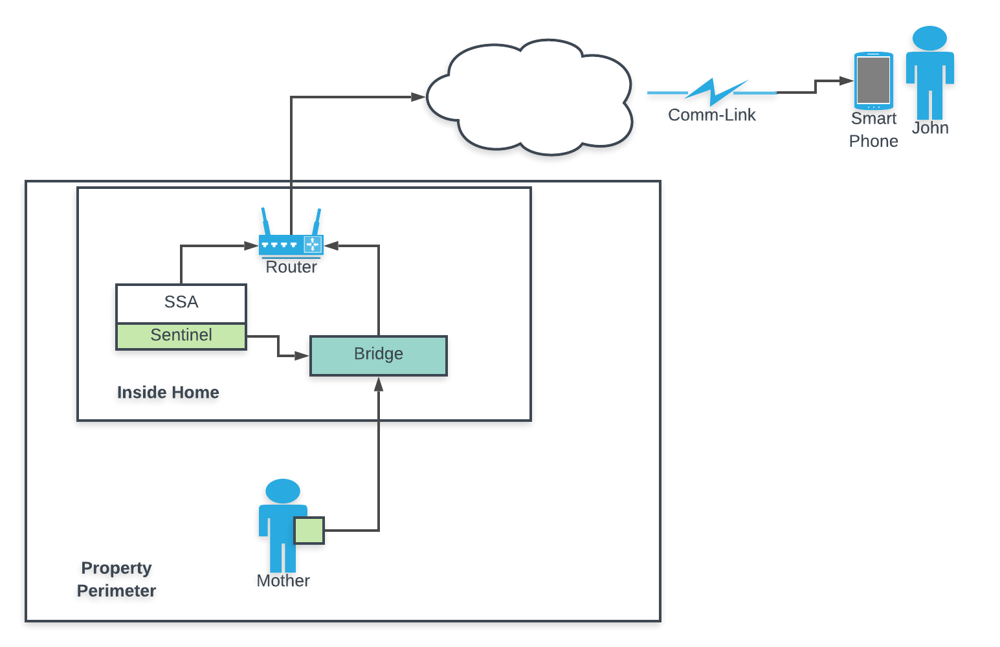

# A Business Framework for SSI in IoT

Authors: Michael Shea (The Dingle Group) & Michael Corning (Secours)

## Abstract

The IDC recently forecasted that by 2025 there will be 41 Billion connected IoT devices generating more that 79 Zettabytes of data. Now it should be noted, that while not all these devices will be generating personal or person related data, they all will have issues around access, control and validation/verification of data being produced/transmitted. It is concerning that in 2019, a consensus of opinion exists that the Internet of Things ecosystem continues to have significant challenges around the realms of security, data access, and control.  Conversely, within the SSI community there is a sense that Decentralized Identifiers (DIDs) and Verifiable Credentials (VCs) can provide the 'silver bullets' to solve these challenges.  

What is not so clear is how.  This is not a technical problem (though there are challenges in this realm), but a business problem; in the hard reality of tight margins and production costs, it is unclear how to build a financial model that demonstrates the financial returns necessary to justify the investment and additional operating costs and potential loss of revenue by adding SSI into new or existing product lines.  This paper attempts to map out a typical IoT system, identify potential SSI deployment points and develop a framework of questions that once answered will provide the information necessary to develop the business case to support the necessary investment.

## The Approach

1. Define reference IoT system for analysis.
2. Outline current top security concerns within the IoT sector
3. Identify questions to be answered
4. Reframe reference IoT system in the context of SSI, identify SSI touch/integration points, identify area of potential cost increases/decreases, identify whether each cost is an attractor or detractor to the overall appeal of the system.
5. Summary

## Reference System

### System Components
* SSA - Smart Smoke Alarm, this device has additional capabilities to generate alerts to external services.
* Scout - a small tracking device that is GPS and/or Bluetooth enabled.
* Bridge - an interface device for the Scout that is connected to an TrackerCo's network.
* Wireless Router - Access point for the household to ISP

###

### User Story

Note: This story is purposely focused on the technical operating characteristics of the story.  Is should be assumed around proper Power of Attorney, and Authorization for use of tracking elements for safety and guardianship controls have been properly executed.

#### Consumer Perspective

John has a mother with dementia. While John's mother is still capable of living in her own home, John is worried about the safety of his mother.  To provide a degree of surety, John has installed a combined solution from TrackerCo and Secours in his mother's home.  The solution is contains the three following components: Smart Smoke Alarm with integrated Scout ($40), 5 separate TrackerCo Scout modules ($40 = (5*$8)), and a TrackerCo Bridge ($125).  The TrackerCo Bridge aggregates location data from all the Scouts and connects to the TrackerCo Network through the home's WiFi Router.  As part of the setup TrackerCo setup process each of the Scout's are regarding with the Bridge. 

People come and go in the home and interact with the SSA. John knows that his mother never leaves the house without her purse, so he has put one Scout in his mother’s purse. This Scout in her purse will interact with the SSA and data from the interaction between her Scout and the SSA are stored in the TrackerCo Network without cost. This data has no reference to John or mother; only to the location of the Scout. If somebody knows the digital identity of mother’s Scout, they can pay for a query the TrackerCo Network for her location. Not good.
 
John is a Secours member, and this comes with a dementia monitoring member benefit. This benefit is like a webhook on the TrackerCo network, so when the purse leaves the range of the SSA, John gets notified and pays a $2 fee for each query. After a month, John has paid for too many false positives, so he further restricts the notification threshold. 

#### Vendor Perspective

TrackerCo has created the Scout and Bridge products as a general purpose geo-location solution collecting geolocation data from the Scout.  Scout's can be either Bluetooth and/or GPS enabled. The consumer will select the appropriate configuration based on usage and/or integrated products. The Scout only records current location and does not otherwise identify directly back to an individual.  However, if the device id becomes known, it is possible to reverse engineer the location history of the individual.

Scout's connect to the TrackerCo Bridge using Bluetooth.  Once data is aggregated in the Bridge it packages the data, digitally signs the data and writes it to the Network.  

TrackerCo provides software/firmware updates to their devices.  The devices are shipped from the factory with a default user/password that the customer is encouraged to update.  Updates to the Scouts are provided through the Bridge by the device owner.  TrackerCo would like to have the ability to push over the wire updates to both the Bridge and Scouts, but costs of infrastructure, security concerns, and negative customer perceptions have prevented forward motion on this effort.

TrackerCo sells the Scout and Bridge hardware and has developed a partner network who are leveraging TrackerCo's data to create products and services.  Secours is a development partner of TrackerCo.  Each of these development partners pay to access the data stored on the TrackerCo network.
 
All these devices have firmware. Today, firmware updates have minimal access controls. Vendors can push updates without the owner knowing.  This means that each of these devices has some level of user based authentication and access controls.

## Current Concerns

Even with IoT exploding across all sectors of society it is surprising that the number of large and significant security gaps continue to persist.  The following list of security concerns was created in late 2017, but unfortunately this list is still very much relevant today.

1. Secure constrained devices
2. Authorize and authenticate devices
3. Manage device updates
4. Secure communication
5. Ensure data privacy and integrity
6. Secure web, mobile, and cloud applications
7. Ensure high availability
8. Detect vulnerabilities and incidents
9. Manage vulnerabilities
10. Predict and preempt security issues

< Additional definition information on security challenges in source: https://developer.ibm.com/articles/iot-top-10-iot-security-challenges/ (viewed August 16, 2019) >

In addition to these is the major security threat due to the lack of user knowledge of cyber-security fundamentals, such as trigger updates/auto-updates, change default passwords and so on. 

As part of this effort, the concerns that can be addressed by SSI will be identified.

## Framework Questions

A market is a summation of positive (or reinforcing) forces that are countered by balancing (or detracting) forces.  In the IoT space the array of security concerns are a strong counter-valing force that have the ability to destroy brand reputation or significantly limit growth due to fear and lack of trust in the technology.  The figure below is a reasonable illustration of the sector the dynamics.  

(Source: The IoT Promises New Benefits and Risks: A Systematic Analysis of Adoption Dynamics of IoT Products - SSRN-id3022111.pdf)

* Map out the following system processes : 
    * 1. data flow - how does data move within/around the system?
    * 2. money flow - how are costs of the system currently dealt with, and how does revenue flow back to the vendor?
    * 3. physical flow - good or services flow through the system?

* Map out value chain; flow of goods and services and return flow of money.
* For each IoT system where are the big commercial costs?  
* How is device identity managed?
* How does the system work with a vendor issued ID?
* How does system change when there is no vendor issued ID for the system components?
* How does the system change when the ID is self issued?
* How does the system change when there is no central ID provider?
* Who is the device controller?  
* Is the device controller also the data subject?  
* Is the data produced by the device about a human data subject?
* How are device updates managed?  Can the device be updated over the air?  Are device updates the responsibility of the user? 
* Who does the device communication with?  Other devices? Device controller? Device user?
* If usage or data consumption can be identified can the device (asset) be shared?
* By adding identity (owner, controller, user) does this change the levels of services that can be offered?


## Reframed Reference System

To be added

## Summary

To be added
