DID Resolution collected diagrams
=================================
Markus Sabadello, Danube Tech (https://danubetech.com), Vienna, July 17th 2019

The [DID Resolution spec](https://w3c-ccg.github.io/did-resolution/) is a
[work item](https://github.com/w3c-ccg/community/blob/master/work_items.md) of
the W3C [Credentials Community Group](https://www.w3.org/community/credentials/) (CCG) that builds on the main
[DID spec](https://w3c-ccg.github.io/did-spec/). A version v0.1 has recently been released
as part of the CCG's [Work Item Process](https://docs.google.com/document/d/1vj811aUbs8GwZUNo-LIFBHafsz4rZTSnRtPv7RQaqNc/).
The released v0.1 is still an early draft; work now continues on v0.2.

The following is a collection of the diagrams that have been used so far to illustrate various key topics of DID Resolution.

# DIDs and DID URLs

Resolving a **DID** basically means executing the "Read" operation of the applicable DID method. Dereferencing a **DID URL** involves additional, method-independent logic (see below). 

<a href="./media/did-resolution-1.png">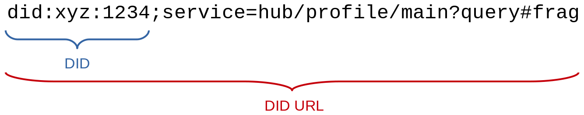</a>

The result of "resolving a DID" is a DID Document or a [DID Resolution Result](https://w3c-ccg.github.io/did-resolution/#did-resolution-result).

The result of "dereferencing a DID URL" is a DID Document, or part of it, or a service endpoint URL, or another resource.

# DID Resolver Architectures

See [this part](https://w3c-ccg.github.io/did-resolution/#architectures) of the DID Resolution spec.

A "local" DID Resolver (e.g. invoked via local code or command line tool) retrieving a DID Document through "local" execution of the DID method's "Read" operation (e.g. by direct access to a blockchain full node):

<a href="./media/did-resolution-2.png">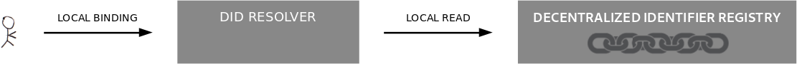</a>

A "local" DID Resolver retrieving a DID Document through "remote" execution of the DID method's "Read" operation (e.g. by using a remote blockchain explorer API):

<a href="./media/did-resolution-3.png">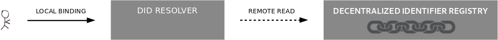</a>

A "remote" DID Resolver (e.g. invoked via the [HTTP(S) binding](https://w3c-ccg.github.io/did-resolution/#bindings-https)
or the [DIDComm binding](https://github.com/hyperledger/aries-rfcs/blob/master/features/0124-did-resolution-protocol/README.md)):

A DID Resolver that supports multiple DID methods:

<a href="./media/did-resolution-6.png">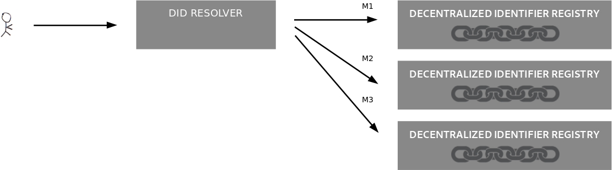</a>

A "local" DID Resolver that invokes a "remote" DID Resolver, which in turn supports multiple DID methods:

<a href="./media/did-resolution-7.png">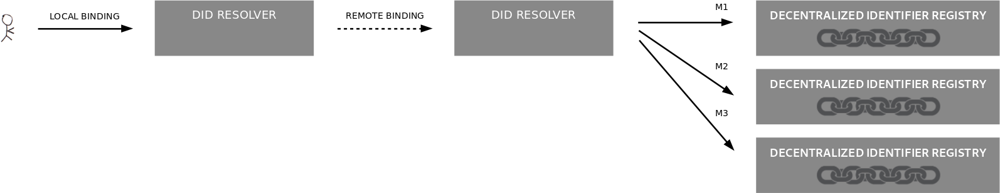</a>

# DID URL Dereferencing

See [this part](https://w3c-ccg.github.io/did-resolution/#dereferencing) of the DID Resolution spec.

The DID URL is just the DID itself. The DID URL is dereferenced to the DID Document:

<a href="./media/did-resolution-8.png">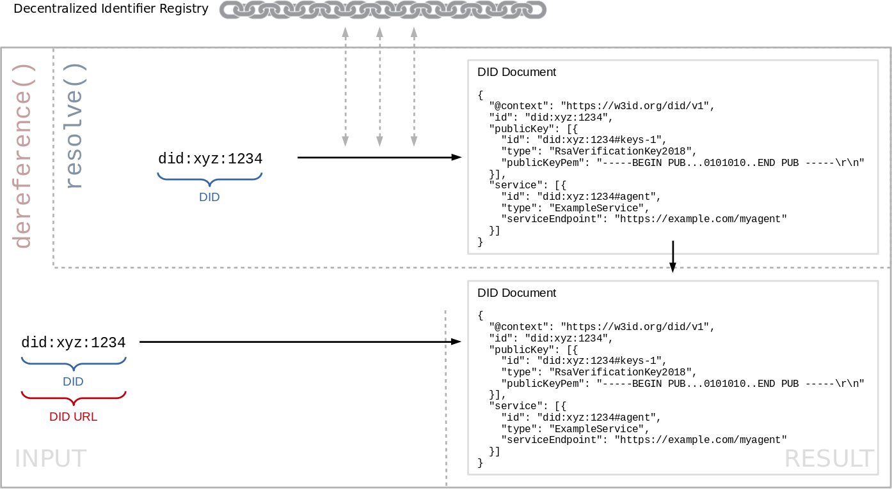</a>

The DID URL contains a [`service` matrix parameter](https://github.com/w3c-ccg/did-spec/pull/190). The DID URL is dereferenced to a service endpoint URL:

<a href="./media/did-resolution-9.png">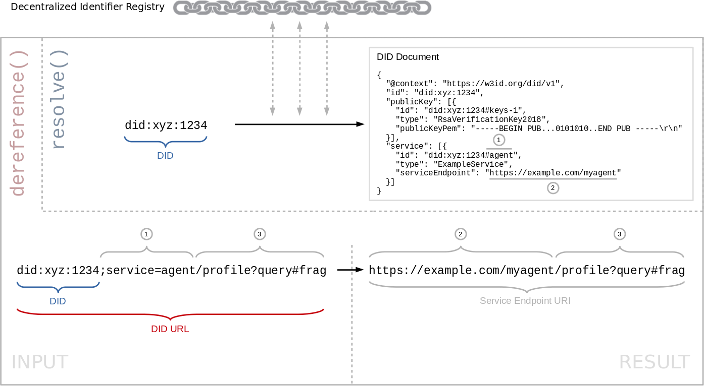</a>

The DID URL contains a fragment. The DID URL is dereferenced to a part of the DID Document (a service):

<a href="./media/did-resolution-10.png">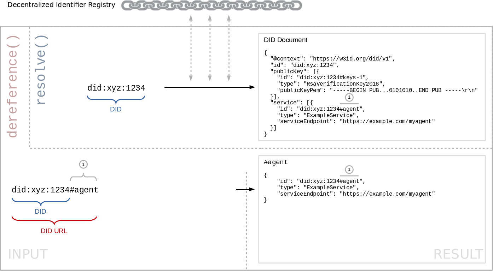</a>

The DID URL contains a fragment and is dereferenced to a part of the DID Document (a public key):

<a href="./media/did-resolution-11.png">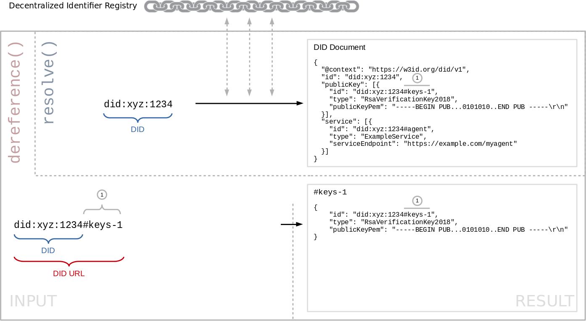</a>

The DID URL contains a [`version-time` matrix parameter](https://github.com/w3c-ccg/did-spec/pull/194) and a fragment. The DID URL is dereferenced to a part of the DID Document (a public key) at a specific point in time:

<a href="./media/did-resolution-12.png">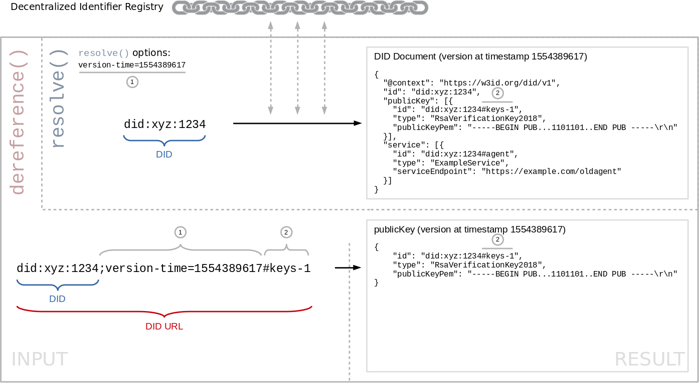</a>

The DID URL contains a [`version-time` matrix parameter](https://github.com/w3c-ccg/did-spec/pull/194) and a [`service` matrix parameter](https://github.com/w3c-ccg/did-spec/pull/190). The DID URL is dereferenced to a service endpoint URL at a specific point in time:

<a href="./media/did-resolution-13.png">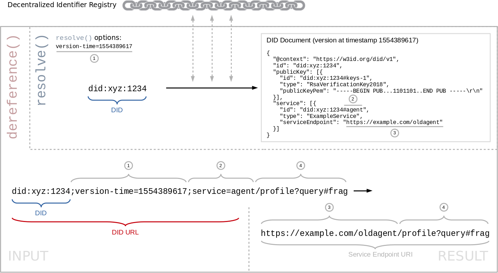</a>
