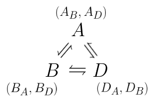

# Nodemail

Ethan Brown
ethn@ethn.co


- [Nodemail](#nodemail)
- [What is Nodemail?](#what-is-nodemail)
- [Introduction](#introduction)
- [Overview](#overview)
- [Concepts](#concepts)
  * [Terminology](#terminology)
    + [Traditional email](#traditional-email)
    + [In Nodemail](#in-nodemail)
  * [Nodes](#nodes)
  * [Client "Wallets"](#client-wallets)
  * [Receiver Addresses](#receiver-addresses)
  * ['Where' is Nodemail](#where-is-nodemail)
  * [Federation vs. Decentralization](#federation-vs-decentralization)
  * [Hierarchical Deterministic Keys](#hierarchical-deterministic-keys)
- [Two party communication (1-to-1)](#two-party-communication-1-to-1)
  * [Two party Nodemail-to-Email](#two-party-nodemail-to-email)
    + [Scenario 1](#scenario-1)
    + [Scenario 2a](#scenario-2a)
    + [Scenario 2b (Receiver Address)](#scenario-2b-receiver-address)
  * [Communicating with a corporation](#communicating-with-a-corporation)
  * [Two party Nodemail-to-Nodemail](#two-party-nodemail-to-nodemail)
- [Multiparty Communication (Many-to-Many)](#multiparty-communication-many-to-many)
- [Goals](#goals)


# What is Nodemail?

Nodemail is a decentralzied protocol for communciation which builds upon the concepts of Self-Sovereign Identity, Hierarchical Deterministic Keys (like BIP32), Decentralized Identifiers (DIDs), and distributed content-addressable storage (like IPFS or dat://). It aims to become a technology that helps build a bridge between the current communication landscape and a future in which our communication technologies afford us greater capacity for openness, trust and subtlety. It currently focuses on interoperability with email; however, in general it can be seen as a system for identity management equally relevant to other forms of digital messaging and transaction.

# Introduction

One impetus for this work, personally, is the feeling that digital communication is a huge part of my life, and yet I feel a general unease about the compromises I must make in the course of communicating digitally with others. I see a lot of potential for how things might go, but feel the current situation is quite limiting. 

One such limitation I can describe by talking about the experience of meeting someone new. When I meet a new friend, perhaps while traveling, there is a profound sense of newness, freshness, emergence. I want to stay in touch in way that maintains this sense of freedom, that reflects the profound opportunity that is afforded us by the unfolding of the future. And yet, what are my choices? My email, my messaging account, my phone number. Each of these things has so many associations, encumberances, liabilities and histories, that upon the connection being made, I feel as if something has been lost or tarnished. I stand by this feeling, and feel there is justification for exploring it more deeply. And I have wondered what alternatives there may be.

For a previous exploration of these issues please see my post here:
http://ethn.xyz/portfolio/nodemail/
or an adapted form I submitted for Web of Trust 8 in Barcelona:
https://github.com/WebOfTrustInfo/rwot8-barcelona/blob/master/topics-and-advance-readings/structures_of_identity.pdf

Nodemail, then, is a system which seeks to create a robust and secure framework that relesases us from our dependence on ossified addresses, and enables us to conceive of communication from the standpoint of networks built on fresh, unique, consensual connections.


# Overview

Nodemail is a protocol which describes a system of communication in which each participant generates a unique hierarchical node for each connection they make, through which they make ongoing structures of communication, shifting the locus from static, publicly available identities/addresses to unique addresses/identities born through connection with others. Further, users maintain the ability to grant and revoke the access others have to communication with them through management of the address which corresponds with each connection. By using such as system, individuals are granted greater control over the correlations others may make about their social networks.  

There are several clear benefits to generating a new address for each connection based on hierarchical key structures:

- grant and revoke access others have to communicating with you
- track how and when others are sharing your contact information
- more easily maintain and separate contextual identities 
- default expectation of privacy and silence 

It is not currently practical or even respectable to maintain so many addresses. Nodemail aims to streamline and normalize the experience of creating individual addresses for each connection we make.

Furthermore, a large part of the Nodemail protocol concerns itself with making hybrid communication with email possible. In principle, Nodemail would be much simpler to implement if it did not seek to create interpoerability with email. In particular, managing multiple addresses in the context of multiparty communications (i.e. Email threads), currently involves some awkward constructions that I am seeking to make more elegant. But, we are using email at the moment, and so I think we need to build bridges. 

# Concepts

## Terminology

	A(B) : "Alice's Bob" i.e. Alice's node she generated to communicate with Bob.
	B(A) : Bob's Alice 

### Traditional email:

Alice has one email for all her connections 
```					      
                         | <---> Dan's Email  <-- Dan
Alice --> Alice's Email  | <---> Bob's Email  <-- Bob
                         | <---> Joe's Email  <-- Joe
```					  
### In Nodemail:

Alice has unique addresses for each connection she has, and one more degree of separation than traditional email:

```
                            | --> A(D)   <-->         Dan's Email         <-- Dan
Alice --> Alice's Nodemail  | --> A(C)   <-->     Corporation's Email     <-- Corporation
                            | --> A(B)   <-->            B(A)             <-- Bob's Nodemail       <-- Bob
```

## Nodes

A node address can function as an email address like this:

	hNKgdSNrdWSdFl9emSX8IQWvP9coh@nodemail.org
	[IPFS CID to DID file] @ [nodemail server]

A node is comprised of both the Content Identifier (CID hash link) to a Decentralized Identifier document (DID) stored on IPFS, and the document itself, which contains the following information:

	ID
	Timestamp
	Nodemail Protocol Resolving Server Domain(s)
	Public Key (Type 2 HID Child Key of Parent)

This guarantees the integrity of the timestamp and public key, irrespective of resolver domain. 

Nodes are immutable.  	


## Client Wallets

By design, the Nodemail protocol does not codify relationships. I.e., a node does not contain within its DID document a reference to the entity or address it was created in order to communicate with. This task is left to clients, which are akin to cryptocurrency wallets, which maintain these associations. 

Clients handle helper functions, track associations, and manage cryptographic keys. 

## Receiver Addresses

Receiver addresses are human readable addresses used to streamline the process of receiving new communication from people without the recipient needing to interact. A receiver address is an endpoint for a function that generates a new node, sends the node to the correspondent, and informs the correspondent that they may commnicate with their intended recipient through the node. 


## 'Where' is Nodemail 
	
## Federation vs. Decentralization 

In general, Nodemail aims to be a protocol rather than a company, service or platform, but in some cases, especially in the case of interoperation with email, centralized constructs are necessary. Ideally, an implementation of Nodemail can be deployed to a personally owned server, a sever in the cloud, or can be offered to others as a service. In Nodemail-to-Nodemail communication, messages can be end to end encrypted, which makes decentralized structures more feasible. However, in the case of Nodemail-to-Email communication, E2E is not possible by default and so various workarounds are proposed. 

For interoperability with Email a specialized MTA is required which correctly routes email messages to the desired nodemail recipient. 

## Hierarchical Deterministic Keys

BIP32 style hierarchical keys offer several useful properties which are well suited to Nodemail.

For a more in depth discussion, please look into Christopher Allen and Shannon Appelcine's BIP32 primer:
		https://github.com/WebOfTrustInfo/rwot1-sf/blob/master/topics-and-advance-readings/hierarchical-deterministic-keys--bip32-and-beyond.md

Or Gregory Maxwell's thread on Bitcointalk: 
		https://bitcointalk.org/index.php?topic=19137.msg239768#msg239768

In the case of Nodemail, this construct is adopted because it enables several features:

- Public / Private Keypairs can be associated in families descending from a root key.
- Third parties (i.e. Nodemail servers providing receiver address functionality) can generate additional addresses without having access to the root private key
- Greater flexibility in proving ownership of associated addresses 
- Simplifies address generation and key management


> From https://raw.githubusercontent.com/bitcoin/bips/master/bip-0032/derivation.png

# Two party communication (1-to-1)

## Two party Nodemail-to-Email
		
I meet Alice. I use Nodemail, and she uses Email. In order to establish communication, we have three options, of which scenario 1 is simplest:

### Scenario 1	
- She gives me her email address
	i.e. Alice@alicemail.com
- I generate a new node
	i.e. dFJTXtRjXZZQOC0UGBztZERcSq4Aj@nodemail.org, or E(A), Ethan's Alice
- I email her address from my node
- She saves my node as my address

Most modern email clients display "pet names" i.e. Alice C. in addition to AliceC@domain.com, so the actual node address is not necessary for Alice to remember, thank goodness. 

### Scenario 2a
- I pre-generate an address
	i.e. H9vYzjajj6CxJxkpdgHg1seShKYTb@nodemail.org
- On a piece of paper, QR code, etc.
- I give Alice this address
- She emails me with it

### Scenario 2b (Receiver Address)
I use a receiver-address, which is human-readable, and makes scenario 2 simpler for Alice.
I give Alice my receiver address 
	i.e. ethan@new.nodemail.org

My receiver address responds to Alice's email with a default welcome message by generating a new node for her, setting it as the reply-to, and informing her of the address:

	Thanks for your email! 

	I'm using Nodemail, so now that we're connected I have
	a unique address just for you:
	
	(Ethan Brown) rtKHX2yLhmkzWZHcD78oowwKdPl9R@nodemail.org
		
	Please save this as my email. I look forward to hearing from you!
	
	Best wishes,
	Ethan

## Communicating with a corporation

Communicating with corporations is sort of the killer app of Nodemail at the moment, because they are the most likely to track you via your email addresses, and the most likely to sell your address to third parties. Further, the assumption is that they have some tooling which doesn't need human readable addresses. 

In this case, when first establishing communication with the corporation, I can generate a new address which will be used solely for this corporation. In this way, I can keep track of how they use my address, and observe whether they share my address with third parties. If I start receiving spam or unwanted communication on the address that I used for a corporation, I can ignore messages sent to this node in perpetuity. Note that I cannot truly delete this node, as the node itself is immutable. But, I can sign a mesage with the private key of the node to tell nodemail servers that messages should no longer be delivered to it. 


## Two party Nodemail-to-Nodemail
 	
Creating a new connection when both parties are using Nodemail affords a wide range of connection rituals. In each case, the basic goal is to generate nodes for one another and exchange them over a secure channel. There are many ways of doing this, and I do not as of yet have an opinion about this. 

In general, when both individuals are using Nodemail, they can expect features more akin to modern secure messaging apps like Signal than email, i.e. E2E encryption, no need to interact with hashes or keys, and automatic verification of message integrity. 

Through their clients, they can choose to reveal ownership of other nodes to one another, and share connections they have with one another. 


# Multiparty Communication (Many-to-Many)

Multiparty communication poses a unique set of challenges in the case of hybrid conversations involving Nodemail clients along with Email clients. 

Consider the instance where Alice, Bob and Dan are communicating in an email thread:

Bob will become aware of Alice's address for Dan, and Dan vice versa. Ideally, my Nodemail client will make a note of this by analyzing headers, and track the fact that Bob and Dan now know the addresses I use for each of them. In most cases, this is trivial, but it does collide with the ideal 1-to-1 relationship of nodes. 

Further, it presentes challenges in verification. Imagine a sensitive conversation taking place between two colleagues, Alice and Dan. Alice is using Nodemail, but Dan is not -- he simply treats Alice's node A(D) for him as an address. Dan would like to bring Bob into the conversation, so he sends Dan the address he has for Alice. Unbeknownst to Dan, Bob already has contacted Alice, and is using A(B) as her address. Bob now sees A(D), Alice's Dan, and is longer sure that he actually knows Alice after all, since his address for her is A(B).

In general, for the context of Nodemail interaction, these are issues which can be resolved by using the public keys present in each node. Either the client signs each message with the relevant keypair, or in the case of trusted third parties, can sign a message with the parent used to create each node.

In the case of hybrid multiparty communication via email/nodemail, I am working on user interaction methods that expose these proofs as a clickable link in the footer. Of course, this runs into the problem of trusted domains, but that is common enough that I am relying on it as a workaround until I find something more elegant. 



# Goals

I'd like to develop a working prototype that provides much of this functionality and am seeking to define the MVP that leverages an existing open source MTA to provide a container and/or repository which would enable individuals to build their own nodemail servers. I am also interested in running a nodemail server as a service so that non-technical users can experiment with the technnology.

I would be very grateful for any and all thoughts / suggestions, and look forward to meeting you in Prague.


Best wishes,
Ethan


