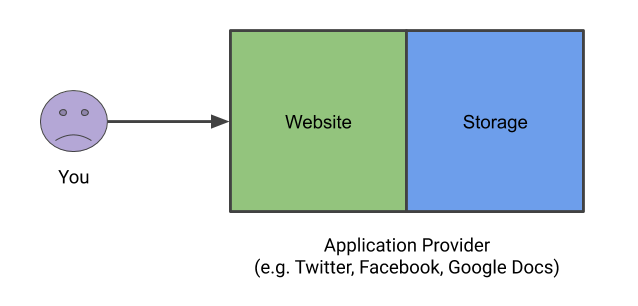
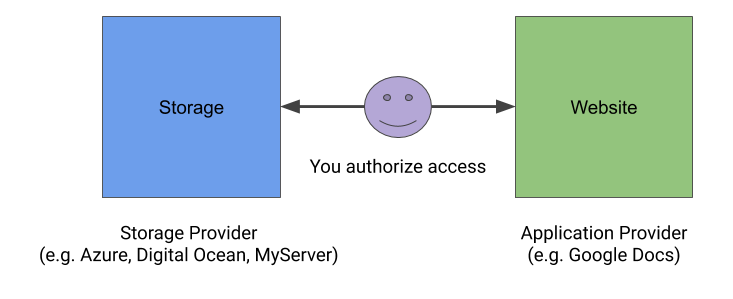
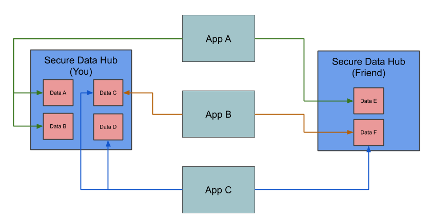

# Secure Data Hubs

By [Manu Sporny](https://www.linkedin.com/in/manusporny/),
   [Dave Longley](https://github.com/dlongley), and
   [Amy Guy](https://rhiaro.co.uk/)

# Introduction

We store a significant amount of sensitive data online such as personally
identifying information, trade secrets, family pictures, and customer
information. The data that we store should be encrypted in transit and at
rest but is often not protected in an appropriate manner. The
[Secure Data Hubs](https://msporny.github.io/data-hubs/) specification
describes a privacy-respecting mechanism for storing, mirroring, indexing,
sharing, and retrieving encrypted data at a storage provider. It is often
useful when an individual or organization wants to protect data in a way that
the storage provider cannot view, analyze, aggregate, or resell the data while
also sharing the data in a fine-grained manner with collaborators. This
approach also ensures that application data is portable and protected from
storage provider data breaches.

# Work in this Space

Before we dive into some of the things that Secure Data Hubs can do, it's
important to understand where they fit into the existing ecosystem.
[Solid](https://solid.mit.edu/) aims to radically change the way Web
applications work today, resulting in true data ownership as well as
improved privacy. The Decentralized Identity Foundation (DIF) has been working
on a system called
[Identity Hubs](https://github.com/decentralized-identity/identity-hub/blob/master/explainer.md),
that are designed to securely store and share data. The
[Hyperledger Aries](https://www.hyperledger.org/projects/aries)
project is focused on a shared, reusable, interoperable tool kit designed for
initiatives and solutions focused on creating, transmitting and storing
verifiable digital credentials.

It is one of the goals of the Secure Data Hubs specification to find
commonalities between these projects (and others) and attempt to standardize
them. We know this effort will take years, and there will be many
compromises along the way, but just like
[Verifiable Credentials](https://w3c.github.io/vc-data-model/)
and
[Decentralized Identifiers](https://w3c-ccg.github.io/did-spec/), we think
the effort is vital to individual-controlled data storage and privacy.

# The Problem

Modern Web and Internet applications tightly couple the application with the
storage of application data.

This is a problem for at least four reasons:

 * It is unknown to you if the application provider is utilizing appropriate
   data protection practices. Often data is not encrypted and therefore
   susceptible to theft.
 * There are no standard interfaces, like an HTTPS API, for retrieving your
   data from the application and using a different application to modify
   your data.
 * It is often the case where the vendor of the application silos your
   data in a way that makes leaving the service provider unpalatable, which
   harms competition.
 * Access to your data is an all or nothing decision, enabling the
   application provider to analyze and sell your data to other entities
   (e.g., corporate espionage, surveillance capitalism).

# A Solution

The simplest and most straightforward (and correct) solution is to decouple
the application from storage.

This solution provides at least four benefits:

 * The data protection practices of the storage provider are known to you.
   All data is encrypted in transit and at rest, greatly reducing the
   risk of theft of your personal or corporate information.
 * The storage interfaces are standardized and known.
 * The risk of being locked into the platform is lowered because you
   control your storage, not the application provider.
 * Migrating data from one storage provider to another is a part of the
   design, achieving true data portability. Encryption at rest also ensures
   that the storage provider cannot read your data without your permission.

The authors of this paper are certainly not the first to suggest this approach.
One could argue that Operating Systems vendors were the first to get this right
in the 1970s, 1980s, and 1990s. File systems of that era separated the storage
between the application and the file system, enabling interoperability at a
data file layer. Proprietary data formats were the lock in mechanism of
choice in those days, but reverse engineering those formats provided a good
counterbalance. It was only when global networked computing expanded that
the ecosystem shifted to siloed data away from the customer's reach, largely
due to the business models that drove the expansion of the Internet and the Web.

# Applications

The solution above enables you and a friend to collaborate, using 3rd party
applications, in a way where you bring your storage.

# Collaboration at RWoT9

We seek to collaborate with the participants at the Vienna meet up, Rebooting
the Web of Trust 9, and the ActivityPub community to explore how the
design of Secure Data Hubs should be improved such that they can be applied to
the tasks of storage of Verifiable Credentials in digital wallets, storage of
ActivityPub messages in a secure and portable manner, and generalized storage
of files in legacy, modern, and next generation Web and Internet applications.
