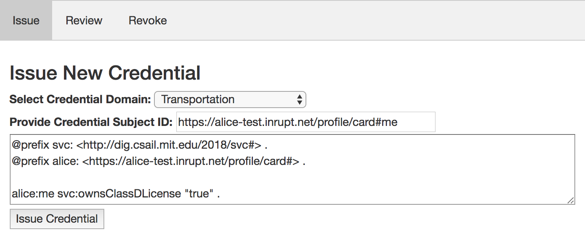
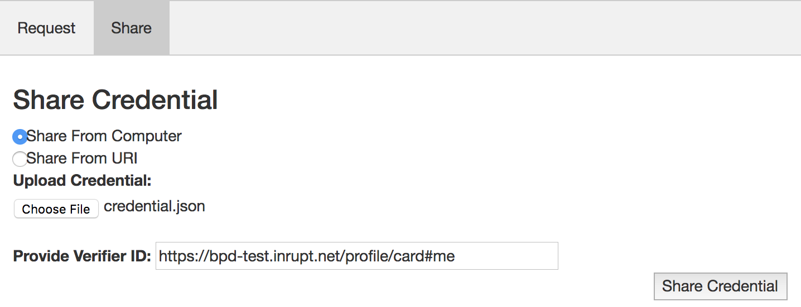
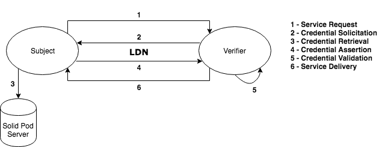
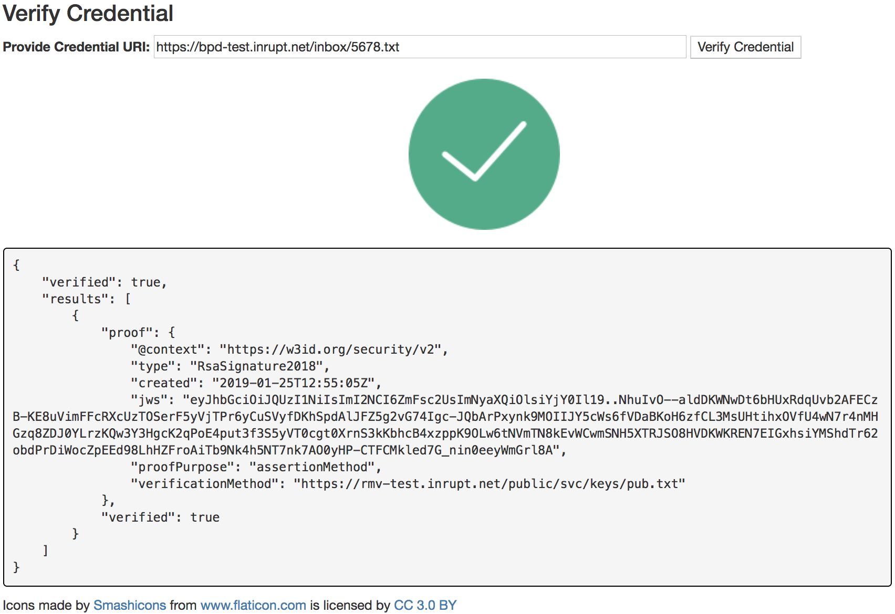
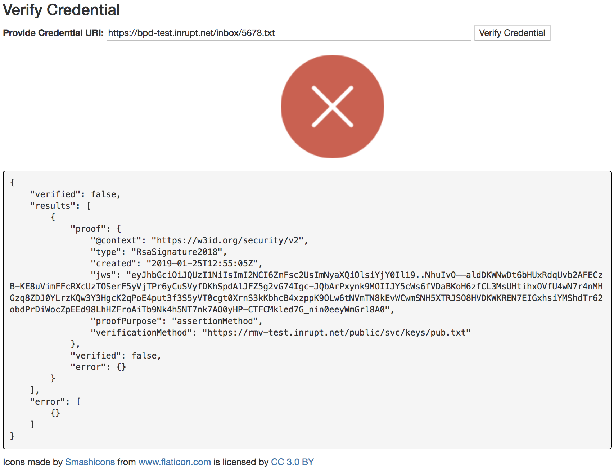

# SolidVC: A Decentralized Verifiable Credentials Management System
By [Kayode Ezike](https://www.linkedin.com/in/kayodeezike)

## Introduction
Credentials are an integral part of our lives. They express our capabilities and consequently determine our access to restricted activities and privileges. For a while, there had not been a very coherent process for securely and privately expressing, distributing, and verifying credentials on the Web, a convenience that would otherwise automate and disencumber the process of granting access to specialized services. To address this apparent deficiency, the World Wide Web Consortium (W3C) proposed the [Verifiable Credentials](https://w3c.github.io/vc-data-model/) specification. This specification laid out a cogent framework for the issuance, storage, presentation, and verification of credentials on the Web.

[SolidVC](https://github.com/kezike/solid-vc) is a decentralized Verifiable Credentials platform built with the open protocols of the Web and for the open community that the Web was intended to serve. It enables the unilateral issuance and presentation of credentials by anyone running the software locally, as well as verification of these credentials against an open credential status document. SolidVC is implemented in the context of [Solid](https://solid.inrupt.com), a Web technology developed at MIT in 2016 that allows decentralized applications to interact with personal data on behalf of users in an access controlled environment. In this paper, I discuss the motivation of SolidVC, provide sufficient background of supporting technologies, present my contribution, outline a real use case, and discuss future improvements to the platform.

## Related Work
The notion of Web based credentials is not entirely new. Many specifications and implementations have addressed this issue in one way or another. I have already referenced Verifiable Credentials, but even before that specification, there was the [Open Badges](https://www.imsglobal.org/sites/default/files/Badges/OBv2p0Final/index.html) specification, which took an initial stab at standardizing achievement credentials on the Web by proposing an ontology that supports such an ecosystem. At its peak, [Mozilla Backpack](https://backpack.openbadges.org), an implementation of Open Badges, enjoyed participation from thousands of organizations worldwide and generated an order of badge instances in the millions.

Additionally, Massive Open Online Courses (MOOC) have contributed formatively to the Web credential ecosystem by opening up the private silos of knowledge to the world and  allowing for students to share achievement credentials across various platforms. [Coursera](https://www.coursera.org/) and [edX](http://www.edx.org/) are some of the early examples of MOOCs that enable the exportation of certificates to other personal and professional platforms, such as LinkedIn.

With time, the credentials community evolved, identifying and avoiding some of the shortcomings of earlier solutions, which largely restricted the issuance functionality to established institutions and constrained the storage of credentials to a single platform (enabling exportation to a few compatible sites at best). Many certification and credential management platforms that have surfaced to address some of these issues have emerged largely from the domains of Self-Sovereign Identity (SSI) and/or Distributed Ledger Technology (DLT). These include the [Credential Handler API](https://w3c-ccg.github.io/credential-handler-api/), [uPort](https://www.uport.me), [Blockcerts](https://www. blockcerts.org), and [Hypercerts](https://github.com/inesc-id/dclaims-pm/blob/master/ thesis-project-doc/Hypercerts_project.pdf). In this paper, I will discuss a solution that combines many of the tenets and benefits of its predecessors to provide an open and accessible framework for storing, exchanging and verifying self-contained credentials on the Web.

## SolidVC
In this section, I present [SolidVC](https://github.com/kezike/solid-vc), a decentralized implementation of the Verifiable Credentials specification that leverages various ontologies, protocols, and specifications of the Web to deliver a robust and extensible credentialing system. By the end of this section, the hope is that the reader understands the various entity roles, procedures, and use cases that are spanned by the SolidVC ecosystem.

### Stakeholders
There are three primary stakeholders in the SolidVC ecosystem: _Subject_1, _Issuer_, and _Verifier_. These roles are no different than those specified in the Verifiable Credentials specification. In a later section, I will specify the behavior of each of these user types.

### Ontology
In SolidVC, I represent credentials with a custom ontology called [_svc_](http://dig.csail.mit.edu/2018/svc)2. The _svc_ ontology defines terms that represent the credential type (i.e., Education, Health, Finance, etc.), the embedded claims, the Subject, the Issuer, and the proof.

_Figure 1: Sample Credential_

The primary resource types in _svc_ are _Credential_ and _CredentialStatusList_. Credential represents the self-sufficient credentials that are requested, issued, shared, and verified in SolidVC. Some of the key properties of this resource are _id_, _domain_, _issuerId_, and _subjectId_. Meanwhile, the _CredentialStatusList_ resource type represents the evolving status of a credential and includes properties such as _credentialStatus_, _credentialId_, _revocationReason_, and _revocationDate_.

### Protocols
SolidVC consists of a number of well-defined protocols for handling credentials. In this section, I will outline these protocols in detail.

#### Setup
Prior to using SolidVC, there are a number of dependencies that the user must install in their local environment (henceforth, _svcLocal_) and in a public SolidVC-provisioned folder that resides in the user's Solid pod (henceforth, _svcRemote_). The software package includes a script (henceforth, _svcSetup_) that checks and establishes that mission-critical prerequisites and constraints are maintained in _svcLocal_ and _svcRemote_. Some of the functionalities of _svcSetup_ are the following:
- Authentication of the user to their Solid account in order to enable privileged access to resources
- Generation of a cryptographic key pair for signing and verifying credentials on the platform
- Publication of the user's public key to a user-defined folder that resides within _svcRemote_
- Update of the user’s Solid profile document to point to their previously published public key
- Configuration of a credential status folder in a user-defined folder that resides within _svcRemote_
- Persistence of the user's relevant information to a configuration file

#### Request
Although the Verifiable Credentials specification imposes no requirement for credential request, SolidVC includes it as a convenience nevertheless. In the Subject app interface, the user can explicitly request a credential from the Issuer via Linked Data Notifications ([LDN](https://www.w3.org/TR/ldn/)). Because a credential requires the verifiable completion of a set of achievements, the Subject is encouraged to provide minimally sufficient data for the sake of efficient authentication and capability determination.

 
_Figure 2: Request and Issuance Protocols_

The structure of a credential request is a lot like that of a credential proper. Not only does it include much of the same metadata, such as the domain, title, description, and Issuer ID, but it is also signed by the creator. The latter condition enables the detection of the scenario in which a malicious user sends a request for a credential on behalf of another unsuspecting user. Without this provision, users might be prone to a form of Denial of Service (DoS) attack that involves launching credential
requests from multiple different Issuers, who might respond to the victim in quick succession.

#### Issuance
In the Issuer app interface, the user can directly create, sign, and issue a credential to a knowingly deserving Subject. This interface is useful if the Issuer already has the proof and user information that they need to reward a Subject with a credential and, consequently, a credential request would be superfluous.

_Figure 3: Issuance Interface_

The Issuance protocol consists of the following detailed steps:
1. Parse N3-serialized credential into [_rdflib_](https://github.com/linkeddata/rdflib.js) quad store.
2. Add credential metadata (i.e., _id_, _domain_, and _credentialStatus_) statements to
quad store.
3. Serialize credential quad store into JSON-LD in preparation for digital signing via [_jsonld-signatures_](https://github. com/digitalbazaar/jsonld-signatures).
4. Load key pair from _svcLocal_.
5. Sign credential with key pair.
6. Submit signed credential to Subject of interest.
7. Instantiate new _rdflib_ quad store that will contain credential status metadata.
8. Add credential status metadata (i.e., _credentialId_ and _credentialStatus_) to quad store. Note that the Issuer has complete freedom over the choice of credential ID, as there is no expectation that this ID be dereferenceable on the Web, considering the sovereignty of credentials on the platform.
9. Serialize credential status quad store into N3.
10. Submit new credential status document to credential status folder in _svcRemote_.

#### Sharing
Sharing credentials in SolidVC is rather simple.

_Figure 4: Sharing Interface_

There are two ways to share credentials with other stakeholders:
1. File Upload: In this mode, the Subject wielding control over the credential can upload a local credential-bearing  file that was previously downloaded from SolidVC to their computer.
2. URI Provision: In this mode, the Subject wielding control over the credential provides the URI of the credential and the ID of the stakeholder, often a Verifier. This triggers a fetch of the credential from the URI and an LDN-supported communication of the content.

#### Verification
In order to verify the provenance and integrity of a credential, the user simply needs to enter its URL.

 
_Figure 5: Verification Protocol_

The Verification protocol involves a number of key steps:
1. Fetch credential from user-provided URL.
2. Search credential for Issuer ID.
3. Discover Issuer public key from Issuer ID via LDN.
4. Search credential for URL of its status document.
5. Fetch credential status (i.e., __ACTIVE__, __EXPIRED__, __REVOKED__, etc.) and related metadata, (i.e., _expiryDate_, _revocationReason_, etc.) from remote credential status folder established during _svcSetup_.
6. Search credential for _jsonld-signatures_ proof.
7. Use combination of public key and proof to verify that the nominal Issuer was indeed the Issuer of the credential.

_Figure 6: Verification Interface Upon Success_

#### Revocation
The Verifiable Credentials specification prescribes the use of the _credentialStatus_ property to augment the credential with useful metadata. This field references a special type of credential that describes the state of the original credential of interest. In SolidVC, there is provision for this notion in the _svc_ ontology. For the user's perspective, the revocation interface simply prompts them to enter the ID of the credential and the reason for revocation. The following is a comprehensive outline of the technical steps involved in the Revocation protocol:
1. Fetch local credential status folder into local _rdflib_ quad store.
2. Search for credential status document with credential ID provided by the user.
3. If credential ID is not present in the user’s credential status folder, return and report to the user. Otherwise, prepare to update the relevant credential status document with revocation metadata.
4. Load revocation metadata into a local _rdflib_ quad store. Relevant metadata include reason and date of revocation, as well as the __REVOKED__ state among other things. In a separate quad store, load RDF statements that may be living in the credential status document, but is incongruent with a revoked credential. Such data includes the previous state (i.e., __ACTIVE__ or __EXPIRED__) or other metadata associated with that state.
5. Submit a [SPARQL](https://www.w3.org/TR/rdf-sparql-query) PATCH request including these insertions and deletions to the credential status.
6. Report whether credential status update was successfully recorded.

### Use Case: Driving License
In this section, I provide a discussion of a typical use case of SolidVC in the context of driving certification. The point of the featured scenario is to give readers insight into the kind of credentialing activity that SolidVC supports.3

#### Setup
Alice is interested in receiving a driving license in the state of Massachusetts. In order to begin this process with the Massachusetts Registry of Motor Vehicles (RMV), she first needs to download SolidVC and execute _svcSetup_. Fortunately for Alice, she only needs to run _svcSetup_ once in order to gain long-term access to the SolidVC ecosystem with a single Solid account.

#### Request
Alice visits the SolidVC Subject interface; enters the [WebID](https://www.w3.org/wiki/WebID) of the RMV, a SolidVC-compliant Issuer; and selects the Transportation option. She proceeds to enter the relevant request metadata, including the WebID of an RMV employee named Chris, and an optional title and description for the request.

#### Issuance
During a cursory review of his SolidVC inbox, Chris notices Alice's recent request. Upon reviewing the request and the attached information, he immediately returns a rejection notice, explaining that Alice must complete a month-long driving course and take an hour-long driving test in person. Alice uses the linked resources in the rejection notice to apply for the driving course and prepare for the driving test.

After a month, Alice has completed the course and taken the test. She reaches out to Chris again, who confirms that she is now certified to drive in the State of Massachusetts. Chris proceeds to the _Issue_ panel of the Issuer interface to create, sign, and deliver a new driving license to Alice.

#### Verification/Revocation
On her way home from an evening outing with her friends, Alice is stopped by Victor, an officer of the Boston Police Department. The officer suspected and confirmed that she was driving under the influence ([DUI](https://en.wikipedia.org/wiki/Driving_under_the_influence)). After ascertaining the validity of her license via the SolidVC Verifier interface, Victor reported Alice’s poor behavior to Chris from the RMV, who subsequently revoked the new license using SolidVC’s revocation function. The result is a status of __REVOKED__, which would appear in the credential status document associated with Alice’s license

_Figure 7: Verification Interface Upon Failure_

## Future Work
There are a number of improvements that I envision for SolidVC. Here is a brief outline of some that come to mind:
- One-to-many SolidVC-Solid account mapping
- Extended RDF serialization support
- Issuer Discovery
- Credential persistence
- Credential expiry support
- Command line interface
- Overall extensibility

At RWoT9, I am open to engagements of varying degrees of formality around items of relevance presented in this paper and beyond.

## Footnotes
1In an earlier draft of Verifiable Credentials, there was a clear delineation drawn between _Subject_ and _Holder_, in which the former is the user that is being described in the credential (e.g., child, dog) and the latter is the controller of the credential (e.g., parent, pet owner). In the latest version of the specification, the _Subject_ role seems to be deprecated in favor of the _Holder_. For simplicity, I have decided to use _Subject_ to describe the persona that encompasses functions from both of these roles in the specification.

2The latest version of _svc_ will most reliably be located in the [GitHub repo](https://github.com/kezike/solid-vc/blob/master/ont/svc.n3), while the [domain](http://dig.csail.mit.edu/2018/svc) referenced above will be updated periodically to reflect the latest changes. Note that the latter contains a stale version of the ontology at the time of this publication.

3Many of the claims in this section, such as personal names, institutional policies, and organizational affiliations with SolidVC are fictional, but are referenced here as real for demonstrative purposes.

## References
- [Original Thesis](https://dspace.mit.edu/handle/1721.1/121667)
- [GitHub Repo](https://github.com/kezike/solid-vc)
