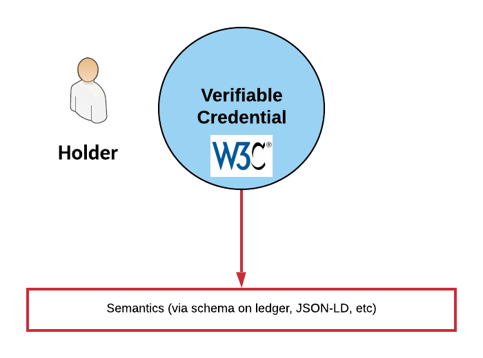
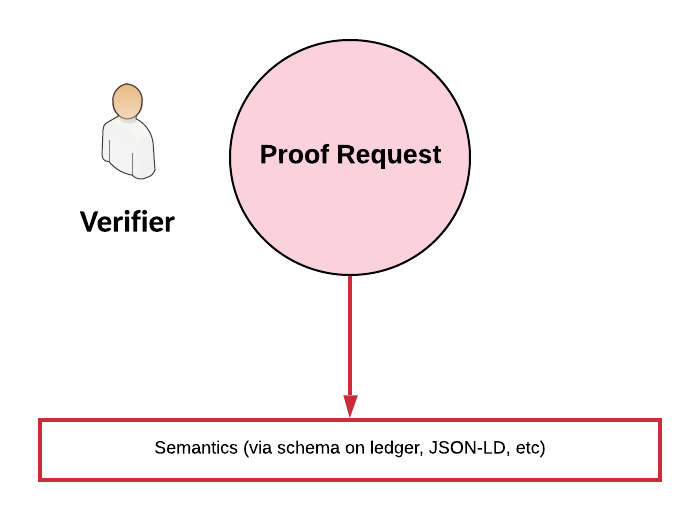
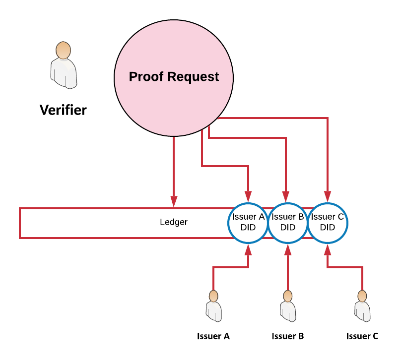
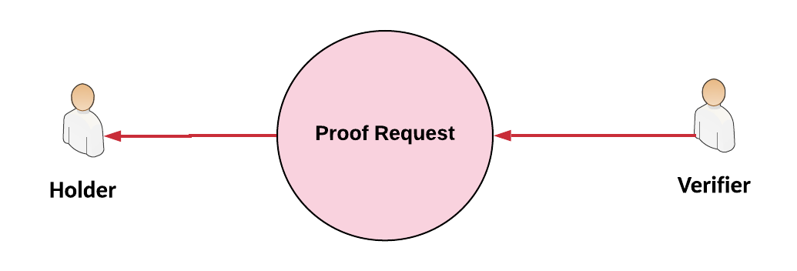
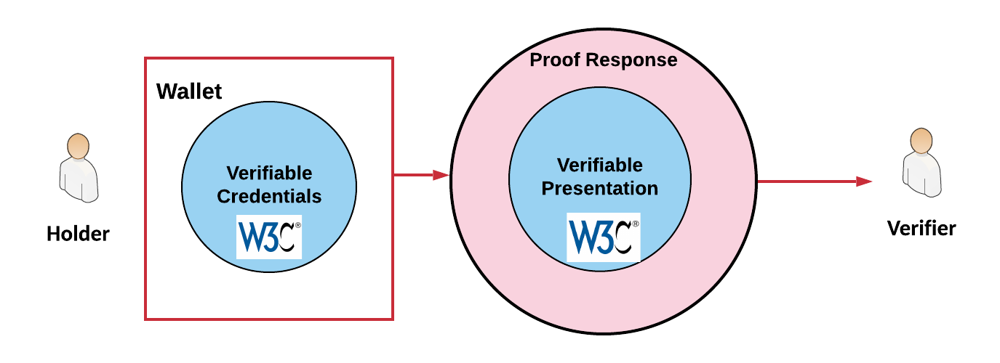

# Addition of Proof Request/Response to a formal Verifiable Credentials specification
- Authors: 
  - Jonathan Reynolds [jonathan.reynolds@workday.com](mailto:jonathan.reynolds@workday.com)
  - Daniel McGrogan [daniel.mcgrogan@workday.com](mailto:daniel.mcgrogan@workday.com)
- Last updated: 2019-08-25

## Abstract
The [W3C Verifiable Credentials (hereafter VC) specification](https://www.w3.org/TR/vc-data-model) does not currently outline how credential data should be requested by a Verifier. This document outlines the approach taken at Workday and proposes it as an addition or companion to the VC spec.

At RWoT we wish to present our approach in order to get community feedback and consensus. Workday recently announced our credentialing platform and will shortly begin to issue credentials within our market verticals. We fully intend to support the community standards around credentialing and therefore wish to drive consensus in the community on a simple, standard approach for requesting and sharing VCs between a holder and verifier.

## Contents
  * [Abstract](#abstract)
  * [Contents](#contents)
  * [Proposal](#proposal)
    + [Introduction](#introduction)
    + [Selective Disclosure](#selective-disclosure-via-individually-signed-attributes)
    + [Zero Knowledge Proofs](#zero-knowledge-proofs)
    + [JSON and JSON-LD](#json-and-json-ld)
    + [Proof Request](#proof-request)
      - [Proof Request Message Structure](#proof-request-message-structure)
        * [JSON-LD](#json-ld)
        * [JSON](#json)
      - [Proof Request Message Example](#proof-request-message-example)
        * [JSON-LD](#json-ld-1)
        * [JSON](#json-1)
      - [Proof Request JSON Schema](#proof-request-json-schema)
      - [Criteria Message Structure](#criteria-message-structure)
        * [JSON-LD](#json-ld-2)
        * [JSON](#json-2)
      - [Criteria Message Example](#criteria-message-example)
        * [JSON-LD](#json-ld-3)
        * [JSON](#json-3)
      - [Criteria JSON Schema](#criteria-json-schema)
    + [Proof Response](#proof-response)
      - [Proof Response Message Structure](#proof-response-message-structure)
        * [JSON](#json-4)
      - [Proof Response Message Example](#proof-response-message-example)
      - [Proof Response JSON Schema](#proof-response-json-schema)
  * [Drawbacks/Limitations](#drawbackslimitations)
  * [Alternatives](#alternatives)
  * [Prior Art](#prior-art)
  * [Unresolved Questions](#unresolved-questions)
  * [Suggested Next Steps](#suggested-next-steps)
  * [Privacy Considerations](#privacy-considerations)
  * [References](#references)
  * [Glossary](#glossary)
    + [Verifier](#verifier)
    + [Agent](#agent)

## Proposal

### Introduction
It is the opinion of the authors that in order to have an interoperable VC flow the question of how to request Credential data must be addressed. We believe that leaving the solution out of the standards will result in competing formats which will reduce interoperability.

A Proof Request is here defined as a document produced by a Verifier which lists the data criteria for a verification event. Similarly, Proof Response is the proposed format with which to respond to a Proof Request. By having Proof Request as part of the VC specification, [software agents](#Agent) can have a common understanding of the data being requested.

It is expected that by using a Proof Request, a Verifier can request multiple pieces of data from a Holder such that each:
- Is described in a known schema or other linked data
- Facilitates selective disclosure
    - Can be a single attribute from the known schema
    - Can be all data from a schema
- Is from one of a supplied list of valid Issuers

The concept of Proof Request already defined as part of [Indy/Sovrin](https://github.com/sovrin-foundation/protocol/blob/master/themis/proof-request.md) as follows:

```The message sent by the relying party to the holder describing the verifiable attributes and appropriate conditions (predicates, issuer of attributes, schema of the credentials used, etc) that the holder need to satisfy.```

This proposal adjusts the definition slightly to move away from the concept of exclusively sending a message. Instead the Proof Request can be sent or otherwise resolved and includes a Proof URL to which a proof response can be sent.




A holder has credentials whose semantic meaning is underpinned by reference to a ledger schema or linked document.



Similarly, a Verifier refers to schemas or linked documents in order to specify the data being requested in the Proof Request.



The Proof Request can also limit the scope of the allowed data by Issuer.



The Holder receives the Proof Request from the Verifier. There are no restrictions placed in this proposal as to how this takes place. The Verifier can pregenerate a Proof Request or do so on demand. The Holder can have the Proof Request sent to them, scan a QR code to resolve a URL, etc. 



Based on the criteria in the Proof Request, the Holder searches their wallet and generates Verifiable Presentations. These are then wrapped in a Proof Response and sent to the Verifier based on the URL specified in the Proof Request.

### Selective Disclosure via Individually Signed Attributes
Selective disclosure of attributes from a VC is desirable and should be supported by implementations of this Proof Request specification. The W3C VC specification lists CL Signatures as the means to achieve selective disclosure. 

Since enterprise use cases are less concerned with Zero Knowledge Proofs, we feel that individually signing attributes on a VC is sufficient for selective disclosure. This has the advantage of simpler crypto which anyone can reason about. In addition the approach of individually signing attributes allows an issuer to fully create a credential without requiring an additional issuer/holder interaction as required when using a blinded master secret.

A separate proposal to update the W3C VC spec to support individually signed attributes on a credential will also be submitted.

### Zero Knowledge Proofs
This document does not currently address Zero Knowledge Proofs. A later version of this document will describe how a Verifier requests  a predicate proof.

### JSON and JSON-LD
Both JSON and JSON-LD are listed in the VC specification as valid formats for Credentials. This implies that a Proof Request must:
- Support JSON and JSON-LD formats
- Allow a Credential of either format to be included as a criterion

### Proof Request

In order to allow both JSON and JSON-LD credentials to be requested and to support JSON and JSON-LD messages the following structure sections will deal with Criteria separately from the main Proof Request message.

#### Proof Request Message Structure

* `id`: Id of the proof request 
* `ProofURL`: URL to send proof response to
* ProofRequest
  * `Accept`: A pair list of syntax types and proof types the verifier will process
  * `Criteria`: Array of requested [Criteria](#criteria-message-structure)
  * `Description`: Proof description
  * `Verifier`: DID of Verifier
* Proof
  * `Created`: Created date
  * `Creator`: Verifier key reference
  * Nonce
  * `Signature Value`: signature string
  * `Type`: Signature Type

#### Proof Request Message Example

##### JSON-LD
<details>
  <summary>Show/Hide Example</summary>

```
{
  "@context": [
    "https://www.w3.org/2018/credentials/v1"
  ],
  "id": "eedeec15-c364-4e4c-b7a7-871413e412f9",
  "type": ["ProofRequest"],
  "proofURL": "https://example.com/v1/proof-response",
  "proofRequest": {
    "accept": ["json/RsaSignature2018", "json-ld/CLSignature2019"]
    "criteria": [...See Criteria section],
    "description": "Credit card application information",
    "verifier": "did:work:WrgHL2icHVN8vwZtY9YmjY"
  },
  "proof": {
    "type": "RsaSignature2018",
    "created": "2018-06-17T10:03:48Z",
    "proofPurpose": "assertionMethod",
    "verificationMethod": "https://example.edu/issuers/14/keys/234",
    "jws": "pY9...Cky6Ed = "
  }
}
```
</details>

##### JSON
<details>
  <summary>Show/Hide Example</summary>

```
{
  "id": "eedeec15-c364-4e4c-b7a7-871413e412f9",
  "proofURL": "https://example.com/v1/proof-response",
  "proofRequest": {
    "criteria": [...See Criteria section],
    "description": "Credit card application information",
    "verifier": "did:work:WrgHL2icHVN8vwZtY9YmjY"
  },
  "proof": {
    "created": "2019-04-01T11:38:12Z",
    "creator": "key-1",
    "nonce": "70b5a966-e818-44a5-8d0f-3873bb10980a",
    "signatureValue": "3FQAREE3D9YCgHjqj54gQ9BZnRhkCur1tTUoovBUuFRhD34mkusNLRuwi4QVRkwc7cEiichmHx7U2957iK4BgVss",
    "type": "Ed25519VerificationKey2018"
  }
}
```
</details>

#### Proof Request JSON Schema
<details>
  <summary>Show/Hide Example</summary>

```
{
  "$schema": "http://json-schema.org/draft-04/schema#",
  "type": "object",
  "properties": {
    "id": {
      "type": "string"
    },
    "proofURL": {
      "type": "string"
    },
    "proofRequest": {
      "type": "object",
      "properties": {
        "criteria": {//see below
        },
        "description": {
          "type": "string"
        },
        "verifier": {
          "type": "string"
        }
      },
      "required": [
        "criteria",
        "description",
        "verifier"
      ]
    },
    "proof": {
      "type": "object",
      "properties": {
        "created": {
          "type": "string"
        },
        "creator": {
          "type": "string"
        },
        "nonce": {
          "type": "string"
        },
        "signatureValue": {
          "type": "string"
        },
        "type": {
          "type": "string"
        }
      },
      "required": [
        "created",
        "creator",
        "nonce",
        "signatureValue",
        "type"
      ]
    }
  },
  "required": [
    "id",
    "proofURL",
    "proofRequest",
    "proof"
  ]
}
```
</details>

#### Criteria Message Structure

* `Description`: Criterion description
* Issuers
    * `Dids`: Array of accepted Issuer DIDs
* `Max`: (Optional) Maximum number of credentials required (e.g. 6 months worth of Payslips)
* `Min`: (Optional) Minimum number of credentials required
* `Reason`: The reason that this data has been requested
* Schema
    * `Id`: DID of Schema 
    * Attributes
    * `Name`: name of attribute
    * `Required`: boolean. Is this attribute required
* Subject
    * `Context` establish the terms used in the type
    * `Type` the type of credential requested
    * Attributes
    * `Name`: name of attribute
    * `Required`: boolean. Is this attribute required

#### Criteria Message Example

##### JSON, JSON-LD
The following is an example with 4 criteria:
- An email address conforming to a schema specified by DID from one of three specified issuers
- First Name, Last Name, Date of Birth as defined in https://stateagency.gov/DrivingLicenceCredential from a single specified issuer 
- Address information conforming to a schema specified by DID from one of three specified issuers
- Six payslips conforming to a schema specified by DID from one of three specified issuers

<details>
  <summary>Show/Hide Example</summary>

```json
    "criteria": [{
        "description": "Contact Information",
        "issuers": {
          "dids": [
            "did:work:Tn1XD2QPskjDCztVGuJC2w",
            "did:work:M1dAMR7zmHD18wELKQTcTU",
            "did:work:7SWNtygraxEPqNKhuWpw8f"
          ]
        },
        "max": 1,
        "min": 1,
        "reason": "Send information regarding your application",
        "schema": "did:work:D7jC1h6LibDbZiF6E9uzhz", [schema is used when the properties are described on a schema]
        "properties": [{
          "name": "emailAddress",
          "required": true
        }]
      },
      {
        "description": "Date of Birth",
        "issuers": {
          "dids": [
            "did:work:2LwMkQadbzQVTGAqUBqWUV"
          ]
        },
        "max": 1,
        "min": 1,
        "reason": "Age Eligibility",
        "context": "https://stateagency.gov", [context and type are used when the properties are described via JSON-LD]
        "type": "DrivingLicenceCredential",
        "properties": [{
            "name": "FirstName",
            "required": true
          },
          {
            "name": "LastName",
            "required": true
          },
          {
            "name": "Date Of Birth",
            "required": true
          }
        ]
      },
      {
        "description": "Billing Address",
        "issuers": {
          "dids": [
            "did:work:PZ5vbLVYjC7c6vjC8w7UM",
            "did:work:W4Qi2D1DpBZig513ztvCFC",
            "did:work:7SWNtygraxEPqNKhuWpw8f"
          ]
        },
        "max": 1,
        "min": 1,
        "reason": "Regulations require a billing address",
        "schema": "did:work:3CRANqJJNw2uU3ZxyBBSwX",
        "properties": [{
            "name": "city",
            "required": true
          },
          {
            "name": "country",
            "required": true
          },
          {
            "name": "postalCode",
            "required": true
          },
          {
            "name": "street1",
            "required": true
          },
          {
            "name": "street2",
            "required": false
          }
        ]
      },

      {
        "description": "6 Months of payslips",
        "issuers": {
          "dids": [
            "did:work:EgLY8mysgbLmj542ygMKWo"
          ]
        },
        "max": 6,
        "min": 6,
        "reason": "Payslips are used to determin credit worthiness",
        "schema": "did:work:KypRcDbLYAUwaA7nPuP3Tf",
        "properties": [{
            "name": "currency",
            "required": true
          },
          {
            "name": "grossPay",
            "required": true
          },
          {
            "name": "payPeriodEnd",
            "required": true
          },
          {
            "name": "payPeriodStart",
            "required": true
          }
        ]
      }
    ]
```
</details>


#### Criteria JSON Schema
Note that we enforce `schema` or `context` and `type`

<details>
  <summary>Show/Hide Example</summary>

```
"criteria": {
  "type": "array",
  "items": 
    {
      "type": "object",
      "properties": {
        "description": {
          "type": "string"
        },
        "issuers": {
          "type": "object",
          "properties": {
            "dids": {
              "type": "array",
              "items": [
                {
                  "type": "string"
                },
                {
                  "type": "string"
                },
                {
                  "type": "string"
                }
              ]
            }
          },
          "required": [
            "dids"
          ]
        },      
      "schema": {
         "type": "string"
        },      
        "context" : {
            "type" : "string"
        },
        "type" : {
            "type" : "string"
        },
        "max": {
          "type": "integer"
        },
        "min": {
          "type": "integer"
        },
        "reason": {
          "type": "string"
        },
        "properties": {
          "type": "array",
          "items": [
            {
              "type": "object",
              "properties": {
                "name": {
                  "type": "string"
                },
                "required": {
                  "type": "boolean"
                }
              },
              "required": [
                "name",
                "required"
              ]
            }
          ]
        }
      },
      "not" : {
        "anyOf": [{"required": ["context","schema"]},{"required": ["type","schema"]}]
      },
      "anyOf":[
        { "required": ["description","schema","issuers","max","min","reason","properties"]},
        { "required": ["description","context", "type","issuers","max","min","reason","properties"]}
      ]
    }
  
}
```
</details>


### Proof Response

#### Proof Response Message Structure

##### JSON

+ FulfilledCriteria
  - `Criterion`: See [above](#criteria-message-structure)
  - `Presentations`: W3C Verifiable Presentations for the requested Criteria
+ Proof
+ `ProofRequestId`: Id to link the Proof Response to the Proof Request to aid Verifier correlation 

#### Proof Response Message Examples

##### Example with single Criterion and Presentation

<details>
  <summary>Show/Hide Example</summary>

```
{
	"id": "672841fc-10a6-4c13-b3e0-349da08ae9f3",
	"proofRequestId": "752e4391-2111-4ab6-b174-67fd88d51e9f",
    "FulfilledCriteria": [
        {
            "Criterion": {
                "description": "Email",
                "issuers": {
                    "dids": [
                        "did:work:RWmzj4ftrGrjwMgNPhYRQ2"
                    ]
                },
                "max": 1,
                "min": 1,
                "reason": "Send information regarding your application",
                "schema": {
                    "attributes": [
                        {
                            "name": "emailAddress",
                            "required": true
                        }
                    ],
                    "id": "did:work:DkAENQnV4998K7CDkZAbHC;spec:b70f9e7e-bd6f-429e-8e08-250d0c4da909"
                }
            },
            "Presentations": [
                {
                    "@context": [
                        "https://w3.org/2018/credentials/v1"
                    ],
                    "created": "2019-08-23T14:29:48Z",
                    "id": "b9cd5414-7c36-4c59-91f3-11a8bbca6b9e",
                    "proof": [
                        {
                            "created": "2019-08-23T14:29:48Z",
                            "creator": "did:work:93kmikE6QnaaNSpA3Fp8Sm#key-1",
                            "nonce": "8ac448d4-6977-447c-9e58-b24ba2a2b07e",
                            "signatureValue": "2qGNdUuEGPQZnajxSCm3wFedRcq47Bzf2dq8WJskYnz5LS9iTVMPcXasXrDB7pHdjAe4wqBV2vKxbi3Gt4wFRHAc",
                            "type": "Ed25519VerificationKey2018"
                        }
                    ],
                    "type": [
                        "VerifiablePresentation"
                    ],
                    "verifiableCredential": [
                        {
                            "@context": [
                                "https://w3.org/2018/credentials/v1"
                            ],
                            "credentialSubjects": [
                                {
                                    "id": "did:work:847yjhrkgjferkrgebsd",
                                    "key": "emailAddress",
                                    "proof": [
                                        {
                                            "created": "2019-08-23T14:27:45Z",
                                            "creator": "did:work:RWmzj4ftrGrjwMgNPhYRQ2#key-1",
                                            "nonce": "47103c6b-34e2-4567-b896-dedab2cf3865",
                                            "signatureValue": "YwU389NKemM2p8nzEj7wYyVgANcTse2RUTnPbMtbj2kHZqXDEfnfdM2Q76BqYJAk1HS95DYWaPebbKr4zzgvYVu",
                                            "type": "Ed25519VerificationKey2018"
                                        }
                                    ],
                                    "value": "noreply@workday.com"
                                }
                            ],
                            "id": "6adb968b-52df-4da0-a720-4a0a6ac8f8db",
                            "issuanceDate": "2019-08-23T14:27:45Z",
                            "issuerDid": "did:work:RWmzj4ftrGrjwMgNPhYRQ2",
                            "schemaId": "did:work:DkAENQnV4998K7CDkZAbHC;spec:b70f9e7e-bd6f-429e-8e08-250d0c4da909",
                            "type": [
                                "VerifiableCredential"
                            ]
                        }
                    ]
                }
            ]
        }
    ],
    "proof": [
        {
            "created": "2019-08-23T14:29:48Z",
            "creator": "did:work:93kmikE6QnaaNSpA3Fp8Sm#key-1",
            "nonce": "d9e9dc30-e284-41d5-84ff-9d39d8e96b6c",
            "signatureValue": "s9diCs3k52eRut4J3id4ZW1KwKLBcGNDFtArZHmW3MNBL1XKariPwYjtmoMjmnoekdfTzLYg22iDAuHcf8B3WGy",
            "type": "Ed25519VerificationKey2018"
        }
    ]
}
```
</details>

##### Longer Example

<details>
  <summary>Show/Hide Example</summary>

```
{
	"id": "672841fc-10a6-4c13-b3e0-349da08ae9f3",
	"proofRequestId": "752e4391-2111-4ab6-b174-67fd88d51e9f",
    "FulfilledCriteria": [
        {
            "Criterion": {
                "description": "Email",
                "issuers": {
                    "dids": [
                        "did:work:RWmzj4ftrGrjwMgNPhYRQ2"
                    ]
                },
                "max": 1,
                "min": 1,
                "reason": "Send information regarding your application",
                "schema": {
                    "attributes": [
                        {
                            "name": "emailAddress",
                            "required": true
                        }
                    ],
                    "id": "did:work:DkAENQnV4998K7CDkZAbHC;spec:b70f9e7e-bd6f-429e-8e08-250d0c4da909"
                }
            },
            "Presentations": [
                {
                    "@context": [
                        "https://w3.org/2018/credentials/v1"
                    ],
                    "created": "2019-08-23T14:29:48Z",
                    "id": "b9cd5414-7c36-4c59-91f3-11a8bbca6b9e",
                    "proof": [
                        {
                            "created": "2019-08-23T14:29:48Z",
                            "creator": "did:work:93kmikE6QnaaNSpA3Fp8Sm#key-1",
                            "nonce": "8ac448d4-6977-447c-9e58-b24ba2a2b07e",
                            "signatureValue": "2qGNdUuEGPQZnajxSCm3wFedRcq47Bzf2dq8WJskYnz5LS9iTVMPcXasXrDB7pHdjAe4wqBV2vKxbi3Gt4wFRHAc",
                            "type": "Ed25519VerificationKey2018"
                        }
                    ],
                    "type": [
                        "VerifiablePresentation"
                    ],
                    "verifiableCredential": [
                        {
                            "@context": [
                                "https://w3.org/2018/credentials/v1"
                            ],
                            "credentialSubjects": [
                                {
                                    "id": "did:work:847yjhrkgjferkrgebsd",
                                    "key": "emailAddress",
                                    "proof": [
                                        {
                                            "created": "2019-08-23T14:27:45Z",
                                            "creator": "did:work:RWmzj4ftrGrjwMgNPhYRQ2#key-1",
                                            "nonce": "47103c6b-34e2-4567-b896-dedab2cf3865",
                                            "signatureValue": "YwU389NKemM2p8nzEj7wYyVgANcTse2RUTnPbMtbj2kHZqXDEfnfdM2Q76BqYJAk1HS95DYWaPebbKr4zzgvYVu",
                                            "type": "Ed25519VerificationKey2018"
                                        }
                                    ],
                                    "value": "noreply@workday.com"
                                }
                            ],
                            "id": "6adb968b-52df-4da0-a720-4a0a6ac8f8db",
                            "issuanceDate": "2019-08-23T14:27:45Z",
                            "issuerDid": "did:work:RWmzj4ftrGrjwMgNPhYRQ2",
                            "schemaId": "did:work:DkAENQnV4998K7CDkZAbHC;spec:b70f9e7e-bd6f-429e-8e08-250d0c4da909",
                            "type": [
                                "VerifiableCredential"
                            ]
                        }
                    ]
                }
            ]
        },
        {
            "Criterion": {
                "description": "Billing Address",
                "issuers": {
                    "dids": [
                        "did:work:KBBj3fsCwYLbPfmiKJgkYx"
                    ]
                },
                "max": 1,
                "min": 1,
                "reason": "Regulations require a billing address",
                "schema": {
                    "attributes": [
                        {
                            "name": "city",
                            "required": true
                        },
                        {
                            "name": "country",
                            "required": true
                        },
                        {
                            "name": "postalCode",
                            "required": true
                        },
                        {
                            "name": "street1",
                            "required": true
                        },
                        {
                            "name": "street2",
                            "required": false
                        }
                    ],
                    "id": "did:work:DkAENQnV4998K7CDkZAbHC;spec:61d33161-7aae-45c4-bf36-eb31ce2b95b6"
                }
            },
            "Presentations": [
                {
                    "@context": [
                        "https://w3.org/2018/credentials/v1"
                    ],
                    "created": "2019-08-23T14:29:48Z",
                    "id": "1f92319e-57aa-48e8-8395-e1ed166e84b1",
                    "proof": [
                        {
                            "created": "2019-08-23T14:29:48Z",
                            "creator": "did:work:93kmikE6QnaaNSpA3Fp8Sm#key-1",
                            "nonce": "34c90fcb-eb20-4e59-9aff-cd697c080453",
                            "signatureValue": "41W5pMaXiihim3esbtLgvYQTVnBtFhRYquHqMqm5csdWLstmXPfM4q1npwnESgBHsVVqWH2LfDZySthPQEAkdYqX",
                            "type": "Ed25519VerificationKey2018"
                        }
                    ],
                    "type": [
                        "VerifiablePresentation"
                    ],
                    "verifiableCredential": [
                        {
                            "@context": [
                                "https://w3.org/2018/credentials/v1"
                            ],
                            "credentialSubjects": [
                                {
                                    "id": "did:work:847yjhrkgjferkrgebsd",
                                    "key": "city",
                                    "proof": [
                                        {
                                            "created": "2019-08-23T14:27:54Z",
                                            "creator": "did:work:KBBj3fsCwYLbPfmiKJgkYx#key-1",
                                            "nonce": "527cdb66-186c-49c6-8149-859ece265c00",
                                            "signatureValue": "3CR4EmY4GAgkEsXyscRnvVHnJLyymFAHBdYCQgiYobbEhHXnrpwhVUT9Pfp5QG6dV1GesPYzrHBpBWPfj1LACGHd",
                                            "type": "Ed25519VerificationKey2018"
                                        }
                                    ],
                                    "value": "Pleasanton"
                                },
                                {
                                    "id": "did:work:847yjhrkgjferkrgebsd",
                                    "key": "country",
                                    "proof": [
                                        {
                                            "created": "2019-08-23T14:27:54Z",
                                            "creator": "did:work:KBBj3fsCwYLbPfmiKJgkYx#key-1",
                                            "nonce": "f7190bdd-12f4-43d0-a34e-3954964c2724",
                                            "signatureValue": "rEtk8Dk1YaTH5RCvmg5mATPqyrn5wwT2AEdPMzquHrDpAoyXdUajNzjSS14yhD3LQGZz6QRqLZLznU7rwTfFwRq",
                                            "type": "Ed25519VerificationKey2018"
                                        }
                                    ],
                                    "value": "US"
                                },
                                {
                                    "id": "did:work:847yjhrkgjferkrgebsd",
                                    "key": "postalCode",
                                    "proof": [
                                        {
                                            "created": "2019-08-23T14:27:54Z",
                                            "creator": "did:work:KBBj3fsCwYLbPfmiKJgkYx#key-1",
                                            "nonce": "103c85c8-1aaa-4521-98ae-1b1b3403bc2e",
                                            "signatureValue": "2x57F9nAFNcpB6NV6PxUAkxzJkWUkbZptMR5sehuMBAjZo4cWT2Skoz9DUHhCYb27AU2fmRYWDxC1n6MQ6vzWu8i",
                                            "type": "Ed25519VerificationKey2018"
                                        }
                                    ],
                                    "value": "94588"
                                },
                                {
                                    "id": "did:work:847yjhrkgjferkrgebsd",
                                    "key": "street1",
                                    "proof": [
                                        {
                                            "created": "2019-08-23T14:27:54Z",
                                            "creator": "did:work:KBBj3fsCwYLbPfmiKJgkYx#key-1",
                                            "nonce": "ade3be00-1831-467d-8b1e-ca27650c1371",
                                            "signatureValue": "nc81qwL56Ua5YkvdUP58nNE58cEphmZtAkQeuTCRXXsGhPDDgcNtuYSzJuyBpRntmy3pwkP9HZMz584yzmWSbfq",
                                            "type": "Ed25519VerificationKey2018"
                                        }
                                    ],
                                    "value": "5928 Stoneridge Mall Rd"
                                }
                            ],
                            "id": "4dbc6ddd-d0ee-4d40-9efc-d51ac2eb9550",
                            "issuanceDate": "2019-08-23T14:27:54Z",
                            "issuerDid": "did:work:KBBj3fsCwYLbPfmiKJgkYx",
                            "schemaId": "did:work:DkAENQnV4998K7CDkZAbHC;spec:61d33161-7aae-45c4-bf36-eb31ce2b95b6",
                            "type": [
                                "VerifiableCredential"
                            ]
                        }
                    ]
                }
            ]
        },
        {
            "Criterion": {
                "description": "Payslips",
                "issuers": {
                    "dids": [
                        "did:work:YXMykiTuPju9nEZDxvUKx6"
                    ]
                },
                "max": 2,
                "min": 1,
                "reason": "Payslips are used to determine credit worthiness",
                "schema": {
                    "attributes": [
                        {
                            "name": "currency",
                            "required": true
                        },
                        {
                            "name": "grossPay",
                            "required": true
                        },
                        {
                            "name": "payPeriodEnd",
                            "required": true
                        },
                        {
                            "name": "payPeriodStart",
                            "required": true
                        }
                    ],
                    "id": "did:work:TGribEAw1pEJxr4agrBPrE;spec:8e200fc9-28d8-4eee-ab85-0f170cd1b0e9"
                }
            },
            "Presentations": [
                {
                    "@context": [
                        "https://w3.org/2018/credentials/v1"
                    ],
                    "created": "2019-08-23T14:29:48Z",
                    "id": "b3c648af-69a5-4073-afe1-ee2d8fed2a56",
                    "proof": [
                        {
                            "created": "2019-08-23T14:29:48Z",
                            "creator": "did:work:93kmikE6QnaaNSpA3Fp8Sm#key-1",
                            "nonce": "944665e8-f353-40f1-840e-76721e09cb34",
                            "signatureValue": "2GKCVRtcHgRKvZ5dVHr81E5XvgWdRb6FZ3LWfw5zAdPKAs15Z83FSmMN1sDJJQoZo9QCbNY3oGaFeNDkVdZqJra8",
                            "type": "Ed25519VerificationKey2018"
                        }
                    ],
                    "type": [
                        "VerifiablePresentation"
                    ],
                    "verifiableCredential": [
                        {
                            "@context": [
                                "https://w3.org/2018/credentials/v1"
                            ],
                            "credentialSubjects": [
                                {
                                    "id": "did:work:847yjhrkgjferkrgebsd",
                                    "key": "currency",
                                    "proof": [
                                        {
                                            "created": "2019-08-23T14:28:03Z",
                                            "creator": "did:work:YXMykiTuPju9nEZDxvUKx6#key-1",
                                            "nonce": "11fd9bad-f5f6-41f9-8c33-ee37948d4697",
                                            "signatureValue": "54WmKb13krcbW5fSofZ38D6oCZxdgwUEcBNGC38suLJqhpEh8pfP9A457HkR48iEWX5goB7eyRgMqUet72KFCKQw",
                                            "type": "Ed25519VerificationKey2018"
                                        }
                                    ],
                                    "value": "USD"
                                },
                                {
                                    "id": "did:work:847yjhrkgjferkrgebsd",
                                    "key": "grossPay",
                                    "proof": [
                                        {
                                            "created": "2019-08-23T14:28:03Z",
                                            "creator": "did:work:YXMykiTuPju9nEZDxvUKx6#key-1",
                                            "nonce": "ae744339-eb71-49fe-a365-16bcc8d81d21",
                                            "signatureValue": "2EKUjp1c9zTHoCrMyyVuEjXC5XFmxpDBtjFwfN6tjDzbNgj67Taj5fKuUpZoJghpS41d4THpB2aiveT98dsX7uUA",
                                            "type": "Ed25519VerificationKey2018"
                                        }
                                    ],
                                    "value": "5000"
                                },
                                {
                                    "id": "did:work:847yjhrkgjferkrgebsd",
                                    "key": "payPeriodEnd",
                                    "proof": [
                                        {
                                            "created": "2019-08-23T14:28:03Z",
                                            "creator": "did:work:YXMykiTuPju9nEZDxvUKx6#key-1",
                                            "nonce": "2ff537b7-6901-43a3-9964-bf7bc10b6282",
                                            "signatureValue": "54Y8TgTh1TTjR5WmsrrnQyf236cYAssQEyuMaWPB7qmCt4y7keFuTb2d61AEf7m61HZzfoBEiwTwWkyhMECGQh8b",
                                            "type": "Ed25519VerificationKey2018"
                                        }
                                    ],
                                    "value": "2006-01-02T15:04:05+04:00"
                                },
                                {
                                    "id": "did:work:847yjhrkgjferkrgebsd",
                                    "key": "payPeriodStart",
                                    "proof": [
                                        {
                                            "created": "2019-08-23T14:28:03Z",
                                            "creator": "did:work:YXMykiTuPju9nEZDxvUKx6#key-1",
                                            "nonce": "75f5beab-9e50-4881-9c46-2a8e2565a08e",
                                            "signatureValue": "62zXHZpSnEXaXudJesZn5hEWth5WUTWuvFJnuvkPSKRCZokmXLXx191xCbbpLC8846JDqYva2wK3PckJQHbwnvsR",
                                            "type": "Ed25519VerificationKey2018"
                                        }
                                    ],
                                    "value": "2006-01-02T15:04:05+04:00"
                                }
                            ],
                            "id": "12c21009-7c13-42da-9cb8-01ea805ed324",
                            "issuanceDate": "2019-08-23T14:28:03Z",
                            "issuerDid": "did:work:YXMykiTuPju9nEZDxvUKx6",
                            "schemaId": "did:work:TGribEAw1pEJxr4agrBPrE;spec:8e200fc9-28d8-4eee-ab85-0f170cd1b0e9",
                            "type": [
                                "VerifiableCredential"
                            ]
                        }
                    ]
                },
                {
                    "@context": [
                        "https://w3.org/2018/credentials/v1"
                    ],
                    "created": "2019-08-23T14:29:48Z",
                    "id": "63ccf1f3-82ba-4ffa-a7ec-b7ee659e8243",
                    "proof": [
                        {
                            "created": "2019-08-23T14:29:48Z",
                            "creator": "did:work:93kmikE6QnaaNSpA3Fp8Sm#key-1",
                            "nonce": "11aa2b4a-ed2a-404b-9215-30d1dafdaee1",
                            "signatureValue": "3A31QNyopJLSbowgAih2KVPHznEeNvr6iCkrUqnHnvYgGSU5UQ4XE8xEzrX8bee2TgvJYG39v9Rcnw7aAHszgNfQ",
                            "type": "Ed25519VerificationKey2018"
                        }
                    ],
                    "type": [
                        "VerifiablePresentation"
                    ],
                    "verifiableCredential": [
                        {
                            "@context": [
                                "https://w3.org/2018/credentials/v1"
                            ],
                            "credentialSubjects": [
                                {
                                    "id": "did:work:847yjhrkgjferkrgebsd",
                                    "key": "currency",
                                    "proof": [
                                        {
                                            "created": "2019-08-23T14:28:03Z",
                                            "creator": "did:work:YXMykiTuPju9nEZDxvUKx6#key-1",
                                            "nonce": "11fd9bad-f5f6-41f9-8c33-ee37948d4697",
                                            "signatureValue": "54WmKb13krcbW5fSofZ38D6oCZxdgwUEcBNGC38suLJqhpEh8pfP9A457HkR48iEWX5goB7eyRgMqUet72KFCKQw",
                                            "type": "Ed25519VerificationKey2018"
                                        }
                                    ],
                                    "value": "USD"
                                },
                                {
                                    "id": "did:work:847yjhrkgjferkrgebsd",
                                    "key": "grossPay",
                                    "proof": [
                                        {
                                            "created": "2019-08-23T14:28:03Z",
                                            "creator": "did:work:YXMykiTuPju9nEZDxvUKx6#key-1",
                                            "nonce": "ae744339-eb71-49fe-a365-16bcc8d81d21",
                                            "signatureValue": "2EKUjp1c9zTHoCrMyyVuEjXC5XFmxpDBtjFwfN6tjDzbNgj67Taj5fKuUpZoJghpS41d4THpB2aiveT98dsX7uUA",
                                            "type": "Ed25519VerificationKey2018"
                                        }
                                    ],
                                    "value": "5000"
                                },
                                {
                                    "id": "did:work:847yjhrkgjferkrgebsd",
                                    "key": "payPeriodEnd",
                                    "proof": [
                                        {
                                            "created": "2019-08-23T14:28:03Z",
                                            "creator": "did:work:YXMykiTuPju9nEZDxvUKx6#key-1",
                                            "nonce": "2ff537b7-6901-43a3-9964-bf7bc10b6282",
                                            "signatureValue": "54Y8TgTh1TTjR5WmsrrnQyf236cYAssQEyuMaWPB7qmCt4y7keFuTb2d61AEf7m61HZzfoBEiwTwWkyhMECGQh8b",
                                            "type": "Ed25519VerificationKey2018"
                                        }
                                    ],
                                    "value": "2006-01-02T15:04:05+04:00"
                                },
                                {
                                    "id": "did:work:847yjhrkgjferkrgebsd",
                                    "key": "payPeriodStart",
                                    "proof": [
                                        {
                                            "created": "2019-08-23T14:28:03Z",
                                            "creator": "did:work:YXMykiTuPju9nEZDxvUKx6#key-1",
                                            "nonce": "75f5beab-9e50-4881-9c46-2a8e2565a08e",
                                            "signatureValue": "62zXHZpSnEXaXudJesZn5hEWth5WUTWuvFJnuvkPSKRCZokmXLXx191xCbbpLC8846JDqYva2wK3PckJQHbwnvsR",
                                            "type": "Ed25519VerificationKey2018"
                                        }
                                    ],
                                    "value": "2006-01-02T15:04:05+04:00"
                                }
                            ],
                            "id": "12c21009-7c13-42da-9cb8-01ea805ed324",
                            "issuanceDate": "2019-08-23T14:28:03Z",
                            "issuerDid": "did:work:YXMykiTuPju9nEZDxvUKx6",
                            "schemaId": "did:work:TGribEAw1pEJxr4agrBPrE;spec:8e200fc9-28d8-4eee-ab85-0f170cd1b0e9",
                            "type": [
                                "VerifiableCredential"
                            ]
                        }
                    ]
                }
            ]
        }
    ],
    "proof": [
        {
            "created": "2019-08-23T14:29:48Z",
            "creator": "did:work:93kmikE6QnaaNSpA3Fp8Sm#key-1",
            "nonce": "d9e9dc30-e284-41d5-84ff-9d39d8e96b6c",
            "signatureValue": "s9diCs3k52eRut4J3id4ZW1KwKLBcGNDFtArZHmW3MNBL1XKariPwYjtmoMjmnoekdfTzLYg22iDAuHcf8B3WGy",
            "type": "Ed25519VerificationKey2018"
        }
    ]
}
```

</details>


#### Proof Response JSON Schema
<details>
  <summary>Show/Hide Example</summary>

```
{
  "$schema": "http://json-schema.org/draft-04/schema#",
  "type": "object",
  "properties": {
    "id": {
      "type": "string"
    },
    "proofRequestId": {
      "type": "string"
    },
    "FulfilledCriteria": {
      "type": "array",
      "items": [
        {
          "type": "object",
          "properties": {
            "Criterion": {...See Criteria section},
            "Presentations": {
              "type": "array",
              "items": [
                {
                  "type": "object",
                  "properties": {
                    "@context": {
                      "type": "array",
                      "items": [
                        {
                          "type": "string"
                        }
                      ]
                    },
                    "created": {
                      "type": "string"
                    },
                    "id": {
                      "type": "string"
                    },
                    "proof": {
                      "type": "array",
                      "items": [
                        {
                          "type": "object",
                          "properties": {
                            "created": {
                              "type": "string"
                            },
                            "creator": {
                              "type": "string"
                            },
                            "nonce": {
                              "type": "string"
                            },
                            "signatureValue": {
                              "type": "string"
                            },
                            "type": {
                              "type": "string"
                            }
                          },
                          "required": [
                            "created",
                            "creator",
                            "nonce",
                            "signatureValue",
                            "type"
                          ]
                        }
                      ]
                    },
                    "type": {
                      "type": "array",
                      "items": [
                        {
                          "type": "string"
                        }
                      ]
                    },
                    "verifiableCredential": {
                      "type": "array",
                      "items": [
                        {
                          "type": "object",
                          "properties": {
                            "@context": {
                              "type": "array",
                              "items": [
                                {
                                  "type": "string"
                                }
                              ]
                            },
                            "credentialSubjects": {
                              "type": "array",
                              "items": [
                                {
                                  "type": "object",
                                  "properties": {
                                    "id": {
                                      "type": "string"
                                    },
                                    "key": {
                                      "type": "string"
                                    },
                                    "proof": {
                                      "type": "array",
                                      "items": [
                                        {
                                          "type": "object",
                                          "properties": {
                                            "created": {
                                              "type": "string"
                                            },
                                            "creator": {
                                              "type": "string"
                                            },
                                            "nonce": {
                                              "type": "string"
                                            },
                                            "signatureValue": {
                                              "type": "string"
                                            },
                                            "type": {
                                              "type": "string"
                                            }
                                          },
                                          "required": [
                                            "created",
                                            "creator",
                                            "nonce",
                                            "signatureValue",
                                            "type"
                                          ]
                                        }
                                      ]
                                    },
                                    "value": {
                                      "type": "string"
                                    }
                                  },
                                  "required": [
                                    "id",
                                    "key",
                                    "proof",
                                    "value"
                                  ]
                                }
                              ]
                            },
                            "id": {
                              "type": "string"
                            },
                            "issuanceDate": {
                              "type": "string"
                            },
                            "issuerDid": {
                              "type": "string"
                            },
                            "schemaId": {
                              "type": "string"
                            },
                            "type": {
                              "type": "array",
                              "items": [
                                {
                                  "type": "string"
                                }
                              ]
                            }
                          },
                          "required": [
                            "@context",
                            "credentialSubjects",
                            "id",
                            "issuanceDate",
                            "issuerDid",
                            "schemaId",
                            "type"
                          ]
                        }
                      ]
                    }
                  },
                  "required": [
                    "@context",
                    "created",
                    "id",
                    "proof",
                    "type",
                    "verifiableCredential"
                  ]
                }
              ]
            }
          },
          "required": [
            "Criterion",
            "Presentations"
          ]
        }
      ]
    },
    "proof": {
      "type": "array",
      "items": [
        {
          "type": "object",
          "properties": {
            "created": {
              "type": "string"
            },
            "creator": {
              "type": "string"
            },
            "nonce": {
              "type": "string"
            },
            "signatureValue": {
              "type": "string"
            },
            "type": {
              "type": "string"
            }
          },
          "required": [
            "created",
            "creator",
            "nonce",
            "signatureValue",
            "type"
          ]
        }
      ]
    }
  },
  "required": [
    "id",
    "proofRequestId",
    "FulfilledCriteria",
    "proof"
  ]
}
```
</details>

##### JSON-LD
The JSON-LD example differs only in the addition of context and type
```
{
  "context":"https://www.w3.org/2018/credentials/v1"
  "type":["ProofResponse"]
  "FulfilledCriteria": [
    {
      "Criterion": {....
```

## Drawbacks/Limitations
- Verbose
- Issuers is a limited subset of DIDs. We should also allow for a Proof from all members of `Issuer trusted by X`.

## Alternatives
- Bespoke exchange mechanism per implementation between clients and agents
- Semantic query language

## Prior Art
- As mentioned above, Proof Requests are a concept which is already present in Hyperledger Indy and therefore Sovrin which has a number of live implementations.
- Hyperledger Aries is [proposing Proof Request negotation protocol](https://github.com/hyperledger/aries-rfcs/tree/master/features/0037-present-proof)
- A more complex negotiation protocol is proposed as [W3C Credential Handler API](https://w3c-ccg.github.io/credential-handler-api) and covers some similar ground to this proposal.

## Unresolved Questions
- We are aware of the projects mentioned in above in Prior Art. Of these, we know that Sovrin is using Proof Requests in live systems. We do not know of other formats currently being used by live or nearly live implementations of VC.

## Suggested Next Steps 
- Specifying issuer identity through semantic assertion on that identity
- Request zero knowledge proof and derived credential as a value response

## Privacy Considerations
- Lack of ZKP predicate requests diminish privacy for certain use cases. For many of the initial uses in enterprise anonymity is not possible given that attributes need to be shared directly to satisfy use-cases. Since it is the intention to add ZKP predicate requests to this specification there is no medium term issue here.

## References
- W3C Verifiable Credentials Specification: https://www.w3.org/TR/vc-data-model
- Sovrin defintion of Proof Request: https://github.com/sovrin-foundation/protocol/blob/master/themis/proof-request.md
- Proof Request in Indy/Sovrin: https://github.com/sovrin-foundation/protocol/blob/master/themis/proof-request.md
- Hyperledger Aries Proposal: https://github.com/hyperledger/aries-rfcs/tree/master/features/0037-present-proof
- W3C Credential Handler API: https://w3c-ccg.github.io/credential-handler-api

## Glossary
- `Agent`: Software used by or acting on behalf of an identity in a VC flow.