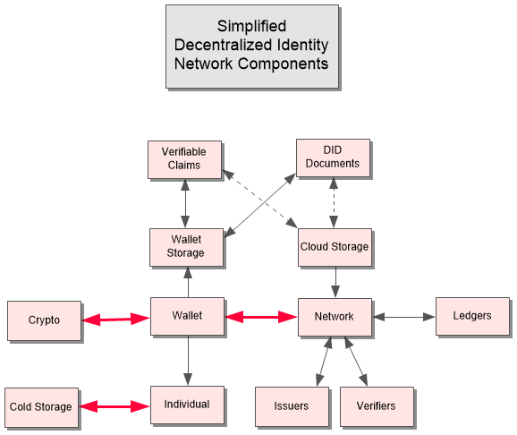
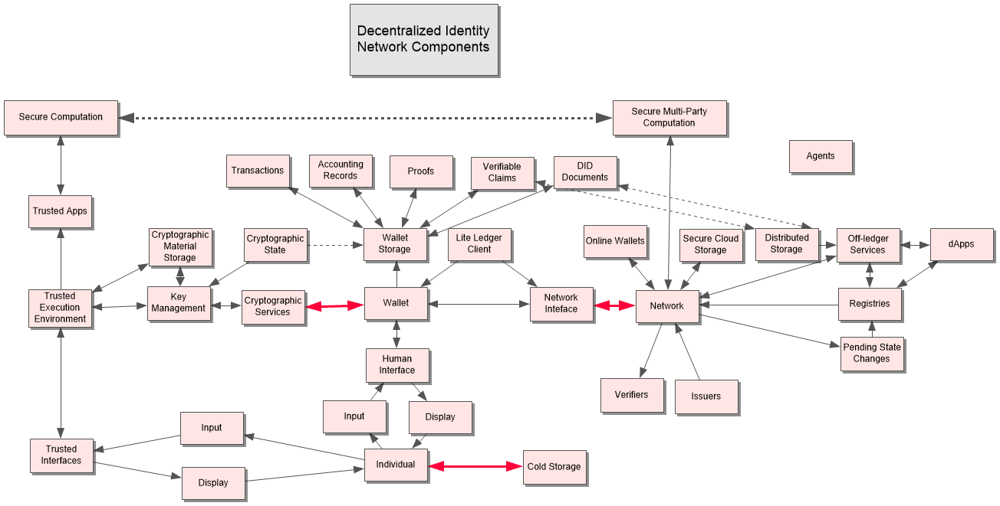

**What’s in Your Wallet?**
==========================

By Christopher Allen
&lt;[*christophera@lifewithalacrity.com*](mailto:christophera@lifewithalacrity.com)&gt;
and Joe Andrieu &lt;[*joe@legreq.com*](mailto:joe@legreq.com)&gt;

**Abstract**
============

Digital wallets secure and manage digital assets, making them one of the
most important pieces of technology in the nascent decentralized digital
asset ecosystem. While back-end systems like distributed ledgers and
distributed file systems provide the backbone for reliable credential
issuance and verification, the value of this backbone remains
inaccessible for widespread, daily use without a usable user-agent—the
tool individuals actually use to perform meaningful functions.

Today’s credential wallets manage a range of digital assets, with
varying degrees of functionality and interoperability. While legacy
credential software is almost uniformly centralized—basically front-end
applications to an issuer’s back-end service, newer, decentralized
software tends to suffer from limited capability as vendors ship minimum
viable products (MVPs) in the battle to establish a defendable role for
themselves in the ecosystem. To date no credential wallet offers a
seamless, interoperable experience across all digital asset classes.

A *Universal Identity Wallet* (UIW) for digital credentials promises
seamless interoperability across issuers and verifiers, and would be
usable by people, organizations, and things, for digital transactions
both online and off.

This paper frames an initial set of terminology based on current
practice and emerging standards. We consider the existing state of the
art in digital wallets, evaluating commonalities, differences, and gaps
in the marketplace. More than simply reviewing existing practice, we
seek to meld the best of today’s wallets with the best of what’s
possible in an imagined future.

Eventually, digital wallets will settle into a handful of common
approaches. As the industry matures, patterns of capability and
architecture will emerge, solving real problems in understandable ways.
This paper provides a synthetic view of one possible future based on
technologies both deployed and under development today.

**Introduction**
================

The invention of Bitcoin in 2008 transformed the notion of a
decentralized digital currency from an academic question to a working
production system worth approximately \$150 billion in 2019. Its
combination of proven cryptographic primitives with a novel consensus
mechanism for resolving “double spends” created a global medium for
transferring value through digital networks. For the first time, people
anywhere could reliably transfer digital value from their own accounts
to someone else’s, without the reliance on a central authority.

The core technology behind Bitcoin, the blockchain or distributed ledger
technology (DLT), offers the promise of similar systems that transfer
digital value other than cryptocurrencies, robustly and securely,
without reliance on a central authority. Thousands of alt-coins, tokens,
ledgers, and other distributed systems have been announced—and many
brought to market—with the promise of liberating a wide range of
value-driven interactions from systems owned or controlled by a central
middleman by moving them to networks based on common protocols that
anyone can participate in and verify. Blockchain and distributed
applications beyond cryptocurrencies include supply chain management,
digital identity, and the continued dematerialization of securities
\[1\].

These decentralized technologies share several goals that simply weren’t
feasible previously:

1.  No reliance on a central authority for verifying identity or otherwise policing transactions in the system
2.  The democratization of authority, allowing any individual or firm to participate on an equal basis
3.  Strong cryptographic guarantees that actions in the network were performed by the entities authorized to do so
4.  Vendor-agnostic technology stacks that don’t require permission to innovate
5.  Resistance to external forms of operational control such as censorship and denial of service

Despite a decade’s worth of innovation, there remain notable challenges
that prevent these approaches from reaching their full potential, the
most salient for this paper are problems of the user interface: the
digital wallet.

Digital Wallets
===============

A digital wallet is how an individual manages digital assets in all
their various forms. In this paper we focus on digital credentials. A
wallet may be purely software, or it may depend on particular hardware,
perhaps with a simple TPM (Trusted Platform Module) chip with limited
functions or a more sophisticated TEE (Trusted Execution Environment)
chip that can actually execute code. The wallet might reside entirely in
the cloud, on a mobile device, on a desktop or laptop, or in a dedicated
air-gapped device. However a wallet is implemented, wherever it runs,
and wherever it stores its information, the wallet is the interface that
individuals use to create, acquire, use, update, and delete their
digital credentials.

Darrell O’Donnell, in his recently published report\[2\], defines
wallets as “where we put stuff”. It’s not a bad definition, and his
review and analysis of existing wallets and their functionality is worth
reading. After that colloquial definition, he clarifies that what he
means by digital wallet is not “digital wallet storage”. We agree. It’s
not where you store stuff, it’s where you *control* it.

Historically, digital wallets have served two separate primary
functions: managing identity credentials and managing keys for
cryptocurrencies.

Wallets for identity credentials include InfoCard and Passport, both
from Microsoft at different times. These applications provided a
standard place for users to manage digitally signed claims for sharing
attributes and for authentication. Some low-end wallets simply scan
existing credit cards and loyalty cards into your mobile phone for
presentation at point of sale. Finally, several vendors, such as
EventBrite and United, offer single-vendor digital wallets, allowing
users to use their mobile device instead of printed tickets for access
to events, flights, and other services. Some mobile platform providers
such as Apple offer integrated wallets that do all of the above. All of
these wallets give users some control over digital credentials designed
for accessing services, but are essentially centralized or at best
federated systems. Many of these credentials are, in fact, stored in
digital wallets (whether in the cloud, on a mobile device, or on a
PC)[^1].

Wallets for cryptocurrencies create and manage the cryptographic key
pairs used to send and receive currency through networks like bitcoin,
ethereum, and litecoin. Although the terminology we introduce may
include terms adopted or borrowed from the world of cryptocurrencies, we
will not discuss them further.

Key Creation and Management
===========================

A key architectural distinction between traditional identity credentials
and decentralized approaches is that wallets for credentials have
historically managed key material to meet the requirements of issuers
and relying parties. The subject typically is uninvolved with key
management. In contrast, decentralized approaches take a lesson from
cryptocurrencies, using keys created and managed by the end-user.

Credential key management has largely focused on making sure the public
key of a key pair is matched to a private key that is under the control
of the issuer. Traditional PKI, which underlies the x.509 certificates
that enable SSL/TLS over the Internet, uses a hierarchy of authority to
assure people that they are using the public keys associated with the
expected issuer. That is, Certificate Authorities (CAs) first identity
proof the recipients of x.509 certificates to ensure they are who they
say they are and CAs can be trusted because they themselves were proofed
by CAs further up the hierarchy all the way to “root CAs” who are,
necessarily, presumed trustworthy and are known, recognizable entities,
both for IT professionals and law enforcement.

Bitcoin changed all of that, enabling multi-million dollar transactions
without the need to definitively prove the real-world identity of
parties involved. Bitcoin bypassed root CAs and central banks to enable
truly peer-to-peer secure transactions of a digital currency that only
exists within its own network (but nevertheless has demonstrated
significant transactional value thanks to its unique characteristics.).

This innovation, sometimes referred to as self-sovereignty--the ability
to securely interact with anyone without an intermediary--eventually led
to the realization that the same approach could be used for generic
identifiers that are created, used, managed, and verified by individuals
(and organizations), still without any systemic intermediary or central
authority. Known as Decentralized Identifiers, or DIDs, these
self-sovereign identifiers were designed to identify both the issuers
and the recipients of signed credentials called Verifiable Credentials,
which, like x.509, use strong cryptography to ensure the statements in
those credentials are authentic and timely, but unlike x.509 use keys
directly created and controlled by individuals.

This innovation, and the emerging standards based on it, democratized
credential management, allowing anyone to verifiably say anything about
anyone else without censure or permission. Unfortunately, it also
created two new problems.

The first is that individuals lack the sophisticated IT departments
needed to build, operate, and maintain robust key management systems and
processes. Lost keys are said to account for as much a \$4 Billion of
bitcoins current market cap\[3\]. The *Universal Identity Wallets* we
discuss in this white paper must provide a range of options for dealing
with lost keys, allowing for varying risk profiles and capability of
individuals, large and small businesses, governmental agencies, and
non-governmental organizations. It isn’t enough to be able to create key
pairs, one must have a reliable, cost effective, and understandable way
to manage them.

The second is that the issuers themselves are no longer vetted by a
hierarchy of trusted authorities. It is up to relying parties to
evaluate each issuer for the suitability of any particular claims. The
removal of a well-rooted hierarchy opens up the credential system to
anyone, but also removes the specific notion of trustworthiness that
held PKI together. Advocates of decentralization argue that PKI’s
trustworthiness was based more on faith than on practical
considerations—CAs today \*do\* get compromised, and in fact became a
major target for attacks. Nevertheless, without even the brittle
hierarchy of PKI, a new system of reputation and accountability must
emerge for large scale adoption.

Our premise is that a new generation of identity wallet is needed to
manage the keys, credentials, and reputations from creation through to
revocation.

Possible Architectures
======================

An examination of current identity wallets reveals various components
that must inevitably be included or addressed in whatever eventual
architecture emerges from this work. We present these architectures as
“strawmen”, designed to illustrate and advance the conversation rather
than definitive for the ultimate outcome.

Simplified Identity Components
------------------------------

A simplified view of decentralized identity wallets shows how
credentials and identifiers (VCs and DIDs) are managed by a wallet
(using cryptography) to provide services for receiving credentials from
issuers and presenting them to verifiers over the network, using the
ledger to keep track of who controls which identifiers.

Identity Components
-------------------

A more granular view adds components that includes ideas from from
cryptocurrency wallets.

Missing Pieces
--------------

From this initial analysis, we can already identify components that are
vital, but are not yet accurately depicted. For example, in the identity
component diagram above, we have “Agents” floating untethered. Some
agents will run as trusted apps on user-owned devices, which is on the
left side of the diagram. Some will run as dApps or distributed apps,
which is on the right side. We also know of plans for additional cloud
agents that aren’t operating directly on the ledger, but instead
operating in a “secure” cloud environment on behalf of the end user.
More than just cloud storage, these agents are interactive and capable
of using keys to execute transactions and other behaviors on behalf of
their principals. And what about smart contracts? Are they agents
running on-ledger as they do in ethereum? We need more thinking to
decide how best to represent these agents and what to call them in their
different capacities.

These systems also provide means for additional capabilities, which may
need additional components in the diagrams, for example,

-   Recovery -- How do individuals recover from key and credential losses?
-   Revocation -- How do issuers revoke or suspend credentials? How are keys revoked?
-   Auditing -- How do you verify operational integrity?
-   Delegation -- How do parties delegate authority to others?
-   Reputation -- How do you systematically evaluate other parties’ capabilities and trustworthiness?
-   Consent & Terms of Use -- How is the user involved in decisions and how is that recorded?
-   Rubrics -- How do you evaluate components and systems against desired criteria?
-   Dynamic & interactive user control
    -   Updates and refresh services -- Automated or semi automated credential updates
    -   Requests management (from Verifiers) -- Asking for the minimal necessary verified data
    -   Current prices/market dynamics -- Synchronization of wallet with real-world oracles
    -   Alerts -- User-facing messages for pre-determined triggers

It is worth noting that because wallets are control mechanisms, it
matters just as much how ***individuals*** control the functionality as
how the **wallets** implement those controls. Many approaches today
focus on either key technical features, such as Zero Knowledge Proofs
and selective disclosure (Evernym & Sovrin) or on particular components
perceived as the “missing link” (Microsoft’s Identity Hubs). What few
have done is to illustrate in clear and unambiguous terms exactly how
the proposed system will be used by individuals across their lifecycle
of engagement. Two papers using a lifecycle approach were written by the
authors of this paper, Joram 1.0.0 \[4\] and Amira 1.0.0 \[5\].

We believe that only by deeply understanding the human
requirements-—independent of the technology choices necessary to
operationalize it—can we have some sense of a complete and universal
solution. Of course, any solution will have its edge cases and
limitations, but we believe that starting with a concrete individual
experience is the best way to ensure that, for at least a few
well-chosen archetypes, the resulting Universal Digital Wallet provides
the broadest, most applicable and effective approach. By understanding
exactly what an individual needs to control throughout a typical
engagement, we can have some confidence that the resulting output
minimizes gaps and missing pieces.

One next step in the realization of a truly universal digital wallet is
establishing a shared language among those developers, regulators,
decision-makers, and end-users co-inventing the emergent decentralized
identity layer for digital society.

The terms we’ve introduced above--even just with minimalistic boxes and
arrows--provide a conceptual framework for distilling a common
vocabulary for how different approaches from different schools of
thought, which in turn should help us define a common architecture for
digital wallets.

References
==========

\[1\] *Dematerialization (securities).* Wikipedia. Online.
[*https://en.wikipedia.org/wiki/Dematerialization\_(securities)*](https://en.wikipedia.org/wiki/Dematerialization_(securities))
Accessed May 22, 2019.

\[2\] O’Donnell, Darrell. *The Current and Future State of Digital
Wallets.* Continuum Loop. Report. Online.
[*https://www.continuumloop.com/get-digital-wallet-report*](https://www.continuumloop.com/get-digital-wallet-report)
Accessed May 15, 2019

\[3\] Khatwani, Sudhir “How Many Bitcoins Are There: In Circulation,
Lost Bitcoins & More (Updated)” Published June 30, 2019. Online.
[*https://coinsutra.com/how-many-bitcoins/*](https://coinsutra.com/how-many-bitcoins/)
Accessed August 7, 2019

\[4\] Andrieu and Clint, “Joram 1.0.0” April 2017. Online.
[*http://bit.ly/joram100*](http://bit.ly/joram100) Accessed August 30,
2019

\[5\] Andrieu, et al. “Amira 1.0.0” July 2018. Online
\[[*http://bit.ly/Amira100*](http://bit.ly/Amira100)\] Accessed August
30, 2019

[^1]: It’s worth noting that OAuth, UMA, OpenID, and related
    network-based authentication, authorization, and information sharing
    approaches generally rely on the security of the communications
    channel rather than the cryptography of a signed credential. When
    you log in with Facebook, a range of information is shared, but that
    information is never actually signed by Facebook, nor is it expected
    to be verifiable outside that specific interaction. This real-time
    flow of authorized data is fundamentally centralized (to the issuer,
    Facebook) and works with standard browsers using standard
    communications protocols. As such, while it may convey the same
    information found in identity credentials, these interactions are
    not an independently controllable and verifiable digital asset.
