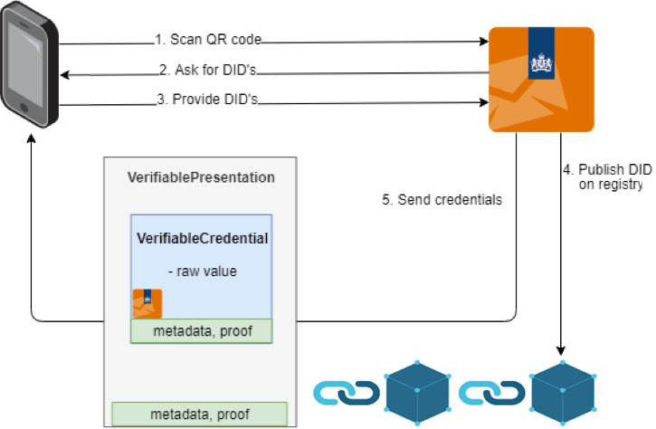
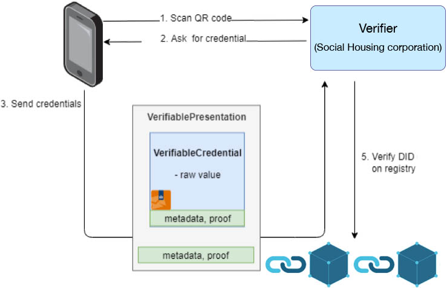
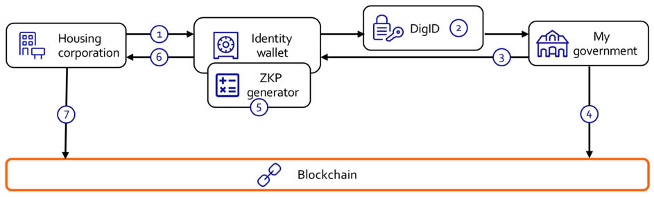
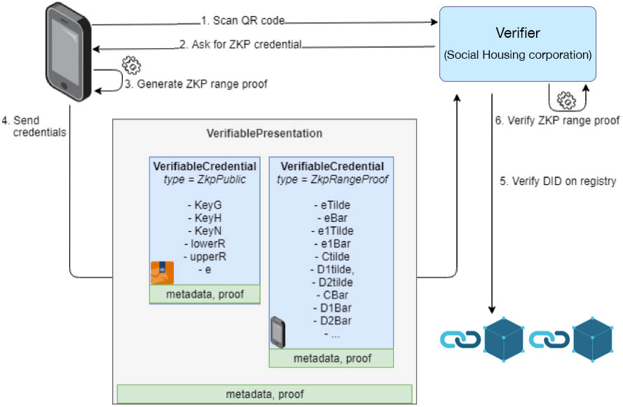

# Utilizing zero-knowledge proofs and verifiable credentials to provide privacy-friendly income tests for social housing

By [David Lamers](https://www.linkedin.com/in/lamersdavid/), david.lamers@rabobank.nl - v1.0

**At Rabobank’s Blockchain Acceleration Lab we have been doing research on self-sovereign identity for years. For Rebooting Web of Trust 8 in Barcelona, we [wrote](https://github.com/WebOfTrustInfo/rwot8-barcelona/blob/master/topics-and-advance-readings/universal-ledger-agent.md) a paper about the Universal Ledger Agent we designed. This abstraction layer makes use of different modules to store and verify credentials issued on different ledgers and using different techniques. We continued with our research and development and have now integrated zero knowledge proofs (ZKP’s) in our W3C verifiable credentials (VC) module for an appealing use case. With the proof of concept, we won a hackathon organized by the Dutch government. This allows us to do a pilot with them.**

#### Our SSI journey

As stated [before](https://github.com/WebOfTrustInfo/rwot8-barcelona/blob/master/topics-and-advance-readings/universal-ledger-agent.md), our SSI journey started in 2016. Within a wide range of partnerships, we explore together with partners the opportunities for users and businesses, as well as the technical standards and solutions. A challenge often faced here was that partners were interested in different technologies. That is why we designed the universal ledger agent used on the holder and verifier side. We have a plugin for an ERC-780 contract on Ethereum, W3C verifiable credentials on Ethereum and a Sovrin plugin. To give you an illustration of the functionalities, the first one makes for example use of the following modules: VP Toolkit, VP Toolkit Models, CryptUtils, VC Status Register, Universal Ledger Agent, Process ETH Barcode, VP Controller, VC Data Management. All will be open sourced soon. Figure 1 and 2 illustrate the issuing and verifying processes.

*Figure 1: flow of issuing credentials without ZKP*

*Figure 2: flow of verifying credentials without ZKP*

An example of the use cases we are working on and doing proof of concepts and pilots for are as follows:
* KYC: onboarding of new customers for retail as well as wholesale 
* Mortgages: optimizing the mortgage application process
* HR: improved way of [onboarding of new employees](https://www.youtube.com/watch?v=3XHPEYnFTwc)

During the hackathon we worked on an additional use case: social housing

#### Social housing
In the Netherlands, an income test is [required](https://www.rijksoverheid.nl/documenten/kamerstukken/2018/11/09/kamerbrief-over-ontwikkeling-administratieve-lasten-woningcorporaties) in order to apply for social housing. With around 2.200.000 social housing units and a zero percent allowed error rate, this is a very expensive process which is required by the Dutch government. Minister Ollongren has committed to come up with a solution to simplify the processes for social housing corporations.

Currently the corporations receive a lot of documents in PDF or printed. For them, it is impossible to make sure if the data is correct, they receive too much personal data which makes it a challenge to comply with GDPR, the data processing is error prone and it is a timely and so costly process. Also, a lot of the potential lessees hand in incomplete files. From lessee perspective, they share too much data, do not have control over shared data, do not know with whom data is shared and end up in a complex and time-consuming process.

For the hackathon ‘Regie op gegevens’ we focused on a solution using self-sovereign identity, blockchain and zero knowledge proofs. Our main focus points were a customer centric approach and data minimalization. The identity wallet with the income test should in the end be a solution to appoint a social housing unit in an easy, safely and trusted way.

#### Proof of concept
The proof of concept covers the following process which is visualized in figure 3:
1.	Social housing corporation sends the income test to the identity wallet
2.	User authenticates at government using DigID, an authentication method for Dutch residents for governmental websites
3.	The government offers an income statement to the identity wallet in the form of a W3C verifiable credential
4.	A decentralized identifier (DID) is published to the blockchain
5.	An answer to the income test is generated in the identity wallet using a zero-knowledge proof
6.	A cryptographically signed yes or no is shared with the housing corporation
7.	The social housing corporation verifies proof and correctness in the blockchain

*Figure 3: process flow income test*

To support this process flow, we have adjusted the flows as shown in figure 1 and 2. When one wants to share a ZKP, a new type of VC is additionally shared with the holder on the issuing side. This 'ZkpPublic VC’ holds the committed value of the data and is shared with the verifier (together with the ZKP) so the issuer of the data and its signature can be verified by the verifier. The new processes are shown in figure 4 and 5.

*Figure 4: flow of issuing credentials with ZKP*

A demo of the proof of concept where the full process is shown can be found on Youtube:
https://www.youtube.com/watch?v=BZYje-ICGi8 (English subtitles are included)

*Figure 5: flow of verifying credentials with ZKP*

#### Acknowledgements
Almost none of the outlined solutions and designs were created solely within Rabobank, therefore we would like to acknowledge and thank our partners for their contributions.