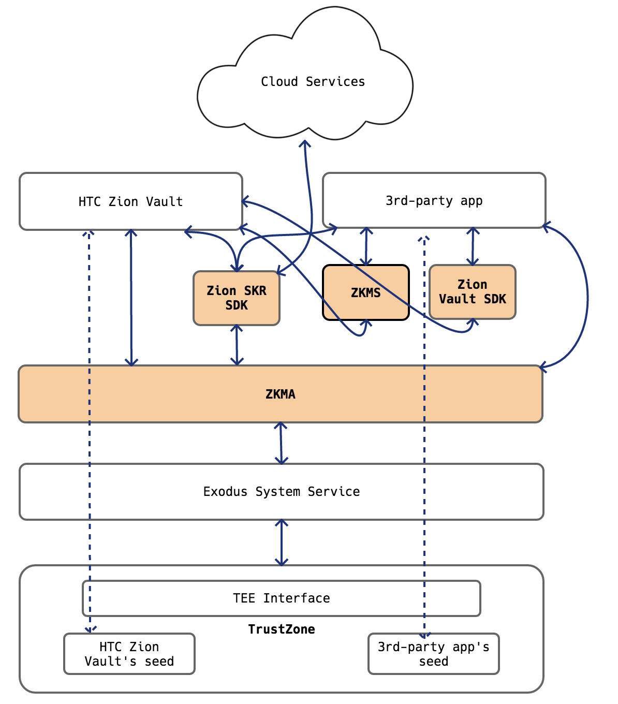

## Zion Key Management APIs and Social Key Recovery

Authors: Hank Chiu, Hankuan Yu, David Chen, Jon Tsai

### Introduction

The goal of HTC Exodus is to let you keep data -- and blockchain currencies -- private and secure on the device rather than in the cloud. And to maximize the capability of that, we believe open to the community is important. Therefore, we create the SDK sets for Zion Key Management APIs to help developers to use the keys protected by Secure Enclave and wish to explore more ideas of using user's own keys. Below briefs how each SDK features:

- ZKMA/ZKMS
  - For apps that need standalone wallet feature, e.g., Opera.
  - Support major coins, e.g., BTC, ETH, LTC, XLM...etc.
  - Support collectibles, e.g., Cryptokitties, Ethermon, Decentraland...etc.
- Zion Vault SDK
  - For exchange purpose apps, e.g., Simplex, Nodle.
- Zion SKR SDK
  - For social key recovery feature
  - V1.0 (Jul. 2019)  
    3rd party apps can backup or restore seeds using HTC UI and UX.
  - V1.2 (Sep. 2019)  
    3rd-party apps can fully customize UI and flow on their own.

### ZKMA/ZKMS

ZKMA (Zion Key Management API) is a service which provides a way for developers to manage seed security built into HTC Exodus devices, which integrates Zion protection. All secure operations (input pin, display seed, sign transaction…) will be performed by the trusted OS and no secure data exposed to the rest of Android.

    

 <b>Figure 1. ZKMA API call flow</b>

  
ZKMA APIs can be called directly or bound as ZKMS of HTC Zion Vault. For performance, our suggestion is you can call ZKMA by ZKMA.aar. Another way which is ZKMS can be used for reducing your APK size. 

|   | ZKMA  | ZKMS  |
|:-:|:-:|:-:|
Library name|  ZKMA.aar |  ZKMS.aar |   |
File Size| 7 MB~  | 20 KB~  |   |
Architecture| Direct call API via ZKMA library  | Call API via ZKMS service  |   |
HTC Zion Vault App| Unnecessary  |  Mandatory |   |

<b>Table 1. A comparison between ZKMA and ZKMS libraries</b>

### ZionVaultSDK

This SDK provides two major functions：

1. Get crypto currency account address from Zion Vault.
2. Request Zion Vault to sign a transaction.

Zion SDK offers two approaches to integrate Zion Vault with the transaction service provided by cryptocurrency exchange services providers：  

1. Web base integration：Zion Vault loads a mobile web page that provided by exchange service provider.
2. Application base integration：Exchange service provider implements an Android application to work with Zion Vault.

Below diagram describes how Zion apps exchange data with Exchange's server securely.

### SKR SDK

Zion Social Key Recovery SDK (Zion-SKR-SDK) is an Android library that provides Java APIs for developers to integrate HTC Zion Vault's Social Key Recovery (SKR) feature into their apps. 3rd party apps integrating Zion-SKR-SDK will be able to use SKR to backup or restore their hierarchical deterministic (HD) wallet seed on HTC Exodus devices.

The below architecture diagram describes the components involved when we implement the Social Key Recovery.

#### SLIP-39 in SKR 2.0

SLIP-39 describes a standard and interoperable implementation of Shamir's secret sharing (SSS). SSS splits a secret into unique parts which can be distributed among participants, and requires a specified minimum number of parts to be supplied in order to reconstruct the original secret. Knowledge of fewer than the required number of parts does not leak information about the secret. In order to support the SLIP-39 and make the apps that use Zion-SKR-SDK can also recover the seed on different apps, we have implemented a [C library for SLIP-39](https://github.com/Seclabs-htc/slip39).

### Collaboration at RWOT9

We are looking forward to discuss the ideas of apps that interests in using keys in Secure Enclave, e.g., wallet app, DID app...etc. We are also like to discuss what to offer in SDK sets that will fulfill the wallet app developer's need.